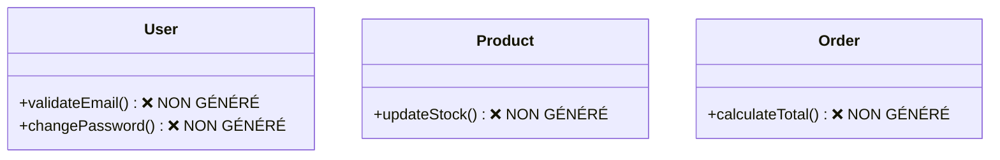

# 🔍 Analyse Code Généré vs Diagrammes Mermaid

## 📊 Résumé de l'Analyse

### ✅ **Points Forts**
- **Champs détectés** - Tous les attributs du diagramme sont générés
- **Types corrects** - UUID, String, Float, Integer respectés
- **Annotations JPA** - @Entity, @Table, @Column présentes
- **Getters/Setters** - Générés automatiquement
- **Méthodes d'état** - suspend()/activate() générées
- **Enums d'état** - UserStatus, ProductStatus créés

### ❌ **Problèmes Identifiés**

#### 1. **Méthodes Métier Manquantes**


#### 2. **Relations JPA Absentes**
```mermaid
classDiagram
    User "1" --> "*" Order    ❌ @OneToMany manquant
    Order "*" --> "*" Product ❌ @ManyToMany manquant
```

#### 3. **Bugs de Génération**
- **Champs dupliqués** - `status` défini 2 fois
- **Import manquants** - `UUID` non importé
- **Annotations incorrectes** - `@Enumerated` mal placé

## 🎯 **Recommandations d'Amélioration**

### 1. **Parser de Méthodes**
```java
// Détecter et générer les méthodes du diagramme
public void validateEmail() {
    // Logique de validation email
}

public void changePassword(String newPassword) {
    // Logique changement mot de passe
}
```

### 2. **Générateur de Relations**
```java
// User.java
@OneToMany(mappedBy = "user", cascade = CascadeType.ALL)
private List<Order> orders = new ArrayList<>();

// Order.java
@ManyToOne
@JoinColumn(name = "user_id")
private User user;

@ManyToMany
@JoinTable(name = "order_products")
private List<Product> products = new ArrayList<>();
```

### 3. **Validation et Nettoyage**
- Détecter les doublons de champs
- Valider les imports nécessaires
- Corriger les annotations JPA

## 📈 **Score de Conformité**

| Aspect | Score | Détail |
|--------|-------|--------|
| **Champs** | 90% | ✅ Tous générés, types corrects |
| **Méthodes** | 30% | ❌ Seules suspend/activate générées |
| **Relations** | 0% | ❌ Aucune relation JPA |
| **Annotations** | 70% | ⚠️ Présentes mais bugs |
| **Structure** | 85% | ✅ Package, classes correctes |

**Score Global: 55%** - Bon pour les bases, améliorations nécessaires pour les fonctionnalités avancées.