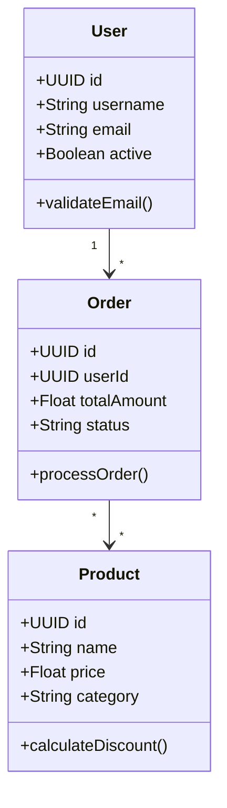

# 🌐 Utilisation de l'API Déployée

## 🚀 API Live - Aucune Installation Requise

**URL de l'API** : `https://codegenerator-cpyh.onrender.com`

L'API est déployée et accessible 24/7. Aucune installation locale n'est nécessaire.

## 📋 Endpoints Disponibles

### 1. **Génération de Projet Complet**
```bash
POST https://codegenerator-cpyh.onrender.com/api/generate/crud
```

### 2. **Validation UML**
```bash
POST https://codegenerator-cpyh.onrender.com/api/generate/validate
```

### 3. **Santé de l'API**
```bash
GET https://codegenerator-cpyh.onrender.com/actuator/health
```

## 🛠️ Exemples d'Utilisation

### **cURL - Génération Java**
```bash
curl -X POST https://codegenerator-cpyh.onrender.com/api/generate/crud \
  -H "Content-Type: application/json" \
  -d '{
    "umlContent": "classDiagram\n    class User {\n        +UUID id\n        +String username\n        +String email\n        +validateEmail()\n    }\n    class Product {\n        +UUID id\n        +String name\n        +Float price\n    }\n    User \"1\" --> \"*\" Product",
    "language": "java",
    "packageName": "com.ecommerce"
  }' \
  -o ecommerce-java.zip
```

### **cURL - Génération Python Django**
```bash
curl -X POST https://codegenerator-cpyh.onrender.com/api/generate/crud \
  -H "Content-Type: application/json" \
  -d '{
    "umlContent": "classDiagram\n    class User {\n        +UUID id\n        +String username\n    }\n    class Post {\n        +UUID id\n        +String title\n        +String content\n    }\n    User \"1\" --> \"*\" Post",
    "language": "django",
    "packageName": "com.blog"
  }' \
  -o blog-django.zip
```

### **cURL - Validation UML**
```bash
curl -X POST https://codegenerator-cpyh.onrender.com/api/generate/validate \
  -H "Content-Type: text/plain" \
  -d "classDiagram
    class User {
        +UUID id
        +String username
        +validateEmail()
    }"
```

## 📱 Insomnia/Postman

### **Configuration de Base**
- **Base URL** : `https://codegenerator-cpyh.onrender.com`
- **Headers** : `Content-Type: application/json`

### **Request Body pour Génération**
```json
{
  "umlContent": "classDiagram\n    class User {\n        +UUID id\n        +String username\n        +String email\n    }\n    class Order {\n        +UUID id\n        +UUID userId\n        +Float totalAmount\n    }\n    User \"1\" --> \"*\" Order",
  "language": "java",
  "packageName": "com.example"
}
```

## 🔄 Workflow Complet

### 1. **Créer le Diagramme UML**


### 2. **Générer le Projet**
```bash
# Sauvegarder le diagramme
cat > ecommerce.mermaid << 'EOF'
classDiagram
    class User {
        +UUID id
        +String username
        +String email
        +validateEmail()
    }
    class Product {
        +UUID id
        +String name
        +Float price
    }
    User "1" --> "*" Product
EOF

# Générer le projet Java
curl -X POST https://codegenerator-cpyh.onrender.com/api/generate/crud \
  -H "Content-Type: application/json" \
  -d "{
    \"umlContent\": \"$(cat ecommerce.mermaid | sed 's/\"/\\\"/g' | tr '\n' '\\n')\",
    \"language\": \"java\",
    \"packageName\": \"com.ecommerce\"
  }" \
  -o ecommerce-project.zip
```

### 3. **Extraire et Utiliser**
```bash
# Extraire le projet
unzip ecommerce-project.zip
cd ecommerce-project/

# Le projet contient maintenant :
# ├── src/                 # Code généré
# ├── update-project.sh    # Mise à jour continue
# ├── start.sh            # Démarrage rapide
# ├── README.md           # Documentation
# └── model.mermaid       # Diagramme exemple

# Démarrer l'application
./start.sh
```

### 4. **Développement Continu**
```bash
# Modifier le diagramme
vim enhanced-model.mermaid

# Mettre à jour le projet (préserve votre code)
./update-project.sh enhanced-model.mermaid
```

## 🎯 Langages Supportés

| Langage | Paramètre | Exemple Package |
|---------|-----------|-----------------|
| **Java Spring Boot** | `"java"` | `"com.ecommerce"` |
| **Python Django** | `"django"` | `"com.blog"` |
| **Python FastAPI** | `"python"` | `"com.api"` |
| **C# .NET** | `"csharp"` | `"MyCompany.CRM"` |
| **TypeScript** | `"typescript"` | `"com.webapp"` |
| **PHP** | `"php"` | `"App\\Ecommerce"` |

## 🔍 Validation et Test

### **Tester la Connexion**
```bash
curl https://codegenerator-cpyh.onrender.com/actuator/health
```

**Réponse attendue** :
```json
{"status":"UP"}
```

### **Valider un Diagramme**
```bash
curl -X POST https://codegenerator-cpyh.onrender.com/api/generate/validate \
  -H "Content-Type: text/plain" \
  -d "classDiagram
    class User {
        +UUID id
        +String name
    }"
```

**Réponse attendue** :
```json
{
  "valid": true,
  "message": "Valid UML",
  "classCount": 1
}
```

## 📦 Contenu du ZIP Généré

Chaque projet généré contient :

```
project.zip
├── src/                     # Code source complet
├── 🔄 update-project.sh     # Mise à jour continue (Linux/macOS)
├── 🔄 update-project.bat    # Mise à jour continue (Windows)
├── 🚀 start.sh              # Démarrage rapide (Linux/macOS)
├── 🚀 start.bat             # Démarrage rapide (Windows)
├── 📚 README.md             # Documentation personnalisée
├── ⚙️ .project-config       # Configuration du projet
├── 📄 model.mermaid         # Diagramme UML exemple
└── 📁 .backups/             # Dossier pour sauvegardes
```

## 🚨 Notes Importantes

- ✅ **Aucune installation locale** requise
- ✅ **API disponible 24/7** sur Render
- ✅ **Projets complets** avec scripts intégrés
- ✅ **Développement continu** avec fusion intelligente
- ✅ **Multi-plateforme** (Linux, macOS, Windows)

## 🆘 Support

- **Documentation** : https://codegenerator-cpyh.onrender.com/docs
- **Exemples** : https://codegenerator-cpyh.onrender.com/examples
- **API Health** : https://codegenerator-cpyh.onrender.com/actuator/health