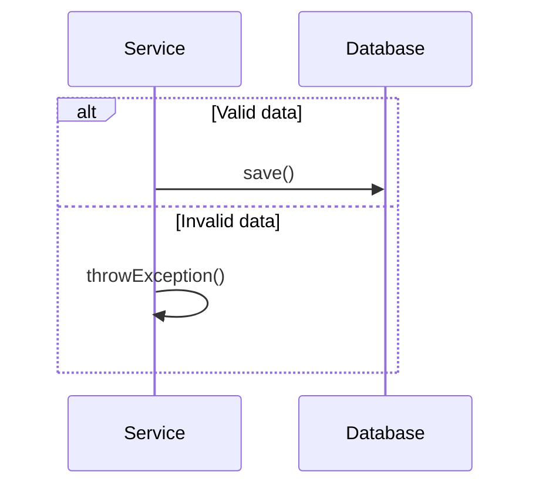
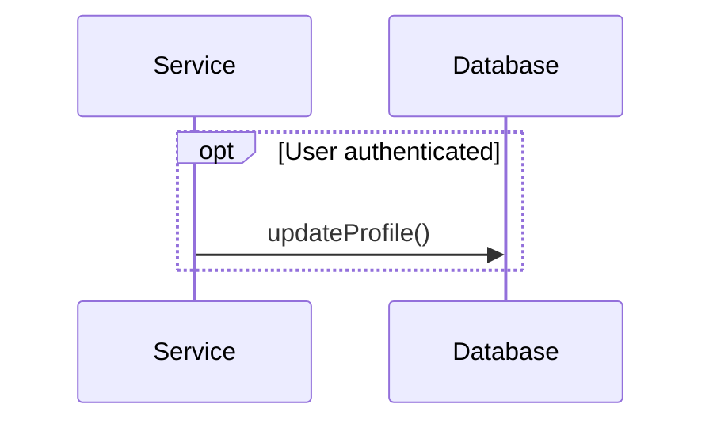
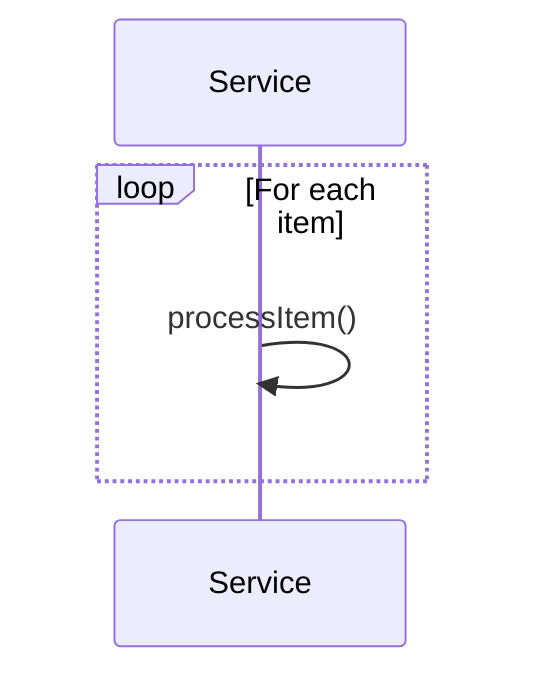
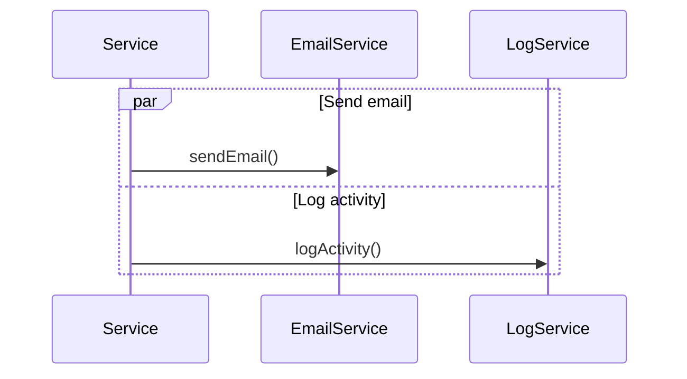
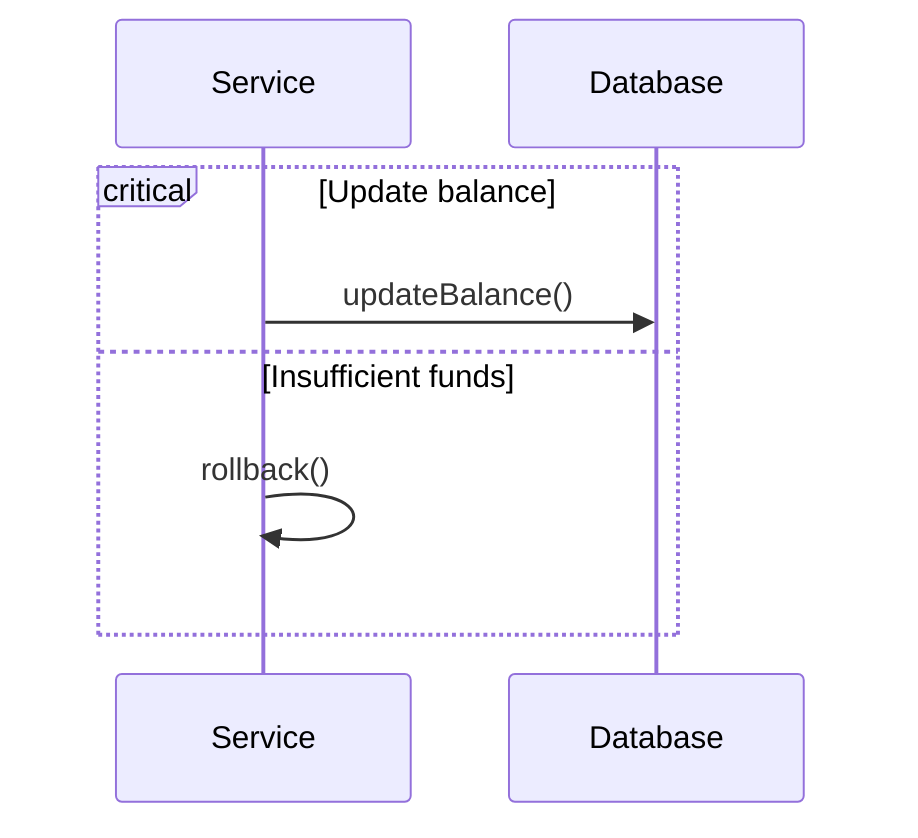
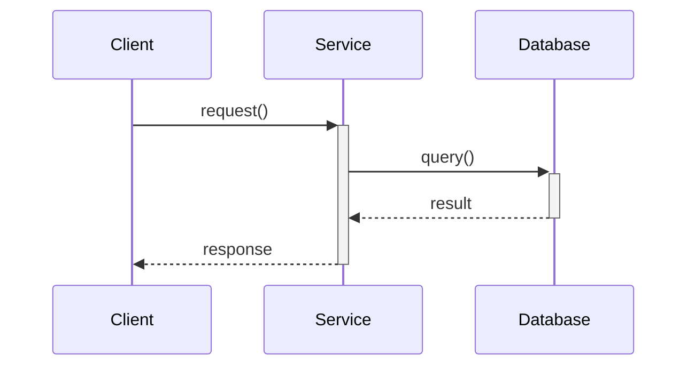

# 🎯 Génération de Code Comportemental

## Vue d'ensemble

La génération de code comportemental combine les **diagrammes de classes** et les **diagrammes de séquence** pour produire du code plus réaliste et fonctionnel. Cette approche révolutionnaire génère non seulement la structure statique des classes, mais aussi la logique métier dynamique basée sur les interactions réelles.

## 🌟 Avantages de l'Approche Comportementale

### 1. **Code Plus Réaliste**
- Logique métier générée à partir des flux d'interaction
- Méthodes avec implémentation fonctionnelle
- Gestion d'erreurs contextuelle

### 2. **Workflows Documentés**
- Extraction automatique des processus métier
- Documentation des scénarios d'utilisation
- Traçabilité entre diagrammes et code

### 3. **Validation Intelligente**
- Validation basée sur les paramètres des méthodes
- Règles métier déduites des interactions
- Gestion des exceptions appropriée

### 4. **Architecture Cohérente**
- Respect des patterns d'interaction
- Séparation des responsabilités
- Code maintenable et évolutif

## 🚀 Utilisation

### API Endpoint
```
POST /api/behavioral/generate
```

### Exemple de Requête
```json
{
  "classDiagramContent": "classDiagram\n    class User {\n        +UUID id\n        +String username\n        +String email\n        +validateEmail()\n    }\n    class Order {\n        +UUID id\n        +UUID userId\n        +Float total\n    }\n    User \"1\" --> \"*\" Order",
  "sequenceDiagramContent": "sequenceDiagram\n    participant Client\n    participant UserController\n    participant UserService\n    participant UserRepository\n    participant Database\n\n    Client->>+UserController: POST /api/users/register\n    UserController->>+UserService: createUser(userData)\n    \n    alt Valid user data\n        UserService->>+UserRepository: save(user)\n        UserRepository->>+Database: INSERT INTO users\n        Database-->>-UserRepository: User created\n        UserRepository-->>-UserService: User entity\n        UserService-->>-UserController: Created user\n        UserController-->>-Client: 201 Created\n    else Invalid data\n        UserService-->>UserController: ValidationException\n        UserController-->>Client: 400 Bad Request\n    end",
  "packageName": "com.example.behavioral",
  "language": "java"
}
```

### Test avec cURL
```bash
curl -X POST "http://localhost:8080/api/behavioral/generate" \
  -H "Content-Type: application/json" \
  -d @behavioral-request.json \
  -o behavioral-project.zip
```

## 📋 Patterns Supportés

### 1. **Fragments Combinés**

#### Alternative (alt/else)

**Code généré :**
```java
if (isValidData(data)) {
    return repository.save(entity);
} else {
    throw new ValidationException("Invalid data");
}
```

#### Optionnel (opt)

**Code généré :**
```java
if (isAuthenticated(user)) {
    repository.updateProfile(profile);
}
```

#### Boucle (loop)

**Code généré :**
```java
for (Item item : items) {
    processItem(item);
}
```

#### Parallèle (par)

**Code généré :**
```java
CompletableFuture.allOf(
    CompletableFuture.runAsync(() -> emailService.sendEmail()),
    CompletableFuture.runAsync(() -> logService.logActivity())
).join();
```

#### Critique (critical)

**Code généré :**
```java
synchronized (this) {
    try {
        database.updateBalance(amount);
    } catch (InsufficientFundsException e) {
        rollback();
    }
}
```

### 2. **Activation/Désactivation**


### 3. **Gestion d'Erreurs**
Génération automatique de try-catch basée sur le contexte des méthodes.

## 🎨 Code Généré

### Structure du Projet
```
behavioral-project/
├── src/main/java/com/example/behavioral/
│   ├── entity/
│   │   ├── User.java
│   │   └── Order.java
│   ├── repository/
│   │   ├── UserRepository.java
│   │   └── OrderRepository.java
│   ├── service/
│   │   ├── UserService.java
│   │   └── OrderService.java
│   └── controller/
│       ├── UserController.java
│       └── OrderController.java
├── WORKFLOWS.md
├── README-BEHAVIORAL.md
└── pom.xml
```

### Exemple d'Entité Générée
```java
@Entity
@Table(name = "users")
public class User {
    @Id
    @GeneratedValue(strategy = GenerationType.IDENTITY)
    private UUID id;
    
    @Column
    @NotBlank(message = "Username cannot be blank")
    private String username;
    
    @Column
    @Email(message = "Invalid email format")
    private String email;
    
    @Column(name = "created_at")
    private LocalDateTime createdAt;
    
    @Column(name = "updated_at")
    private LocalDateTime updatedAt;
    
    // Getters and setters...
}
```

### Exemple de Service Généré
```java
@Service
public class UserService {
    
    @Autowired
    private UserRepository repository;
    
    public User createUser(Object userData) {
        // Validate input data
        if (entity == null) throw new IllegalArgumentException("Entity cannot be null");
        // Set audit fields
        entity.setCreatedAt(LocalDateTime.now());
        entity.setUpdatedAt(LocalDateTime.now());
        // Save to database
        return repository.save(entity);
    }
    
    public User authenticateUser(Object credentials) {
        // Retrieve from database
        return repository.findById(id).orElseThrow(() -> 
            new EntityNotFoundException("Entity not found"));
    }
}
```

## 🔧 Configuration

### Langages Supportés
- **Java** (Spring Boot)
- **Python** (FastAPI/Django)
- **C#** (.NET Core)
- **TypeScript** (Express)
- **PHP** (Slim Framework)

### Endpoints API
- `POST /api/behavioral/generate` - Génération comportementale
- `POST /api/behavioral/validate` - Validation des diagrammes
- `GET /api/behavioral/example` - Exemple de requête
- `GET /api/behavioral/languages` - Langages supportés

## 📊 Comparaison

| Aspect | Génération Classique | Génération Comportementale |
|--------|---------------------|----------------------------|
| **Structure** | Classes vides | Classes avec logique métier |
| **Méthodes** | Signatures seulement | Implémentation complète |
| **Validation** | Basique | Contextuelle et intelligente |
| **Workflows** | Non documentés | Extraits et documentés |
| **Exceptions** | Génériques | Spécifiques au contexte |
| **Tests** | Manuels | Basés sur les scénarios |

## 🎯 Cas d'Usage

### 1. **E-commerce**
- Processus de commande complet
- Gestion des stocks
- Paiements et facturation

### 2. **Gestion d'Utilisateurs**
- Inscription et authentification
- Gestion des profils
- Permissions et rôles

### 3. **Systèmes Bancaires**
- Transactions sécurisées
- Gestion des comptes
- Audit et conformité

### 4. **Applications Métier**
- Workflows complexes
- Validation de données
- Intégrations système

## 🚀 Démarrage Rapide

1. **Préparer les diagrammes**
   ```bash
   # Créer class-diagram.mermaid
   # Créer sequence-diagram.mermaid
   ```

2. **Générer le code**
   ```bash
   ./test-behavioral-generation.sh
   ```

3. **Démarrer l'application**
   ```bash
   cd behavioral-project
   mvn spring-boot:run
   ```

## 📚 Documentation Avancée

- [Guide des Patterns de Séquence](SEQUENCE-PATTERNS.md)
- [Exemples Complets](BEHAVIORAL-EXAMPLES.md)
- [Personnalisation](BEHAVIORAL-CUSTOMIZATION.md)
- [Bonnes Pratiques](BEHAVIORAL-BEST-PRACTICES.md)

## 🔮 Évolutions Futures

- Support des diagrammes d'activité
- Génération de tests automatisés
- Intégration avec les outils CI/CD
- Templates personnalisables
- Métriques de qualité du code

---

**La génération comportementale transforme vos diagrammes UML en applications fonctionnelles et réalistes !** 🎉