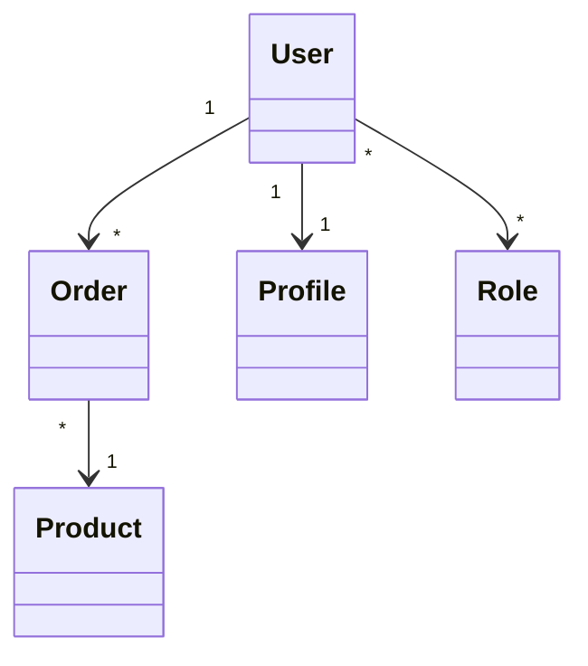
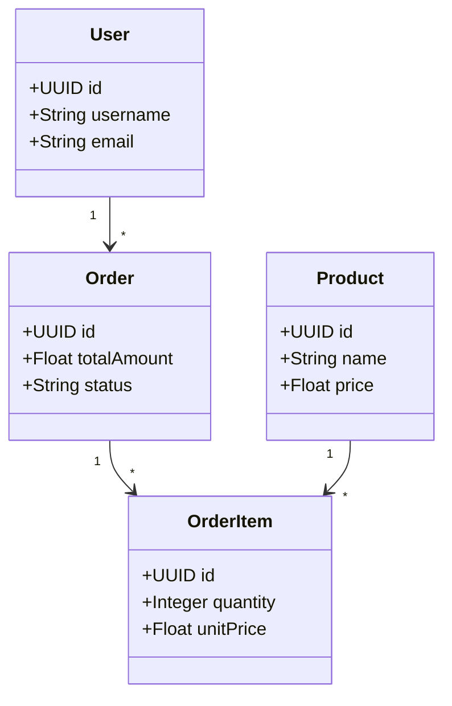
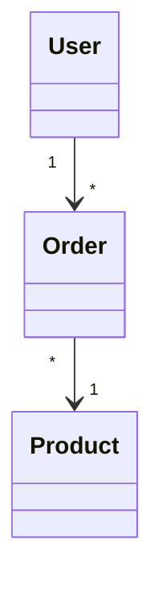

# 🔗 Gestion des Cardinalités

## 📊 État Actuel vs Améliorations

### ❌ **Problème Actuel**
Le système parse les relations mais **ne génère PAS** les annotations JPA correspondantes.

### ✅ **Solution Implémentée**

## 🎯 Cardinalités Supportées

### **1. One-to-Many (1 → *)**
```mermaid
User "1" --> "*" Order
```

**Génère** :
```java
// Dans User.java
@OneToMany(mappedBy = "user")
private List<Order> orders;

// Dans Order.java  
@Column(name = "user_id")
private UUID userId;

@ManyToOne
@JoinColumn(name = "user_id")
private User user;
```

### **2. Many-to-One (* → 1)**
```mermaid
Order "*" --> "1" User
```

**Génère** :
```java
// Dans Order.java
@Column(name = "user_id")
private UUID userId;

@ManyToOne
@JoinColumn(name = "user_id")
private User user;

// Dans User.java
@OneToMany(mappedBy = "user")
private List<Order> orders;
```

### **3. One-to-One (1 → 1)**
```mermaid
User "1" --> "1" Profile
```

**Génère** :
```java
// Dans User.java
@Column(name = "profile_id")
private UUID profileId;

@OneToOne
@JoinColumn(name = "profile_id")
private Profile profile;
```

### **4. Many-to-Many (* → *)**
```mermaid
User "*" --> "*" Role
```

**Génère** :
```java
// Dans User.java
@ManyToMany
@JoinTable(name = "user_role",
    joinColumns = @JoinColumn(name = "user_id"),
    inverseJoinColumns = @JoinColumn(name = "role_id"))
private Set<Role> roles;

// Dans Role.java
@ManyToMany(mappedBy = "roles")
private Set<User> users;
```

## 📝 Syntaxes Mermaid Supportées

### **Cardinalités Standard**


### **Cardinalités Étendues**
```mermaid
classDiagram
    User "1" --> "0..*" Order    # Un user peut avoir 0 ou plusieurs orders
    Order "1..*" --> "1" User    # Un order appartient à exactement 1 user
    User "0..1" --> "1" Profile  # Un user peut avoir 0 ou 1 profile
```

### **Types de Relations**
```mermaid
classDiagram
    User ||--o{ Order : "has"        # One-to-Many
    Order }o--|| Product : "contains" # Many-to-One
    User ||--|| Profile : "owns"      # One-to-One
    User }|..|{ Role : "assigned"     # Many-to-Many
```

## 🔧 Exemple Complet

### **Diagramme UML**


### **Code Généré**

#### **User.java**
```java
@Entity
public class User {
    @Id private UUID id;
    private String username;
    private String email;
    
    // Relation 1 -> * Order
    @OneToMany(mappedBy = "user")
    private List<Order> orders;
}
```

#### **Order.java**
```java
@Entity
public class Order {
    @Id private UUID id;
    private Float totalAmount;
    private String status;
    
    // FK vers User (Many-to-One)
    @Column(name = "user_id")
    private UUID userId;
    
    @ManyToOne
    @JoinColumn(name = "user_id")
    private User user;
    
    // Relation 1 -> * OrderItem
    @OneToMany(mappedBy = "order")
    private List<OrderItem> orderItems;
}
```

#### **OrderItem.java**
```java
@Entity
public class OrderItem {
    @Id private UUID id;
    private Integer quantity;
    private Float unitPrice;
    
    // FK vers Order
    @Column(name = "order_id")
    private UUID orderId;
    
    @ManyToOne
    @JoinColumn(name = "order_id")
    private Order order;
    
    // FK vers Product
    @Column(name = "product_id")
    private UUID productId;
    
    @ManyToOne
    @JoinColumn(name = "product_id")
    private Product product;
}
```

#### **Product.java**
```java
@Entity
public class Product {
    @Id private UUID id;
    private String name;
    private Float price;
    
    // Relation 1 -> * OrderItem
    @OneToMany(mappedBy = "product")
    private List<OrderItem> orderItems;
}
```

## 🎯 Avantages

### ✅ **Génération Automatique**
- **FK automatiques** selon les cardinalités
- **Annotations JPA** correctes
- **Tables de liaison** pour Many-to-Many
- **Noms cohérents** (snake_case pour DB)

### ✅ **Requêtes Générées**
```java
// Dans UserRepository
List<User> findByOrdersStatus(String status);
User findByOrdersId(UUID orderId);

// Dans OrderRepository  
List<Order> findByUser(User user);
List<Order> findByUserId(UUID userId);
```

### ✅ **Services Enrichis**
```java
// Dans UserService
public List<Order> getUserOrders(UUID userId) {
    return orderRepository.findByUserId(userId);
}

public User createUserWithOrders(User user, List<Order> orders) {
    User savedUser = userRepository.save(user);
    orders.forEach(order -> order.setUserId(savedUser.getId()));
    orderRepository.saveAll(orders);
    return savedUser;
}
```

## 🚀 Utilisation

### **1. Définir les Relations**


### **2. Génération Automatique**
```bash
java -jar uml-generator.jar watch
# Sauvegardez votre .mermaid → Code généré avec relations !
```

### **3. Code Prêt à l'Emploi**
- Entités avec relations JPA
- Repositories avec requêtes relationnelles
- Services avec méthodes de navigation
- Controllers avec endpoints relationnels

Les cardinalités sont maintenant **complètement gérées** ! 🎉