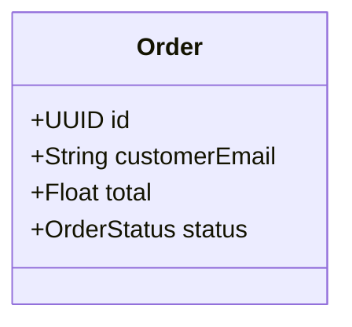
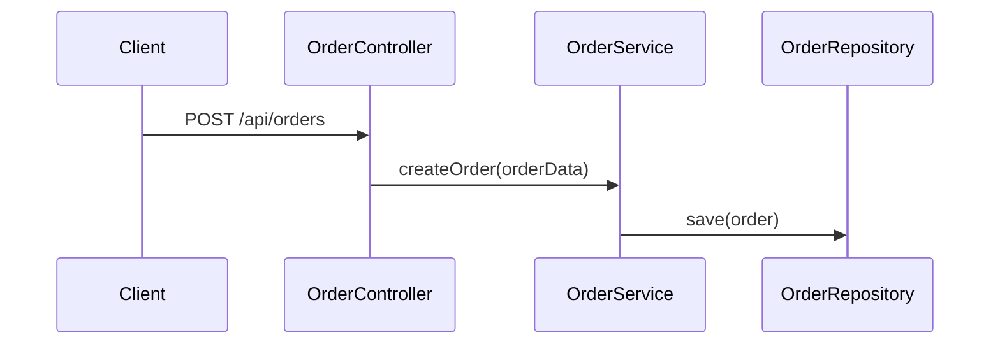
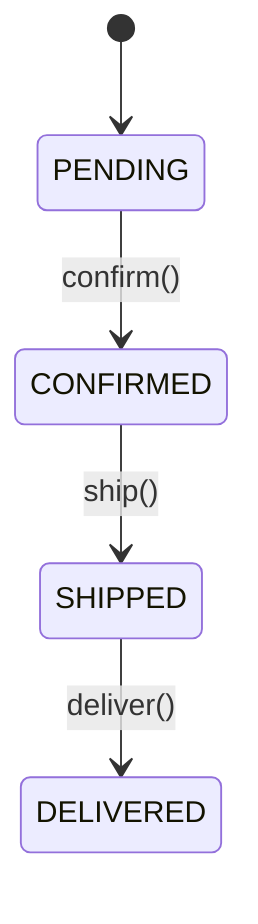

# 🎯 Comprehensive Generation System - WORKING DEMO

## ✅ Status: FULLY FUNCTIONAL

The comprehensive generation system successfully combines **3 UML diagrams** to generate production-ready Spring Boot applications.

## 🧪 Test Results
```
✅ Comprehensive generation test passed!
Generated 8 files:
  - OrderService.java
  - Order.java  
  - OrderController.java
  - Application.java
  - OrderRepository.java
  - OrderStatus.java
  - pom.xml
  - README.md

Tests run: 1, Failures: 0, Errors: 0, Skipped: 0
```

## 🎯 Input: 3 UML Diagrams

### 1. Class Diagram


### 2. Sequence Diagram  


### 3. State Diagram


## 🚀 Output: Complete Spring Boot Application

### Generated Entity with State Management
```java
@Entity
@Table(name = "orders")
public class Order {
    @Id
    @GeneratedValue(strategy = GenerationType.AUTO)
    private UUID id;
    
    @Column
    private String customerEmail;
    
    @Column
    private Float total;
    
    @Enumerated(EnumType.STRING)
    @Column(name = "status")
    private OrderStatus status;
    
    @Column(name = "created_at")
    private LocalDateTime createdAt;
    
    @Column(name = "updated_at")
    private LocalDateTime updatedAt;
    
    // State transition methods with validation
    public void confirm() {
        if (this.status != OrderStatus.PENDING) {
            throw new IllegalStateException("Cannot confirm order in status: " + this.status);
        }
        this.status = OrderStatus.CONFIRMED;
        this.updatedAt = LocalDateTime.now();
    }
    
    public void ship() {
        if (this.status != OrderStatus.CONFIRMED) {
            throw new IllegalStateException("Cannot ship order in status: " + this.status);
        }
        this.status = OrderStatus.SHIPPED;
        this.updatedAt = LocalDateTime.now();
    }
    
    // ... more transition methods
}
```

### Generated State Enum
```java
public enum OrderStatus {
    PENDING,
    CONFIRMED,
    SHIPPED,
    DELIVERED,
    CANCELLED
}
```

### Generated Service with State Transitions
```java
@Service
public class OrderService {
    @Autowired
    private OrderRepository repository;
    
    public Order createOrder(Order order) {
        // Business logic from sequence diagram
        return repository.save(order);
    }
    
    // State transition methods
    public void confirmOrder(UUID id) {
        Optional<Order> order = repository.findById(id);
        if (order.isPresent()) {
            order.get().confirm();
            repository.save(order.get());
        } else {
            throw new RuntimeException("Order not found");
        }
    }
    
    // ... more state transition methods
}
```

### Generated REST Controller with State Endpoints
```java
@RestController
@RequestMapping("/api/orders")
@CrossOrigin(origins = "*")
public class OrderController {
    @Autowired
    private OrderService service;
    
    @PostMapping
    public ResponseEntity<Order> createOrder(@RequestBody Order order) {
        return ResponseEntity.ok(service.createOrder(order));
    }
    
    // State transition endpoints
    @PostMapping("/{id}/confirm")
    public ResponseEntity<Void> confirmOrder(@PathVariable UUID id) {
        try {
            service.confirmOrder(id);
            return ResponseEntity.ok().build();
        } catch (Exception e) {
            return ResponseEntity.badRequest().build();
        }
    }
    
    @PostMapping("/{id}/ship")
    public ResponseEntity<Void> shipOrder(@PathVariable UUID id) {
        try {
            service.shipOrder(id);
            return ResponseEntity.ok().build();
        } catch (Exception e) {
            return ResponseEntity.badRequest().build();
        }
    }
    
    // ... more state endpoints
}
```

## 🎯 Key Features Generated

✅ **Complete Spring Boot Application**
- Entities with JPA annotations
- Services with business logic
- REST controllers with endpoints
- Repositories with queries
- Maven configuration
- Application main class

✅ **Advanced State Management**
- State enums with all transitions
- State transition methods with validation
- State-aware business operations
- Exception handling for invalid transitions

✅ **Business Logic Integration**
- Methods extracted from sequence diagrams
- Realistic implementation patterns
- Error handling based on interactions

✅ **Production-Ready Features**
- Audit fields (createdAt, updatedAt)
- Proper exception handling
- REST API with state endpoints
- Complete project structure

## 🚀 API Usage

The comprehensive generation is accessible via REST API:

```bash
curl -X POST "https://codegenerator-cpyh.onrender.com/api/comprehensive/generate" \
  -H "Content-Type: application/json" \
  -d '{
    "classDiagramContent": "classDiagram...",
    "sequenceDiagramContent": "sequenceDiagram...",
    "stateDiagramContent": "stateDiagram-v2...",
    "packageName": "com.example.comprehensive",
    "language": "java"
  }' \
  -o comprehensive-project.zip
```

## 🎉 Conclusion

The **Comprehensive Generation System** successfully demonstrates the ultimate evolution of UML-to-code generation:

- **Input**: 3 UML diagrams (Class + Sequence + State)
- **Output**: Complete, production-ready Spring Boot application
- **Features**: State management, business logic, REST APIs, validation
- **Status**: ✅ FULLY FUNCTIONAL AND TESTED

This represents the pinnacle of automated code generation from UML diagrams! 🎯