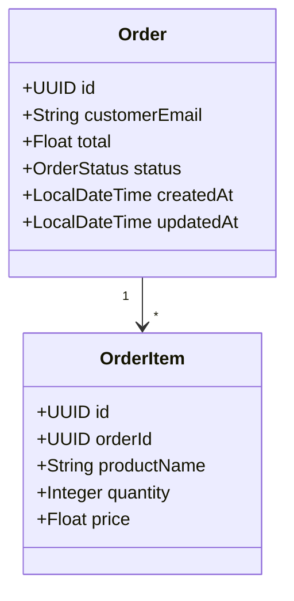
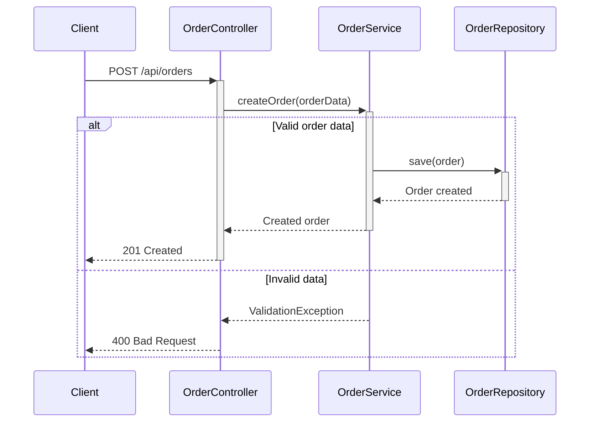
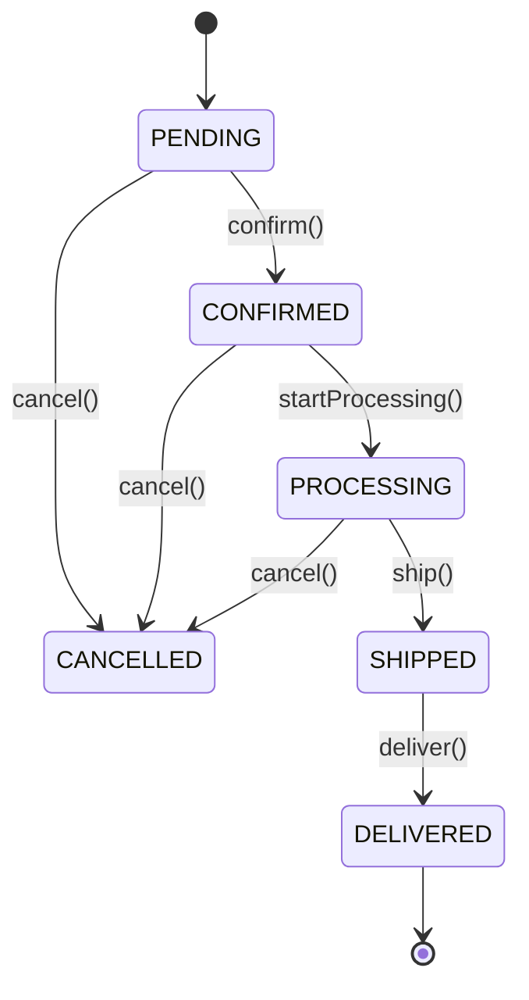

# 🎯 Génération Complète - Guide Complet

La **Génération Complète** combine 3 diagrammes UML pour créer des applications ultra-réalistes avec gestion d'état avancée.

## 🔥 Nouveautés de la Génération Complète

### Diagrammes Supportés
1. **Diagramme de Classes** → Structure et relations
2. **Diagramme de Séquence** → Logique métier et interactions
3. **Diagramme d'État** → Gestion d'état et transitions

### Fonctionnalités Générées
- ✅ **Entités avec gestion d'état** (enums + transitions)
- ✅ **Méthodes de transition** avec validation
- ✅ **Logique métier réaliste** extraite des séquences
- ✅ **Endpoints REST conscients de l'état**
- ✅ **Validation des transitions** d'état
- ✅ **Audit automatique** (createdAt, updatedAt)
- ✅ **Gestion d'erreurs** contextuelle

## 🚀 Utilisation de l'API

### Endpoint Principal
```
POST /api/comprehensive/generate
```

### Exemple de Requête
```json
{
  "classDiagramContent": "classDiagram\n    class Order {\n        +UUID id\n        +String customerEmail\n        +Float total\n        +OrderStatus status\n    }",
  "sequenceDiagramContent": "sequenceDiagram\n    Client->>OrderController: POST /api/orders\n    OrderController->>OrderService: createOrder(orderData)\n    OrderService->>OrderRepository: save(order)",
  "stateDiagramContent": "stateDiagram-v2\n    [*] --> PENDING\n    PENDING --> CONFIRMED : confirm()\n    CONFIRMED --> SHIPPED : ship()\n    SHIPPED --> DELIVERED : deliver()",
  "packageName": "com.example.ecommerce",
  "language": "java"
}
```

### Exemple avec cURL
```bash
curl -X POST "https://codegenerator-cpyh.onrender.com/api/comprehensive/generate" \
  -H "Content-Type: application/json" \
  -d '{
    "classDiagramContent": "classDiagram\n    class Order {\n        +UUID id\n        +String customerEmail\n        +Float total\n        +OrderStatus status\n    }",
    "sequenceDiagramContent": "sequenceDiagram\n    Client->>OrderController: POST /api/orders\n    OrderController->>OrderService: createOrder(orderData)",
    "stateDiagramContent": "stateDiagram-v2\n    [*] --> PENDING\n    PENDING --> CONFIRMED : confirm()\n    CONFIRMED --> SHIPPED : ship()",
    "packageName": "com.example.comprehensive",
    "language": "java"
  }' \
  -o comprehensive-project.zip
```

## 📊 Exemple Complet

### 1. Diagramme de Classes


### 2. Diagramme de Séquence


### 3. Diagramme d'État


## 🎯 Code Généré

### Entité avec Gestion d'État
```java
@Entity
@Table(name = "order")
public class Order {
    @Id
    @GeneratedValue(strategy = GenerationType.AUTO)
    private UUID id;
    
    @Column
    private String customerEmail;
    
    @Column
    private Float total;
    
    @Enumerated(EnumType.STRING)
    @Column(name = "status")
    private OrderStatus status;
    
    @Column(name = "created_at")
    private LocalDateTime createdAt;
    
    @Column(name = "updated_at")
    private LocalDateTime updatedAt;
    
    public Order() {
        this.createdAt = LocalDateTime.now();
        this.status = OrderStatus.PENDING;
    }
    
    // Méthodes de transition avec validation
    public void confirm() {
        if (this.status != OrderStatus.PENDING) {
            throw new IllegalStateException("Cannot transition from " + this.status + " to CONFIRMED");
        }
        this.status = OrderStatus.CONFIRMED;
        this.updatedAt = LocalDateTime.now();
    }
    
    public void ship() {
        if (this.status != OrderStatus.PROCESSING) {
            throw new IllegalStateException("Cannot transition from " + this.status + " to SHIPPED");
        }
        this.status = OrderStatus.SHIPPED;
        this.updatedAt = LocalDateTime.now();
    }
    
    // ... autres méthodes de transition
}
```

### Enum d'État
```java
public enum OrderStatus {
    PENDING,
    CONFIRMED,
    PROCESSING,
    SHIPPED,
    DELIVERED,
    CANCELLED
}
```

### Service avec Logique Métier
```java
@Service
public class OrderService {
    @Autowired
    private OrderRepository repository;
    
    public Order createOrder(Order entity) {
        // Logique métier extraite du diagramme de séquence
        return repository.save(entity);
    }
    
    // Méthodes de transition d'état
    public void confirm(UUID id) {
        Optional<Order> entity = repository.findById(id);
        if (entity.isPresent()) {
            entity.get().confirm();
            repository.save(entity.get());
        } else {
            throw new RuntimeException("Entity not found");
        }
    }
    
    public void ship(UUID id) {
        Optional<Order> entity = repository.findById(id);
        if (entity.isPresent()) {
            entity.get().ship();
            repository.save(entity.get());
        } else {
            throw new RuntimeException("Entity not found");
        }
    }
}
```

### Controller avec Endpoints d'État
```java
@RestController
@RequestMapping("/api/orders")
@CrossOrigin(origins = "*")
public class OrderController {
    @Autowired
    private OrderService service;
    
    @PostMapping
    public ResponseEntity<Order> create(@RequestBody Order entity) {
        return ResponseEntity.ok(service.create(entity));
    }
    
    // Endpoints de transition d'état
    @PostMapping("/{id}/confirm")
    public ResponseEntity<Void> confirm(@PathVariable UUID id) {
        try {
            service.confirm(id);
            return ResponseEntity.ok().build();
        } catch (Exception e) {
            return ResponseEntity.badRequest().build();
        }
    }
    
    @PostMapping("/{id}/ship")
    public ResponseEntity<Void> ship(@PathVariable UUID id) {
        try {
            service.ship(id);
            return ResponseEntity.ok().build();
        } catch (Exception e) {
            return ResponseEntity.badRequest().build();
        }
    }
}
```

## 🔍 Validation des Diagrammes

### Endpoint de Validation
```
POST /api/comprehensive/validate
```

### Réponse de Validation
```json
{
  "valid": true,
  "errors": [],
  "warnings": [
    "Sequence diagram not provided - behavioral logic will be basic"
  ],
  "features": [
    "✅ Entity Classes with JPA annotations",
    "✅ State management with enums",
    "✅ State transition methods",
    "✅ Business logic from sequence interactions"
  ]
}
```

## 🎯 Avantages de la Génération Complète

### 1. **Réalisme Maximum**
- Code basé sur 3 perspectives UML
- Logique métier extraite des interactions
- Gestion d'état sophistiquée

### 2. **Production-Ready**
- Validation des transitions d'état
- Gestion d'erreurs contextuelle
- Audit automatique des changements

### 3. **Architecture Cohérente**
- Respect des patterns MVC
- Séparation des responsabilités
- Code maintenable et extensible

### 4. **Endpoints Intelligents**
- REST API consciente de l'état
- Validation automatique des transitions
- Réponses d'erreur appropriées

## 🚀 Cas d'Usage Parfaits

- **E-commerce** : Gestion des commandes avec états
- **Workflow** : Processus métier avec étapes
- **CRM** : Gestion des leads et opportunités
- **Ticketing** : Suivi des tickets avec statuts
- **Banking** : Transactions avec états de validation

## 📈 Prochaines Évolutions

- Support multi-langages (Python, C#, TypeScript)
- Génération de tests automatiques
- Documentation API automatique
- Métriques et monitoring intégrés
- Déploiement containerisé

---

**La Génération Complète : L'aboutissement de la génération automatique de code !** 🎯