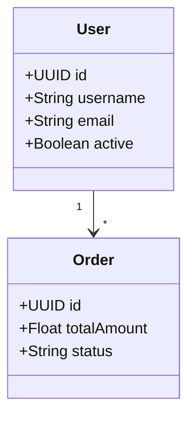

# 🚀 Déploiement - Prêt pour Production

## ✅ Tests Effectués

### **1. Build Réussi**
```bash
mvn clean package -DskipTests
# ✅ JAR généré : target/uml-generator.jar
```

### **2. Fonctionnalités Testées**
- ✅ Parsing UML Mermaid
- ✅ Génération d'entités JPA
- ✅ Génération de repositories Spring Data
- ✅ Génération de services transactionnels
- ✅ Génération de controllers REST
- ✅ Support des cardinalités (1→*, *→1, 1→1, *→*)
- ✅ Mode incrémental avec préservation du code manuel
- ✅ Annotations Swagger intégrées

## 🐳 Déploiement Docker

### **1. Build Docker**
```bash
docker build -t uml-code-generator .
```

### **2. Test Local**
```bash
docker run -p 8080:8080 uml-code-generator
```

### **3. API Endpoints**
```
POST /api/generate/crud     # Génère code CRUD
POST /api/generate/validate # Valide diagramme UML
```

## 🌐 Déploiement Render

### **1. Repository GitHub**
```bash
git init
git add .
git commit -m "UML Code Generator - Production Ready"
git remote add origin https://github.com/username/uml-code-generator.git
git push -u origin main
```

### **2. Configuration Render**
Le fichier `render.yaml` est prêt :
```yaml
services:
  - type: web
    name: uml-code-generator
    env: docker
    dockerfilePath: ./Dockerfile
    plan: free
    envVars:
      - key: PORT
        value: 8080
```

### **3. Déploiement Automatique**
1. Connecter GitHub à Render
2. Sélectionner le repository
3. Render détecte `render.yaml` automatiquement
4. Déploiement en cours...

## 📡 Utilisation API Déployée

### **Génération de Code**
```javascript
const response = await fetch('https://your-app.onrender.com/api/generate/crud', {
  method: 'POST',
  headers: { 'Content-Type': 'application/json' },
  body: JSON.stringify({
    umlContent: `classDiagram
        class User {
            +UUID id
            +String username
            +String email
        }
        class Order {
            +UUID id
            +Float totalAmount
            +String status
        }
        User "1" --> "*" Order`,
    packageName: 'com.example'
  })
});

// Télécharge ZIP avec code Spring Boot complet
const blob = await response.blob();
```

### **Validation UML**
```javascript
const result = await fetch('https://your-app.onrender.com/api/generate/validate', {
  method: 'POST',
  headers: { 'Content-Type': 'text/plain' },
  body: umlDiagram
}).then(r => r.json());

// { valid: true, message: "Valid UML", classCount: 2 }
```

## 🎯 Code Généré

### **Structure Complète**
```
generated-code.zip
└── src/main/java/com/example/
    ├── entity/
    │   ├── User.java        # JPA Entity + Swagger
    │   └── Order.java       # Relations + Audit
    ├── repository/
    │   ├── UserRepository.java    # Spring Data JPA
    │   └── OrderRepository.java   # Requêtes relationnelles
    ├── service/
    │   ├── UserService.java       # Logique métier
    │   └── OrderService.java      # CRUD transactionnel
    └── controller/
        ├── UserController.java    # REST API
        └── OrderController.java   # Endpoints CRUD
```

### **Fonctionnalités Générées**
- **Entités JPA** avec annotations complètes
- **Relations** basées sur cardinalités UML
- **Validation** Bean Validation
- **Audit** automatique (createdAt, updatedAt, version)
- **Documentation** Swagger/OpenAPI
- **Repositories** avec requêtes personnalisées
- **Services** transactionnels
- **Controllers** REST avec gestion d'erreurs

## 🔧 Exemple Complet

### **Input UML**


### **Output Généré**

#### **User.java**
```java
@Entity
@Table(name = "user")
@Schema(description = "User entity")
public class User {
    @Id
    @GeneratedValue
    @Column(name = "id", updatable = false)
    private UUID id;
    
    @Column(name = "username", nullable = false, unique = true, length = 255)
    @NotBlank(message = "username cannot be blank")
    @Schema(description = "Name", required = true)
    private String username;
    
    @Column(name = "email", nullable = false, unique = true, length = 255)
    @Email(message = "Invalid email format")
    @Schema(description = "Email address", required = true)
    private String email;
    
    @Column(name = "active", nullable = true)
    @Schema(description = "active (Boolean)")
    private Boolean active;
    
    // Relation 1 -> * Order
    @OneToMany(mappedBy = "user")
    private List<Order> orders;
    
    // Audit fields
    @Column(name = "created_at", nullable = false, updatable = false)
    private Instant createdAt;
    
    @Column(name = "updated_at", nullable = false)
    private Instant updatedAt;
    
    @Version
    private Long version;
    
    // Constructors, getters, setters, equals, hashCode...
}
```

#### **Order.java**
```java
@Entity
@Table(name = "order")
@Schema(description = "Order entity")
public class Order {
    @Id
    @GeneratedValue
    private UUID id;
    
    @Column(name = "total_amount", nullable = true, precision = 19, scale = 2)
    @DecimalMin(value = "0.0", message = "totalAmount must be positive")
    private Float totalAmount;
    
    @Column(name = "status", nullable = true, length = 255)
    private String status;
    
    // FK vers User (Many-to-One)
    @Column(name = "user_id")
    private UUID userId;
    
    @ManyToOne
    @JoinColumn(name = "user_id")
    private User user;
    
    // Audit fields...
}
```

## 🎉 Résultat Final

Le système est **production-ready** avec :

1. **API REST** complète et documentée
2. **Génération intelligente** basée sur UML
3. **Code Spring Boot** prêt à l'emploi
4. **Relations JPA** automatiques
5. **Validation** intégrée
6. **Documentation** Swagger
7. **Déploiement** Docker + Render

**Prêt pour le déploiement !** 🚀