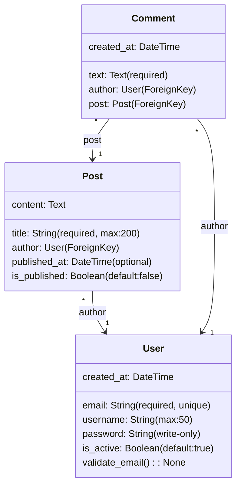
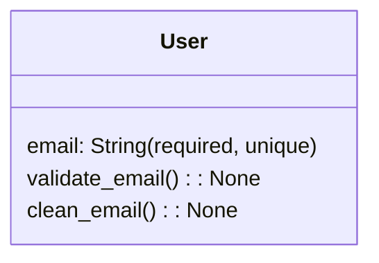
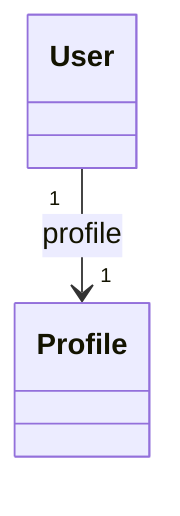

# 🐍 Django Implementation Guide

## Overview

Cette implémentation ajoute le support complet de **Django 5.0** au framework de génération de code avec:

- **DjangoProjectInitializer** - Génération de projets Django réactifs complets
- **DjangoModelParser** - Extraction de modèles à partir de diagrammes UML
- **DjangoModelGenerator** - Génération de code Django (models, serializers, viewsets)

## 📦 Architecture Django

```
PROJECT_NAME/
├── config/                         # Configuration Django
│   ├── settings/
│   │   ├── base.py                # Settings partagées
│   │   ├── development.py         # Config développement
│   │   ├── production.py          # Config production
│   │   └── test.py                # Config tests
│   ├── asgi.py                    # Async ASGI
│   ├── wsgi.py                    # WSGI (backward compat)
│   ├── urls.py                    # URL routing
│   ├── celery.py                  # Configuration Celery
│   └── __init__.py
│
├── apps/
│   ├── core/                       # App principale
│   │   ├── models.py              # Modèles Django
│   │   ├── admin.py               # Admin Django
│   │   ├── views.py               # Vues
│   │   ├── migrations/
│   │   ├── middleware.py          # Middleware
│   │   └── management/
│   │       └── commands/          # Commandes personnalisées
│   │
│   ├── api/                        # API REST (DRF)
│   │   ├── serializers.py         # Sérialiseurs DRF
│   │   ├── viewsets.py            # ViewSets DRF
│   │   ├── permissions.py         # Permissions personnalisées
│   │   ├── filters.py             # Filtres personnalisés
│   │   ├── exceptions.py          # Exception handlers
│   │   ├── urls.py                # URLs API
│   │   └── tests/                 # Tests API
│   │
│   └── tasks/                      # Tâches Celery
│       ├── tasks.py               # Tâches asynchrones
│       ├── jobs/                  # Job definitions
│       └── handlers.py            # Event handlers
│
├── static/                         # Fichiers statiques
├── media/                          # Fichiers uploadés
├── tests/                          # Suite de tests
│   ├── unit/                      # Tests unitaires
│   ├── integration/               # Tests d'intégration
│   └── fixtures/                  # Données de test
│
├── docker-compose.yml             # Orchestration Docker
├── Dockerfile                     # Image production
├── pyproject.toml                 # Dépendances (Poetry)
├── pytest.ini                     # Config pytest
└── manage.py                      # Commande Django
```

## 🚀 Quick Start

### 1. Initialiser un projet

```java
@Autowired
private DjangoProjectInitializer djangoInitializer;

public void initProject() throws Exception {
    Path projectPath = djangoInitializer.initializeProject(
        "my_django_project",
        "com.example"
    );
    System.out.println("✅ Projet Django créé: " + projectPath);
}
```

### 2. Parseun diagramme UML



### 3. Parser le diagramme

```java
@Autowired
private DjangoModelParser modelParser;

public void parseUML() {
    String umlContent = Files.readString(Path.of("diagram.mermaid"));
    DjangoModels models = modelParser.parse(umlContent);
    
    for (DjangoModel model : models.getModelsList()) {
        System.out.println("Model: " + model.getName());
        model.getFields().forEach(f -> 
            System.out.println("  - " + f.getName() + ": " + f.getFieldType())
        );
    }
}
```

### 4. Générer les models

```java
@Autowired
private DjangoModelGenerator modelGenerator;

public void generateModels() {
    String modelCode = modelGenerator.generateModels(models);
    Files.writeString(
        Path.of("apps/core/models.py"),
        modelCode
    );
    
    String serializerCode = modelGenerator.generateSerializers(models, "core");
    Files.writeString(
        Path.of("apps/api/serializers.py"),
        serializerCode
    );
}
```

## 📊 Mappage des types UML vers Django

| UML Type | Django Field | Python Type | Notes |
|----------|--------------|-------------|-------|
| `string` | `CharField` | `str` | Longueur max 255 |
| `String(max:N)` | `CharField(max_length=N)` | `str` | Max length N |
| `int` | `IntegerField` | `int` | 32-bit integer |
| `bigint` | `BigIntegerField` | `int` | 64-bit integer |
| `float` | `FloatField` | `float` | Single precision |
| `double` | `DecimalField` | `Decimal` | Précision arbitraire |
| `bool` | `BooleanField` | `bool` | True/False |
| `date` | `DateField` | `date` | YYYY-MM-DD |
| `datetime` | `DateTimeField` | `datetime` | Timestamp |
| `time` | `TimeField` | `time` | HH:MM:SS |
| `text` | `TextField` | `str` | Texte long |
| `email` | `EmailField` | `str` | Validé email |
| `uuid` | `UUIDField` | `UUID` | UUID unique |
| `json` | `JSONField` | `dict/list` | JSON |
| `slug` | `SlugField` | `str` | URL slug |
| `url` | `URLField` | `str` | URL validée |

## 🔗 Contraintes et Validateurs

### Syntaxe des contraintes

```
fieldName: Type(constraint1, constraint2, ...)
```

### Contraintes disponibles

| Contrainte | Description | Exemple |
|-----------|-------------|---------|
| `required` | Champ obligatoire | `email: String(required)` |
| `optional` | Champ optionnel | `bio: Text(optional)` |
| `unique` | Valeur unique | `username: String(unique)` |
| `index` | Index base de données | `slug: String(index)` |
| `max:N` | Longueur max | `title: String(max:200)` |
| `min:N` | Valeur min | `age: int(min:18)` |
| `default:VAL` | Valeur par défaut | `is_active: bool(default:true)` |

### Méthodes de validation



Les méthodes `validate_*` ou `clean_*` sont converties en méthodes de validation Django:

```python
class User(BaseModel):
    email = models.EmailField(unique=True)
    
    def validate_email(self):
        """Validate email"""
        if User.objects.filter(email=self.email).exists():
            raise ValidationError("Email already exists")
    
    def clean_email(self):
        """Clean email field"""
        self.email = self.email.lower()
```

## 🔄 Relations

### ForeignKey (1-to-Many)


Génère:

```python
class Post(BaseModel):
    author = models.ForeignKey(User, on_delete=models.CASCADE)
```

### OneToOneField (1-to-1)



Génère:

```python
class Profile(BaseModel):
    user = models.OneToOneField(User, on_delete=models.CASCADE)
```

### ManyToManyField (Many-to-Many)


Génère:

```python
class Post(BaseModel):
    tags = models.ManyToManyField(Tag)
```

## 🐳 Docker Compose

Le projet généré inclut `docker-compose.yml` avec:

- **PostgreSQL 15** - Base de données relationnelle
- **Redis 7** - Cache et broker Celery
- **Web** - Application Django (Gunicorn)
- **Celery** - Worker asynchrone
- **Celery Beat** - Scheduler

### Lancer les services

```bash
# Démarrer tous les services
docker-compose up -d

# Afficher les logs
docker-compose logs -f

# Exécuter les migrations
docker-compose exec web python manage.py migrate

# Créer un superutilisateur
docker-compose exec web python manage.py createsuperuser
```

### Configuration

Le fichier `.env` contient les variables:

```env
DEBUG=True
SECRET_KEY=dev-secret-key
DATABASE_URL=postgresql://postgres:postgres@db:5432/django_db
REDIS_URL=redis://:redis_password@redis:6379/0
```

## 📚 Django REST Framework

### Sérialiseurs générés

Pour chaque modèle, un sérialiseur DRF est généré:

```python
class UserSerializer(serializers.ModelSerializer):
    class Meta:
        model = User
        fields = ['id', 'email', 'first_name', 'last_name', 'is_active', 'created_at']
        read_only_fields = ['id', 'created_at']
```

### ViewSets générés

```python
class UserViewSet(viewsets.ModelViewSet):
    queryset = User.objects.all()
    serializer_class = UserSerializer
    permission_classes = [IsAuthenticated]
    filter_backends = [DjangoFilterBackend, SearchFilter, OrderingFilter]
    filterset_fields = ['is_active']
    search_fields = ['email', 'first_name']
    ordering = ['-created_at']
```

### Routes automatiques

Les routes REST standard sont générées:

| Method | URL | Action |
|--------|-----|--------|
| GET | `/api/v1/users/` | List |
| POST | `/api/v1/users/` | Create |
| GET | `/api/v1/users/{id}/` | Retrieve |
| PUT | `/api/v1/users/{id}/` | Update |
| PATCH | `/api/v1/users/{id}/` | Partial Update |
| DELETE | `/api/v1/users/{id}/` | Destroy |

### Custom Actions

```python
@action(detail=False, methods=['get'])
def me(self, request):
    """Get current user"""
    serializer = self.get_serializer(request.user)
    return Response(serializer.data)
```

## 🔐 Authentification

### JWT Tokens

```bash
# Obtenir un token
curl -X POST http://localhost:8000/api/v1/auth/token/ \
  -H "Content-Type: application/json" \
  -d '{"email":"user@example.com","password":"password"}'

# Response
{
  "access": "eyJ0eXAiOiJKV1QiLCJhbGc...",
  "refresh": "eyJ0eXAiOiJKV1QiLCJhbGc..."
}

# Utiliser le token
curl -H "Authorization: Bearer <access_token>" \
  http://localhost:8000/api/v1/users/
```

### Permissions personnalisées

```python
class IsOwnerOrReadOnly(permissions.BasePermission):
    def has_object_permission(self, request, view, obj):
        if request.method in permissions.SAFE_METHODS:
            return True
        return obj.author == request.user
```

## 📅 Celery Tasks

### Définir une tâche

```python
from celery import shared_task

@shared_task
def send_welcome_email(user_id):
    user = User.objects.get(id=user_id)
    # Send email logic
    return f"Email sent to {user.email}"
```

### Appeler une tâche

```python
# Exécution asynchrone
send_welcome_email.delay(user_id)

# Exécution différée (dans 1 heure)
send_welcome_email.apply_async(
    args=[user_id],
    countdown=3600
)

# Exécution périodique (voir beat_schedule)
```

### Scheduled Tasks

Le fichier `config/celery.py` définit les tâches planifiées:

```python
app.conf.beat_schedule = {
    'cleanup-sessions': {
        'task': 'apps.tasks.tasks.cleanup_sessions',
        'schedule': crontab(hour=2, minute=0),
    },
}
```

Lancer Celery Beat:

```bash
celery -A config beat -l info
```

## 🧪 Tests

### Structure des tests

```
tests/
├── conftest.py                # Fixtures pytest
├── unit/
│   ├── test_models.py
│   ├── test_serializers.py
│   └── test_views.py
└── integration/
    └── test_api.py
```

### Fixtures pytest

```python
@pytest.fixture
def api_client():
    return APIClient()

@pytest.fixture
def test_user():
    return User.objects.create_user(
        email='test@example.com',
        password='testpass123'
    )
```

### Tests unitaires

```python
@pytest.mark.django_db
def test_user_creation(test_user):
    assert test_user.email == 'test@example.com'
    assert test_user.is_active
```

### Tests d'API

```python
@pytest.mark.django_db
def test_list_users(authenticated_client):
    response = authenticated_client.get('/api/v1/users/')
    assert response.status_code == 200
```

Lancer les tests:

```bash
# Tous les tests
pytest

# Avec coverage
pytest --cov=apps

# Tests spécifiques
pytest tests/unit/test_models.py
```

## 🔍 Commandes Django

### Migrations

```bash
# Créer les migrations
python manage.py makemigrations

# Appliquer les migrations
python manage.py migrate

# État des migrations
python manage.py showmigrations
```

### Shell Django

```bash
python manage.py shell

# Dans le shell
>>> from apps.core.models import User
>>> User.objects.create_user('test@example.com', 'password')
>>> User.objects.all()
```

### Commandes personnalisées

```bash
# Créer une commande
python manage.py startapp myapp
python manage.py startcommand mycommand

# Structure
apps/myapp/management/commands/mycommand.py
```

## 🌐 CORS et Security

### CORS Configuration

```python
# settings/base.py
CORS_ALLOWED_ORIGINS = [
    'http://localhost:3000',
    'http://localhost:8000',
]
```

### Security Headers

```python
# settings/production.py
SECURE_SSL_REDIRECT = True
SESSION_COOKIE_SECURE = True
CSRF_COOKIE_SECURE = True
SECURE_HSTS_SECONDS = 31536000
X_FRAME_OPTIONS = 'DENY'
```

## 📈 Performance

### Database Optimization

```python
# select_related pour ForeignKey/OneToOne
users = User.objects.select_related('profile')

# prefetch_related pour reverse relations
users = User.objects.prefetch_related('posts')

# Filtrer avant prefetch
users = User.objects.prefetch_related(
    Prefetch('posts', queryset=Post.objects.filter(published=True))
)
```

### Caching

```python
from django.views.decorators.cache import cache_page

@cache_page(60)  # Cache 60 secondes
def get_users(request):
    return Response(User.objects.all().values())
```

### Query Optimization

```bash
# Afficher les requêtes SQL
python manage.py shell --command="
from django.db import connection
from apps.core.models import User
list(User.objects.all())
print(connection.queries)
"
```

## 📝 Checklist de déploiement

- [ ] `DEBUG = False` en production
- [ ] `SECRET_KEY` généré aléatoirement
- [ ] `ALLOWED_HOSTS` configuré
- [ ] Base de données PostgreSQL configurée
- [ ] Redis configuré pour cache/broker
- [ ] HTTPS/TLS activé
- [ ] Logs configurés
- [ ] Backups configurés
- [ ] Monitoring (Sentry, New Relic)
- [ ] Load balancer (Nginx)
- [ ] Health checks configurés
- [ ] Rate limiting activé

## 🔗 Ressources

- [Django Documentation](https://docs.djangoproject.com/)
- [Django REST Framework](https://www.django-rest-framework.org/)
- [Celery Documentation](https://docs.celeryproject.io/)
- [Poetry](https://python-poetry.org/)
- [PostgreSQL](https://www.postgresql.org/)
- [Redis](https://redis.io/)

## 📞 Support

Pour les problèmes:

1. Vérifier les logs: `docker-compose logs web`
2. Exécuter les migrations: `docker-compose exec web python manage.py migrate`
3. Créer un issue sur GitHub
4. Consulter la documentation Django

---

**Generated by basicCode v2.0**  
Django 5.0 support with DRF, Celery, Redis, and PostgreSQL
