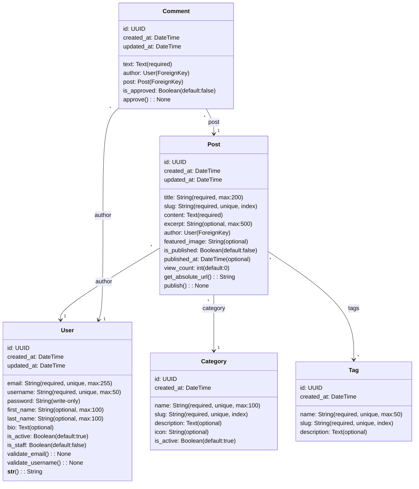

# 🐍 Django Real-World Example: Blog Platform

## Scénario: Blog Platform avec Users, Posts, Comments, Tags

### UML Diagram



## 📝 Generated Django Models

### Step 1: Parse UML Diagram

```python
from com.basiccode.generator.parser import DjangoModelParser
from pathlib import Path

parser = DjangoModelParser()
uml_content = Path("blog_diagram.mermaid").read_text()
models = parser.parse(uml_content)

# Output:
# Found 5 models:
#   - User (5 fields, 2 validators)
#   - Post (10 fields, 2 methods)
#   - Comment (5 fields)
#   - Tag (4 fields)
#   - Category (5 fields)
```

### Step 2: Generate models.py

Generated code:

```python
from django.db import models
from django.core.validators import (
    EmailValidator, URLValidator, MinValueValidator,
    MaxValueValidator, RegexValidator, FileExtensionValidator
)
from django.utils.translation import gettext_lazy as _
from django.utils import timezone
from django.db.models.signals import post_save, pre_save
from django.dispatch import receiver
from django.core.exceptions import ValidationError
import uuid
import json


class BaseModel(models.Model):
    """Base model with common fields"""
    id = models.UUIDField(primary_key=True, default=uuid.uuid4, editable=False)
    created_at = models.DateTimeField(auto_now_add=True, verbose_name=_('Created at'))
    updated_at = models.DateTimeField(auto_now=True, verbose_name=_('Updated at'))
    
    class Meta:
        abstract = True
        ordering = ['-created_at']
    
    def __repr__(self):
        return f"<{self.__class__.__name__}: {self.id}>"


class ActiveManager(models.Manager):
    """Manager for active objects only"""
    def get_queryset(self):
        return super().get_queryset().filter(is_active=True)


class TimestampManager(models.Manager):
    """Manager with timestamp utilities"""
    def recent(self, days=7):
        from datetime import timedelta
        cutoff = timezone.now() - timedelta(days=days)
        return self.filter(created_at__gte=cutoff)
    
    def today(self):
        return self.filter(created_at__date=timezone.now().date())


class User(BaseModel):
    """Blog user model"""
    email = models.EmailField(unique=True, max_length=255)
    username = models.CharField(unique=True, max_length=50)
    password = models.CharField(max_length=255)  # Write-only in API
    first_name = models.CharField(blank=True, max_length=100)
    last_name = models.CharField(blank=True, max_length=100)
    bio = models.TextField(blank=True, null=True)
    is_active = models.BooleanField(default=True)
    is_staff = models.BooleanField(default=False)
    
    objects = models.Manager()
    active = ActiveManager()
    
    class Meta:
        verbose_name = _('user')
        verbose_name_plural = _('users')
        ordering = ['-created_at']
    
    def __str__(self):
        return self.email
    
    def validate_email(self):
        """Validate email field"""
        if User.objects.filter(email=self.email).exclude(id=self.id).exists():
            raise ValidationError("Email already exists")
    
    def validate_username(self):
        """Validate username field"""
        if len(self.username) < 3:
            raise ValidationError("Username must be at least 3 characters long")


class Category(BaseModel):
    """Blog category"""
    name = models.CharField(unique=True, max_length=100)
    slug = models.SlugField(unique=True, db_index=True)
    description = models.TextField(blank=True, null=True)
    icon = models.CharField(blank=True, max_length=255)
    is_active = models.BooleanField(default=True)
    
    objects = models.Manager()
    active = ActiveManager()
    
    class Meta:
        verbose_name = _('category')
        verbose_name_plural = _('categories')
        ordering = ['name']
    
    def __str__(self):
        return self.name


class Tag(BaseModel):
    """Blog tag"""
    name = models.CharField(unique=True, max_length=50)
    slug = models.SlugField(unique=True, db_index=True)
    description = models.TextField(blank=True, null=True)
    
    objects = models.Manager()
    
    class Meta:
        verbose_name = _('tag')
        verbose_name_plural = _('tags')
        ordering = ['name']
    
    def __str__(self):
        return self.name


class Post(BaseModel):
    """Blog post"""
    title = models.CharField(unique=True, max_length=200)
    slug = models.SlugField(unique=True, db_index=True)
    content = models.TextField(blank=False)
    excerpt = models.CharField(blank=True, max_length=500)
    author = models.ForeignKey(User, on_delete=models.CASCADE)
    category = models.ForeignKey(Category, on_delete=models.CASCADE)
    tags = models.ManyToManyField(Tag)
    featured_image = models.CharField(blank=True, max_length=255)
    is_published = models.BooleanField(default=False)
    published_at = models.DateTimeField(blank=True, null=True)
    view_count = models.IntegerField(default=0)
    
    objects = models.Manager()
    
    class Meta:
        verbose_name = _('post')
        verbose_name_plural = _('posts')
        ordering = ['-created_at']
    
    def __str__(self):
        return self.title
    
    def get_absolute_url(self):
        """Get post URL"""
        return f"/posts/{self.slug}/"
    
    def publish(self):
        """Publish the post"""
        self.is_published = True
        self.published_at = timezone.now()
        self.save()


class Comment(BaseModel):
    """Blog comment"""
    text = models.TextField(blank=False)
    author = models.ForeignKey(User, on_delete=models.CASCADE)
    post = models.ForeignKey(Post, on_delete=models.CASCADE)
    is_approved = models.BooleanField(default=False)
    
    objects = models.Manager()
    
    class Meta:
        verbose_name = _('comment')
        verbose_name_plural = _('comments')
        ordering = ['-created_at']
    
    def __str__(self):
        return f"Comment by {self.author} on {self.post}"
    
    def approve(self):
        """Approve the comment"""
        self.is_approved = True
        self.save()


# Signal handlers
@receiver(post_save, sender=User)
def user_post_save(sender, instance, created, **kwargs):
    """Handle User post-save signal"""
    if created:
        import logging
        logger = logging.getLogger(__name__)
        logger.info(f'User created: {instance.id}')


@receiver(post_save, sender=Post)
def post_post_save(sender, instance, created, **kwargs):
    """Handle Post post-save signal"""
    if created:
        import logging
        logger = logging.getLogger(__name__)
        logger.info(f'Post created: {instance.id}')
```

### Step 3: Generate serializers.py

```python
from rest_framework import serializers
from apps.core.models import (
    User,
    Post,
    Comment,
    Tag,
    Category,
)


class UserSerializer(serializers.ModelSerializer):
    """Serializer for User"""
    class Meta:
        model = User
        fields = ['id', 'email', 'username', 'first_name', 'last_name', 'bio', 
                  'is_active', 'created_at', 'updated_at']
        read_only_fields = ['id', 'created_at', 'updated_at']


class TagSerializer(serializers.ModelSerializer):
    """Serializer for Tag"""
    class Meta:
        model = Tag
        fields = ['id', 'name', 'slug', 'description', 'created_at']
        read_only_fields = ['id', 'created_at']


class CategorySerializer(serializers.ModelSerializer):
    """Serializer for Category"""
    class Meta:
        model = Category
        fields = ['id', 'name', 'slug', 'description', 'icon', 'is_active', 'created_at']
        read_only_fields = ['id', 'created_at']


class PostListSerializer(serializers.ModelSerializer):
    """List serializer for Post (lightweight)"""
    author = UserSerializer(read_only=True)
    category = CategorySerializer(read_only=True)
    
    class Meta:
        model = Post
        fields = ['id', 'title', 'slug', 'excerpt', 'author', 'category', 
                  'is_published', 'published_at', 'view_count', 'created_at']
        read_only_fields = ['id', 'created_at', 'view_count']


class PostDetailSerializer(serializers.ModelSerializer):
    """Detail serializer for Post (full content)"""
    author = UserSerializer(read_only=True)
    category = CategorySerializer(read_only=True)
    tags = TagSerializer(many=True, read_only=True)
    
    class Meta:
        model = Post
        fields = ['id', 'title', 'slug', 'content', 'excerpt', 'author', 'category',
                  'tags', 'featured_image', 'is_published', 'published_at', 
                  'view_count', 'created_at', 'updated_at']
        read_only_fields = ['id', 'created_at', 'updated_at', 'view_count']


class CommentSerializer(serializers.ModelSerializer):
    """Serializer for Comment"""
    author = UserSerializer(read_only=True)
    
    class Meta:
        model = Comment
        fields = ['id', 'text', 'author', 'post', 'is_approved', 'created_at', 'updated_at']
        read_only_fields = ['id', 'created_at', 'updated_at']
```

### Step 4: Generate viewsets.py

```python
from rest_framework import viewsets, status
from rest_framework.decorators import action
from rest_framework.response import Response
from rest_framework.permissions import IsAuthenticated, IsAdminUser, AllowAny
from django_filters.rest_framework import DjangoFilterBackend
from rest_framework.filters import SearchFilter, OrderingFilter
from apps.core.models import (
    User, Post, Comment, Tag, Category
)
from apps.api.serializers import (
    UserSerializer, PostListSerializer, PostDetailSerializer,
    CommentSerializer, TagSerializer, CategorySerializer
)


class UserViewSet(viewsets.ModelViewSet):
    """ViewSet for User"""
    queryset = User.objects.all()
    serializer_class = UserSerializer
    permission_classes = [IsAuthenticated]
    filter_backends = [DjangoFilterBackend, SearchFilter, OrderingFilter]
    filterset_fields = ['is_active', 'is_staff']
    search_fields = ['email', 'username', 'first_name', 'last_name']
    ordering_fields = ['created_at']
    ordering = ['-created_at']
    
    @action(detail=False, methods=['get'])
    def me(self, request):
        """Get current user"""
        serializer = self.get_serializer(request.user)
        return Response(serializer.data)


class CategoryViewSet(viewsets.ModelViewSet):
    """ViewSet for Category"""
    queryset = Category.objects.filter(is_active=True)
    serializer_class = CategorySerializer
    permission_classes = [AllowAny]
    filter_backends = [SearchFilter, OrderingFilter]
    search_fields = ['name', 'description']
    ordering_fields = ['name', 'created_at']
    ordering = ['name']


class TagViewSet(viewsets.ModelViewSet):
    """ViewSet for Tag"""
    queryset = Tag.objects.all()
    serializer_class = TagSerializer
    permission_classes = [AllowAny]
    filter_backends = [SearchFilter, OrderingFilter]
    search_fields = ['name', 'description']
    ordering_fields = ['name', 'created_at']
    ordering = ['name']


class PostViewSet(viewsets.ModelViewSet):
    """ViewSet for Post"""
    queryset = Post.objects.filter(is_published=True)
    permission_classes = [AllowAny]
    filter_backends = [DjangoFilterBackend, SearchFilter, OrderingFilter]
    filterset_fields = ['category', 'is_published', 'author']
    search_fields = ['title', 'content', 'excerpt']
    ordering_fields = ['created_at', 'published_at', 'view_count']
    ordering = ['-published_at']
    
    def get_serializer_class(self):
        if self.action == 'retrieve':
            return PostDetailSerializer
        return PostListSerializer
    
    def get_permissions(self):
        if self.action in ['create', 'update', 'partial_update', 'destroy']:
            permission_classes = [IsAuthenticated]
        else:
            permission_classes = [AllowAny]
        return [permission() for permission in permission_classes]
    
    @action(detail=True, methods=['post'])
    def publish(self, request, pk=None):
        """Publish a post"""
        post = self.get_object()
        if post.author != request.user:
            return Response(
                {'error': 'Not authorized'},
                status=status.HTTP_403_FORBIDDEN
            )
        post.publish()
        serializer = self.get_serializer(post)
        return Response(serializer.data)
    
    @action(detail=True, methods=['post'])
    def increment_views(self, request, pk=None):
        """Increment view count"""
        post = self.get_object()
        post.view_count += 1
        post.save()
        return Response({'view_count': post.view_count})


class CommentViewSet(viewsets.ModelViewSet):
    """ViewSet for Comment"""
    serializer_class = CommentSerializer
    permission_classes = [IsAuthenticated]
    filter_backends = [DjangoFilterBackend, SearchFilter, OrderingFilter]
    filterset_fields = ['post', 'is_approved', 'author']
    search_fields = ['text']
    ordering_fields = ['created_at']
    ordering = ['-created_at']
    
    def get_queryset(self):
        # Users can only see their own unapproved comments
        # Everyone can see approved comments
        user = self.request.user
        if user.is_staff:
            return Comment.objects.all()
        else:
            return Comment.objects.filter(
                models.Q(is_approved=True) | models.Q(author=user)
            )
    
    def perform_create(self, serializer):
        serializer.save(author=self.request.user)
    
    @action(detail=True, methods=['post'], permission_classes=[IsAdminUser])
    def approve(self, request, pk=None):
        """Approve a comment"""
        comment = self.get_object()
        comment.approve()
        serializer = self.get_serializer(comment)
        return Response(serializer.data)
```

## 🧪 Test Example

```python
import pytest
from django.test import Client
from rest_framework.test import APIClient
from rest_framework_simplejwt.tokens import RefreshToken
from apps.core.models import User, Post, Category


@pytest.fixture
def api_client():
    return APIClient()


@pytest.fixture
def test_user():
    return User.objects.create_user(
        email='test@example.com',
        username='testuser',
        password='testpass123'
    )


@pytest.fixture
def authenticated_client(api_client, test_user):
    refresh = RefreshToken.for_user(test_user)
    api_client.credentials(HTTP_AUTHORIZATION=f'Bearer {refresh.access_token}')
    return api_client


@pytest.mark.django_db
class TestUserAPI:
    def test_list_users_requires_auth(self, api_client):
        response = api_client.get('/api/v1/users/')
        assert response.status_code == 401
    
    def test_list_users_authenticated(self, authenticated_client):
        response = authenticated_client.get('/api/v1/users/')
        assert response.status_code == 200
    
    def test_get_current_user(self, authenticated_client, test_user):
        response = authenticated_client.get('/api/v1/users/me/')
        assert response.status_code == 200
        assert response.data['email'] == test_user.email


@pytest.mark.django_db
class TestPostAPI:
    def test_list_published_posts(self, api_client):
        category = Category.objects.create(name='Tech', slug='tech')
        user = User.objects.create_user('author@example.com', 'author', 'pass')
        Post.objects.create(
            title='First Post',
            slug='first-post',
            content='Content',
            author=user,
            category=category,
            is_published=True
        )
        
        response = api_client.get('/api/v1/posts/')
        assert response.status_code == 200
        assert len(response.data) == 1
    
    def test_create_post_requires_auth(self, api_client):
        response = api_client.post('/api/v1/posts/', {
            'title': 'New Post',
            'slug': 'new-post',
            'content': 'Content'
        })
        assert response.status_code == 401
    
    def test_publish_post(self, authenticated_client, test_user):
        category = Category.objects.create(name='Tech', slug='tech')
        post = Post.objects.create(
            title='Draft Post',
            slug='draft-post',
            content='Content',
            author=test_user,
            category=category,
            is_published=False
        )
        
        response = authenticated_client.post(
            f'/api/v1/posts/{post.id}/publish/'
        )
        assert response.status_code == 200
        assert response.data['is_published'] is True
```

## 📊 API Usage Example

### Create User

```bash
curl -X POST http://localhost:8000/api/v1/users/ \
  -H "Content-Type: application/json" \
  -d '{
    "email": "user@example.com",
    "username": "john_doe",
    "password": "secure_password"
  }'
```

### Get JWT Token

```bash
curl -X POST http://localhost:8000/api/v1/auth/token/ \
  -H "Content-Type: application/json" \
  -d '{
    "email": "user@example.com",
    "password": "secure_password"
  }'
```

### Create Post (Authenticated)

```bash
curl -X POST http://localhost:8000/api/v1/posts/ \
  -H "Authorization: Bearer <token>" \
  -H "Content-Type: application/json" \
  -d '{
    "title": "Django Tips",
    "slug": "django-tips",
    "content": "Here are some Django tips...",
    "category": 1,
    "tags": [1, 2, 3]
  }'
```

### List Posts with Filtering

```bash
# Filter by category
curl http://localhost:8000/api/v1/posts/?category=1

# Search in title
curl http://localhost:8000/api/v1/posts/?search=django

# Order by date
curl http://localhost:8000/api/v1/posts/?ordering=-created_at

# Pagination
curl http://localhost:8000/api/v1/posts/?page=2
```

### Publish Post

```bash
curl -X POST http://localhost:8000/api/v1/posts/123/publish/ \
  -H "Authorization: Bearer <token>"
```

---

**This blog platform demonstrates:**
- ✅ Complete model definitions with relationships
- ✅ Serializers for list and detail views
- ✅ ViewSets with custom actions
- ✅ Permission and authentication handling
- ✅ Filtering, searching, and ordering
- ✅ Signal handlers for business logic
- ✅ Comprehensive testing examples

Generated by basicCode v2.0 - Django 5.0
