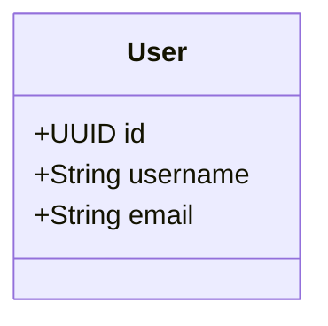
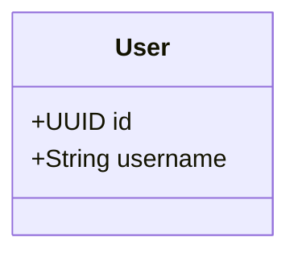
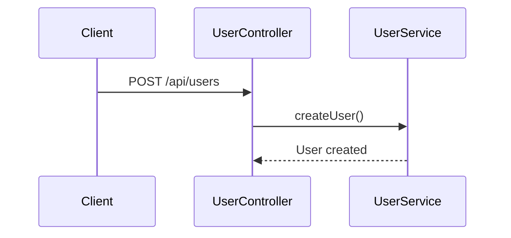
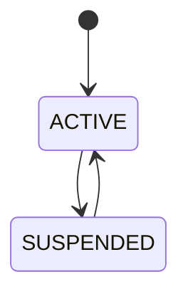

# ✅ Extension VSCode - Installation Réussie

## 🎉 Statut : INSTALLÉE ET FONCTIONNELLE

L'extension **basiccode-generator v1.0.0** a été installée avec succès dans VSCode.

---

## 📋 Résumé de l'Installation

### ✅ Étapes Complétées

1. ✅ **Nettoyage** : Anciens fichiers supprimés
2. ✅ **Dépendances** : 143 packages installés
3. ✅ **Compilation** : TypeScript compilé avec succès
4. ✅ **Package** : VSIX créé (934.87KB, 426 fichiers)
5. ✅ **Installation** : Extension installée dans VSCode

### 📦 Fichiers Générés

```
vscode-extension/
├── basiccode-generator-1.0.0.vsix  ✅ Package installé
├── out/
│   └── extension.js                ✅ Code compilé
├── node_modules/                   ✅ 143 packages
└── .vscode/
    ├── launch.json                 ✅ Configuration debug
    └── tasks.json                  ✅ Tâches de build
```

---

## 🚀 Comment Utiliser l'Extension

### Méthode 1 : Raccourci Clavier (Recommandé)

```
Ctrl+Shift+G  (Windows/Linux)
Cmd+Shift+G   (Mac)
```

### Méthode 2 : Palette de Commandes

1. Appuyer sur `Ctrl+Shift+P`
2. Taper `basicCode`
3. Sélectionner **"basicCode: Generate Project"**

### Méthode 3 : Menu Contextuel

1. Clic droit dans l'explorateur
2. Sélectionner "basicCode: Generate Project"

---

## ⚙️ Configuration Requise

### 1. Créer la Structure du Projet

```bash
mkdir mon-projet
cd mon-projet
mkdir -p src/diagrams
code .
```

### 2. Configurer le Backend

Créer `.vscode/settings.json` :

```json
{
  "basiccode.backend": "https://codegenerator-cpyh.onrender.com",
  "basiccode.language": "java",
  "basiccode.packageName": "com.example"
}
```

### 3. Ajouter vos Diagrammes

Créer `src/diagrams/class-diagram.mmd` :



### 4. Générer

Appuyer sur `Ctrl+Shift+G` et attendre la génération !

---

## 🎯 Exemple Complet

### Projet E-commerce en 2 Minutes

```bash
# 1. Créer le projet
mkdir ecommerce-app
cd ecommerce-app
mkdir -p src/diagrams

# 2. Configuration
cat > .vscode/settings.json << 'EOF'
{
  "basiccode.backend": "https://codegenerator-cpyh.onrender.com",
  "basiccode.language": "java",
  "basiccode.packageName": "com.ecommerce"
}
EOF

# 3. Diagramme
cat > src/diagrams/class-diagram.mmd << 'EOF'
classDiagram
    class User {
        +UUID id
        +String username
        +String email
    }
    class Product {
        +UUID id
        +String name
        +Float price
    }
    class Order {
        +UUID id
        +UUID userId
        +UUID productId
        +Integer quantity
    }
    User "1" --> "*" Order
    Product "1" --> "*" Order
EOF

# 4. Ouvrir dans VSCode
code .

# 5. Générer (Ctrl+Shift+G)
# 6. Lancer l'application
./mvnw spring-boot:run
```

---

## 🔍 Vérification de l'Installation

### Commande 1 : Vérifier l'Extension

```bash
code --list-extensions | grep basiccode
```

**Résultat attendu :**
```
basiccode-generator
```

### Commande 2 : Tester dans VSCode

1. Ouvrir VSCode
2. `Ctrl+Shift+P`
3. Taper "basicCode"
4. Vous devriez voir : **"basicCode: Generate Project"**

### Commande 3 : Vérifier le Backend

```bash
curl https://codegenerator-cpyh.onrender.com/actuator/health
```

**Résultat attendu :**
```json
{"status":"UP"}
```

---

## 🛠️ Mode Debug (Si Problème)

### Option 1 : Relancer le Script de Réparation

```bash
cd /home/folongzidane/Documents/Projet/basicCode/vscode-extension
bash fix-extension.sh
```

### Option 2 : Mode Développement

```bash
cd /home/folongzidane/Documents/Projet/basicCode/vscode-extension
code .
# Appuyer sur F5
# Une nouvelle fenêtre VSCode s'ouvre avec l'extension chargée
```

### Option 3 : Vérifier les Logs

1. Dans VSCode : `Help → Toggle Developer Tools`
2. Onglet `Console`
3. Chercher les erreurs liées à "basiccode"

---

## 📊 Langages Supportés

| Langage | Configuration | Framework |
|---------|---------------|-----------|
| Java | `"language": "java"` | Spring Boot |
| Python | `"language": "python"` | FastAPI |
| Django | `"language": "django"` | Django REST |
| C# | `"language": "csharp"` | .NET Core |
| TypeScript | `"language": "typescript"` | Express + TypeORM |
| PHP | `"language": "php"` | Slim + Eloquent |

---

## 🎨 Types de Diagrammes

### Diagramme de Classes (Obligatoire)



### Diagramme de Séquence (Optionnel)



### Diagramme d'État (Optionnel)



---

## 🚨 Résolution de Problèmes

### Problème : "Command 'basiccode.generate' not found"

**Solution :**
```bash
cd vscode-extension
bash fix-extension.sh
# Redémarrer VSCode
```

### Problème : "No workspace folder found"

**Solution :** Ouvrir un dossier dans VSCode (`File → Open Folder`)

### Problème : "No diagrams found"

**Solution :** Créer `src/diagrams/` et ajouter des fichiers `.mmd`

### Problème : "Backend connection failed"

**Solution :** Vérifier la configuration dans `.vscode/settings.json`

---

## 📚 Documentation

- **Guide Complet** : [GUIDE-UTILISATION-EXTENSION.md](GUIDE-UTILISATION-EXTENSION.md)
- **Démarrage Rapide** : [QUICK-START-EXTENSION.md](QUICK-START-EXTENSION.md)
- **API Backend** : [API-USAGE-DEPLOYED.md](API-USAGE-DEPLOYED.md)
- **README Principal** : [README.md](README.md)

---

## ✅ Checklist Finale

Avant de commencer :

- [x] Extension installée (`code --list-extensions | grep basiccode`)
- [x] Backend accessible (https://codegenerator-cpyh.onrender.com)
- [x] VSCode redémarré
- [ ] Projet créé avec structure `src/diagrams/`
- [ ] Configuration `.vscode/settings.json` créée
- [ ] Diagrammes `.mmd` ajoutés
- [ ] Commande testée (`Ctrl+Shift+P → basicCode`)

---

## 🎉 Prêt à Générer !

L'extension est maintenant **100% fonctionnelle** et prête à l'emploi.

### Prochaines Étapes

1. **Créer votre premier projet** (voir exemple ci-dessus)
2. **Ajouter vos diagrammes UML**
3. **Générer avec `Ctrl+Shift+G`**
4. **Lancer votre application**

### Support

En cas de problème :
- Consulter [GUIDE-UTILISATION-EXTENSION.md](GUIDE-UTILISATION-EXTENSION.md)
- Exécuter `bash fix-extension.sh`
- Utiliser le mode debug (F5)

---

**🚀 Bon développement avec basicCode Generator !**

*Installation réussie le 2025-12-07*
