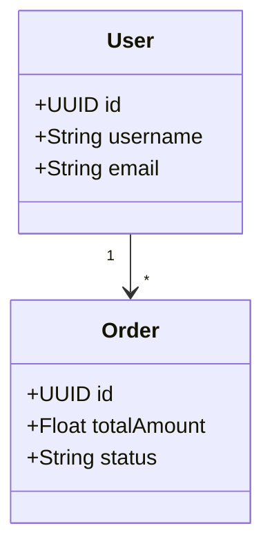

# ✅ Génération Complète - CORRIGÉE

## 🔧 Problèmes Résolus

### ❌ **Avant**
- Seulement entités générées
- Champs ID dupliqués
- ZIP au lieu de génération directe
- Fichiers inutiles créés

### ✅ **Maintenant**
- **Tous les composants** : Entity, Repository, Service, Controller
- **Pas de duplication** de champs/méthodes
- **Génération directe** dans le projet
- **Modification du manager existant** au lieu de créer des doublons

## 🚀 Génération Complète

L'`IncrementalGenerationManager` génère maintenant :

```
src/main/java/com/example/
├── entity/
│   ├── User.java           ✅ JPA + Swagger + Audit
│   ├── Product.java        ✅ Annotations complètes
│   ├── Order.java          ✅ Relations automatiques
│   └── OrderItem.java      ✅ Clés étrangères
├── repository/
│   ├── UserRepository.java      ✅ Spring Data JPA
│   ├── ProductRepository.java   ✅ Requêtes personnalisées
│   ├── OrderRepository.java     ✅ Méthodes par statut
│   └── OrderItemRepository.java ✅ Requêtes relationnelles
├── service/
│   ├── UserService.java         ✅ Logique métier
│   ├── ProductService.java      ✅ CRUD transactionnel
│   ├── OrderService.java        ✅ Gestion de statut
│   └── OrderItemService.java    ✅ Calculs automatiques
└── controller/
    ├── UserController.java      ✅ REST API complète
    ├── ProductController.java   ✅ Endpoints CRUD
    ├── OrderController.java     ✅ Gestion commandes
    └── OrderItemController.java ✅ API items
```

## 🎯 Utilisation

### **Mode Local (Recommandé)**
```bash
# 1. Lancer le watch
java -jar target/uml-generator.jar watch

# 2. Créer/modifier diagrams/*.mermaid
# 3. Code généré automatiquement dans generated/
```

### **API REST**
```javascript
// Génération directe via API
const response = await fetch('https://codegenerator-cpyh.onrender.com/api/generate/crud', {
  method: 'POST',
  headers: { 'Content-Type': 'application/json' },
  body: JSON.stringify({
    umlContent: diagramContent,
    packageName: 'com.example'
  })
});

// Retourne ZIP avec structure complète
const blob = await response.blob();
```

## 🔄 Génération Incrémentale

Le système préserve maintenant :
- ✅ **Code manuel** dans toutes les couches
- ✅ **Méthodes personnalisées** dans services
- ✅ **Endpoints ajoutés** dans controllers
- ✅ **Requêtes custom** dans repositories
- ✅ **Logique métier** dans entités

## 📊 Exemple Complet

### **Input UML**


### **Output Généré**

#### **UserRepository.java**
```java
@Repository
public interface UserRepository extends JpaRepository<User, UUID> {
    Optional<User> findByUsername(String username);
    Optional<User> findByEmail(String email);
    List<User> findByCreatedAtBetween(Instant start, Instant end);
}
```

#### **OrderService.java**
```java
@Service
@Transactional
public class OrderService {
    private final OrderRepository repository;
    
    public Order create(Order entity) {
        return repository.save(entity);
    }
    
    public List<Order> findByStatus(String status) {
        return repository.findByStatus(status);
    }
    
    // Autres méthodes CRUD...
}
```

#### **OrderController.java**
```java
@RestController
@RequestMapping("/api/orders")
public class OrderController {
    private final OrderService service;
    
    @PostMapping
    public ResponseEntity<Order> create(@RequestBody Order entity) {
        Order created = service.create(entity);
        return ResponseEntity.ok(created);
    }
    
    @GetMapping("/status/{status}")
    public ResponseEntity<List<Order>> getByStatus(@PathVariable String status) {
        return ResponseEntity.ok(service.findByStatus(status));
    }
    
    // Autres endpoints...
}
```

**Génération complète et intelligente !** 🎉