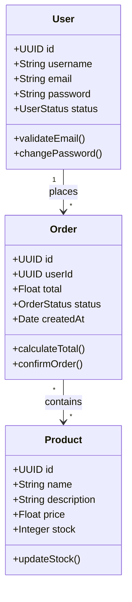
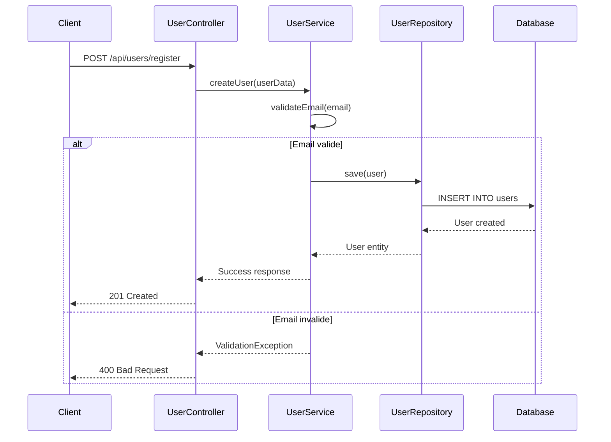
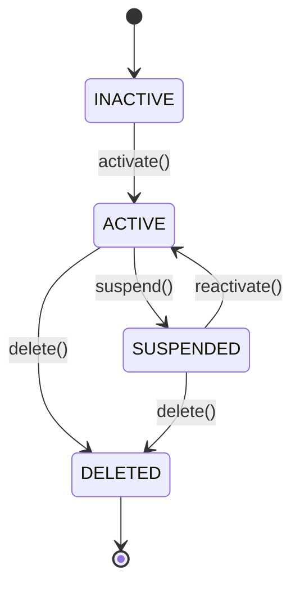

# 🚀 Guide d'Utilisation - Extension VSCode basicCode

## 📋 Prérequis

✅ Backend déployé : https://codegenerator-cpyh.onrender.com  
✅ Extension compilée : `basiccode-generator-1.0.0.vsix`  
✅ VSCode installé

---

## 🔧 Installation de l'Extension

### Méthode 1 : Installation via VSIX (Recommandée)

```bash
cd /home/folongzidane/Documents/Projet/basicCode/vscode-extension

# Installer l'extension
code --install-extension basiccode-generator-1.0.0.vsix

# Ou via VSCode UI
# 1. Ouvrir VSCode
# 2. Ctrl+Shift+P → "Extensions: Install from VSIX..."
# 3. Sélectionner basiccode-generator-1.0.0.vsix
```

### Méthode 2 : Recompiler et Installer

```bash
cd vscode-extension

# Installer les dépendances
npm install

# Compiler TypeScript
npm run compile

# Créer le package VSIX
npx vsce package

# Installer
code --install-extension basiccode-generator-1.0.0.vsix
```

---

## ⚙️ Configuration de l'Extension

### 1. Configurer l'URL du Backend

Ouvrir les paramètres VSCode (`Ctrl+,`) et chercher "basiccode" :

```json
{
  "basiccode.backend": "https://codegenerator-cpyh.onrender.com",
  "basiccode.language": "java",
  "basiccode.packageName": "com.example"
}
```

### 2. Configuration via settings.json

```json
// .vscode/settings.json dans votre projet
{
  "basiccode.backend": "https://codegenerator-cpyh.onrender.com",
  "basiccode.language": "java",
  "basiccode.packageName": "com.mycompany.project",
  "basiccode.outputDirectory": "generated"
}
```

---

## 📁 Structure du Projet

Créer cette structure dans votre workspace VSCode :

```
mon-projet/
├── src/
│   └── diagrams/
│       ├── class-diagram.mmd
│       ├── sequence-diagram.mmd
│       └── state-diagram.mmd
└── .vscode/
    └── settings.json
```

---

## 📝 Créer vos Diagrammes

### 1. Diagramme de Classes (class-diagram.mmd)



### 2. Diagramme de Séquence (sequence-diagram.mmd)



### 3. Diagramme d'État (state-diagram.mmd)



---

## 🎯 Utilisation de l'Extension

### Méthode 1 : Via Palette de Commandes

1. **Ouvrir la palette** : `Ctrl+Shift+P` (Windows/Linux) ou `Cmd+Shift+P` (Mac)
2. **Taper** : `basicCode: Generate Project`
3. **Appuyer sur Entrée**

### Méthode 2 : Via Raccourci Clavier

- **Windows/Linux** : `Ctrl+Shift+G`
- **Mac** : `Cmd+Shift+G`

### Méthode 3 : Via Menu Contextuel

1. Clic droit dans l'explorateur de fichiers
2. Sélectionner "basicCode: Generate Project"

---

## 🔄 Processus de Génération

L'extension va :

1. ✅ **Scanner** les diagrammes dans `src/diagrams/`
2. ✅ **Uploader** vers le backend
3. ✅ **Générer** le code sur le serveur
4. ✅ **Télécharger** le projet généré
5. ✅ **Merger** intelligemment avec votre code existant
6. ✅ **Créer des backups** des fichiers modifiés

### Barre de Progression

```
🔄 Generating project...
├─ 10% Uploading diagrams...
├─ 30% Processing on server...
├─ 60% Downloading...
├─ 90% Extracting...
└─ 100% Complete! ✅
```

---

## 🛠️ Résolution du Problème "Command Not Found"

### Diagnostic

```bash
# Vérifier les extensions installées
code --list-extensions | grep basiccode

# Vérifier les logs VSCode
# Help → Toggle Developer Tools → Console
```

### Solution 1 : Réinstaller l'Extension

```bash
cd /home/folongzidane/Documents/Projet/basicCode/vscode-extension

# Désinstaller
code --uninstall-extension basiccode-generator

# Réinstaller
code --install-extension basiccode-generator-1.0.0.vsix

# Redémarrer VSCode
```

### Solution 2 : Vérifier package.json

Le problème vient souvent d'une mauvaise configuration. Vérifiez :

```json
{
  "activationEvents": [
    "onCommand:basiccode.generate"
  ],
  "main": "./out/extension.js",
  "contributes": {
    "commands": [
      {
        "command": "basiccode.generate",
        "title": "Generate Project",
        "category": "basicCode"
      }
    ]
  }
}
```

### Solution 3 : Recompiler

```bash
cd vscode-extension

# Nettoyer
rm -rf out/ node_modules/ *.vsix

# Réinstaller
npm install

# Recompiler
npm run compile

# Vérifier la compilation
ls -la out/extension.js

# Recréer le package
npx vsce package

# Réinstaller
code --install-extension basiccode-generator-1.0.0.vsix
```

### Solution 4 : Mode Développement

```bash
cd vscode-extension

# Ouvrir dans VSCode
code .

# Appuyer sur F5 pour lancer en mode debug
# Une nouvelle fenêtre VSCode s'ouvrira avec l'extension chargée
```

---

## 📊 Exemples d'Utilisation

### Exemple 1 : Projet E-commerce Simple

**Structure :**
```
ecommerce-project/
└── src/
    └── diagrams/
        └── class-diagram.mmd
```

**Commande :**
1. `Ctrl+Shift+P`
2. `basicCode: Generate Project`
3. Sélectionner langage : `java`

**Résultat :**
```
ecommerce-project/
├── src/
│   ├── main/
│   │   └── java/
│   │       └── com/example/
│   │           ├── entities/
│   │           ├── repositories/
│   │           ├── services/
│   │           └── controllers/
│   └── diagrams/
└── pom.xml
```

### Exemple 2 : Projet Complet avec Comportement

**Structure :**
```
blog-project/
└── src/
    └── diagrams/
        ├── class-diagram.mmd
        ├── sequence-diagram.mmd
        └── state-diagram.mmd
```

**Configuration :**
```json
{
  "basiccode.backend": "https://codegenerator-cpyh.onrender.com",
  "basiccode.language": "django",
  "basiccode.packageName": "com.blog"
}
```

**Résultat :**
- ✅ Modèles Django avec relations
- ✅ Serializers DRF
- ✅ ViewSets avec logique métier
- ✅ URLs configurées
- ✅ Tests unitaires
- ✅ Documentation API

---

## 🎨 Langages Supportés

| Langage | Valeur Config | Framework |
|---------|---------------|-----------|
| Java | `java` | Spring Boot |
| Python FastAPI | `python` | FastAPI |
| Python Django | `django` | Django REST |
| C# | `csharp` | .NET Core |
| TypeScript | `typescript` | Express + TypeORM |
| PHP | `php` | Slim + Eloquent |

---

## 🔍 Vérification Post-Génération

### 1. Vérifier les Fichiers Générés

```bash
# Lister les nouveaux fichiers
find . -name "*.java" -o -name "*.py" -o -name "*.cs"

# Vérifier les backups
find . -name "*.backup"
```

### 2. Tester l'Application

```bash
# Java
./mvnw spring-boot:run

# Python
python manage.py runserver

# Django
python manage.py migrate
python manage.py runserver
```

### 3. Accéder à la Documentation

- **Swagger UI** : http://localhost:8080/swagger-ui.html
- **API Docs** : http://localhost:8080/docs

---

## 🚨 Dépannage

### Erreur : "No workspace folder found"

**Solution :** Ouvrir un dossier dans VSCode (`File → Open Folder`)

### Erreur : "No diagrams found"

**Solution :** Créer le dossier `src/diagrams/` et ajouter vos fichiers `.mmd`

### Erreur : "Backend connection failed"

**Solution :** Vérifier que le backend est accessible :
```bash
curl https://codegenerator-cpyh.onrender.com/actuator/health
```

### Erreur : "Command 'basiccode.generate' not found"

**Solutions :**
1. Réinstaller l'extension (voir section ci-dessus)
2. Redémarrer VSCode
3. Vérifier les logs : `Help → Toggle Developer Tools → Console`
4. Utiliser le mode développement (F5)

---

## 📚 Ressources

- **Backend API** : https://codegenerator-cpyh.onrender.com
- **Documentation API** : https://codegenerator-cpyh.onrender.com/docs
- **Guide API** : [API-USAGE-DEPLOYED.md](API-USAGE-DEPLOYED.md)
- **README Principal** : [README.md](README.md)

---

## 🎯 Workflow Recommandé

### 1. Initialisation

```bash
# Créer un nouveau projet
mkdir mon-projet
cd mon-projet
code .

# Créer la structure
mkdir -p src/diagrams
mkdir -p .vscode
```

### 2. Configuration

```bash
# Créer settings.json
cat > .vscode/settings.json << 'EOF'
{
  "basiccode.backend": "https://codegenerator-cpyh.onrender.com",
  "basiccode.language": "java",
  "basiccode.packageName": "com.monprojet"
}
EOF
```

### 3. Créer les Diagrammes

```bash
# Créer un diagramme de classes
cat > src/diagrams/class-diagram.mmd << 'EOF'
classDiagram
    class User {
        +UUID id
        +String username
        +String email
    }
EOF
```

### 4. Générer

1. `Ctrl+Shift+P`
2. `basicCode: Generate Project`
3. Attendre la génération
4. Vérifier les fichiers générés

### 5. Tester

```bash
# Compiler et lancer
./mvnw spring-boot:run

# Tester l'API
curl http://localhost:8080/api/users
```

---

## ✅ Checklist de Vérification

Avant de générer :

- [ ] Backend accessible (https://codegenerator-cpyh.onrender.com)
- [ ] Extension installée (`code --list-extensions | grep basiccode`)
- [ ] Workspace ouvert dans VSCode
- [ ] Dossier `src/diagrams/` créé
- [ ] Au moins un diagramme `.mmd` présent
- [ ] Configuration `basiccode.*` définie
- [ ] Commande visible dans palette (`Ctrl+Shift+P`)

Après génération :

- [ ] Fichiers générés présents
- [ ] Backups créés (si fichiers existants)
- [ ] Compilation réussie
- [ ] Application démarre
- [ ] API accessible
- [ ] Documentation Swagger disponible

---

## 🎉 Succès !

Si tout fonctionne, vous devriez voir :

```
✅ Project generated successfully!
```

Et votre projet est prêt à être utilisé ! 🚀

---

*Guide créé le 2025-12-07 • Version 1.0*
