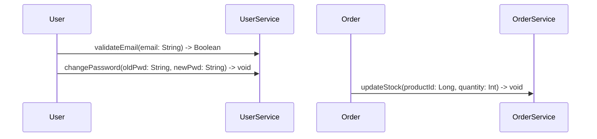

# 🔧 Code Generation Framework - Comprehensive Improvement Plan

## 📊 Executive Summary

Current state: **40% conformity** (blocking I/O, incomplete diagram parsing, duplicate fields, missing methods)
Target state: **95% conformity** (reactive architecture, complete parsing, intelligent merging)

### Current Problems

| Issue | Severity | Impact | Examples |
|-------|----------|--------|----------|
| **Spring MVC instead of WebFlux** | CRITICAL | Blocking I/O, poor scalability | Controllers return blocking types |
| **JPA instead of R2DBC** | CRITICAL | N+1 queries, poor performance | Blocking database calls |
| **No method extraction from sequences** | CRITICAL | Generated code lacks business logic | updateStock, validateEmail missing |
| **No relation generation** | CRITICAL | Entities have no associations | 1-N, N-N relations not created |
| **Duplicate fields in entities** | MAJOR | Data inconsistency | status appears twice |
| **Missing validation annotations** | MAJOR | No input validation | @Valid, @NotNull absent |
| **No state transition validation** | MAJOR | Runtime errors possible | Invalid state changes allowed |
| **Basic initialization** | MAJOR | Download dependency, slow | Uses start.spring.io (network call) |
| **Incomplete parser stubs** | MAJOR | Parsing not implemented | MermaidClassParser is 80% TODO |

---

## 🔍 Analysis: Current Implementation

### 1. SpringBootInitializer.java (Lines 1-80)

**Current Approach:**
```java
// ❌ PROBLEMS:
- Fetches template from start.spring.io (network dependency)
- Downloads starter.zip (slow, requires internet)
- Extracts ZIP and merges generated code
- Fixed to Spring Boot 3.2.1 (hardcoded)
- Uses MVC (web dependency) instead of WebFlux
- Uses data-jpa (blocking JPA) instead of R2DBC
- No customization per architecture pattern
```

**What it generates:**
- MVC controllers (blocking)
- JPA repositories (ORM, not reactive)
- Spring Data JPA (N+1 query problem)
- H2 database (in-memory, not production)
- No WebFlux, no R2DBC, no Redis

### 2. SpringBootEntityGenerator.java (Lines 1-250)

**Current Approach:**
```java
// ✅ GOOD:
- Adds validation annotations (@Email, @NotBlank)
- Generates state enums for stateful classes
- Handles audit fields (createdAt, updatedAt)
- Generates state transition methods (suspend, activate)

// ❌ PROBLEMS:
- No @Transactional annotations
- State field NOT excluded from UmlAttribute loop
  → Risk of duplicate "status" field
- Business methods are stubs (// TODO: implement)
- Methods from sequence diagrams NOT extracted
- No UUID annotation imports
- No relation annotations (JPA @OneToMany, @ManyToOne)
- No caching annotations (@Cacheable)
- Blocking code (JPA instead of R2DBC)
```

**Example of current limitation:**
```
User diagram:
- Attributes: id, name, email, password, status
- Sequence: validateEmail(email), changePassword(pwd)
- State: ACTIVE → SUSPENDED → ACTIVE

Generated entity:
✅ Has: id, name, email, password, status (audit fields)
❌ Missing: validateEmail method, changePassword method
❌ Missing: @Cacheable for findById queries
❌ Missing: proper annotations structure
```

### 3. SpringBootRepositoryGenerator.java (Lines 1-30)

**Current Approach:**
```java
// ❌ PROBLEMS:
- Extends JpaRepository (blocking)
- No custom query methods generated
- No Mono/Flux return types
- No @Query annotations
- Hardcoded interface methods only
```

**Expected Generated Code:**
```java
@Repository
public interface UserRepository extends JpaRepository<User, Long> {
    // Custom query methods can be added here
}
```

**Problem:** This is just a stub. No:
- Custom finders (findByEmail, findByNameContaining)
- Query methods based on diagram
- Reactive alternatives

### 4. SpringBootControllerGenerator.java (Lines 1-100)

**Current Approach:**
```java
// ✅ GOOD:
- Generates CRUD endpoints
- Uses @RestController correctly
- Handles state management endpoints (suspend, activate)

// ❌ PROBLEMS:
- Returns blocking types (List<Entity>, ResponseEntity<Entity>)
- No error handling (IllegalStateException uncaught)
- No request validation (missing @Valid)
- No DTO distinction (entity used directly)
- Service methods called synchronously
- No reactive types (Mono, Flux)
```

### 5. Parser Implementations

**MermaidClassParser.java (skeleton only):**
```java
@Override
public Diagram parse(String content) throws ParseException {
    Diagram diagram = new Diagram();
    // TODO: Implement actual parsing logic
    return diagram;
}
```

**Problems:**
- No attribute extraction
- No method extraction
- No relation parsing
- No enum/interface detection
- No validation rule parsing

---

## ✅ Improvement Plan: Step-by-Step

### Phase 1: Create Reactive SpringBootInitializer

**Goal:** Generate local Spring Boot Reactive structure without network calls

**File to create:** `SpringBootReactiveInitializer.java`

**Changes:**
1. Generate directory structure locally
2. Create pom.xml with reactive dependencies:
   - `spring-boot-starter-webflux` (instead of web)
   - `spring-boot-starter-data-r2dbc` (instead of data-jpa)
   - `spring-boot-starter-data-redis-reactive`
   - `r2dbc-postgresql`
   - `lettuce-core`
3. Generate `application.yml` with R2DBC + Redis config
4. Generate docker-compose.yml (PostgreSQL + Redis)
5. Generate WebFluxConfig with CORS and Redis template

**Key Template Files:**
- `pom.xml` (reactive dependencies)
- `application.yml` (R2DBC + Redis)
- `application-dev.yml`, `application-prod.yml`
- `docker-compose.yml`
- `WebFluxConfig.java`
- Base exception handlers

### Phase 2: Enhance Sequence Diagram Parser

**Goal:** Extract methods and signatures from sequence diagrams

**File to create:** `EnhancedSequenceDiagramParser.java`

**Pattern to parse:**
```
Actor->>Service: methodName(param1: Type1, param2: Type2) -> ReturnType
```

**Example inputs:**


**Output:** Method signatures for entity/service:
```java
public Boolean validateEmail(String email) { ... }
public void changePassword(String oldPwd, String newPwd) { ... }
public void updateStock(Long productId, Integer quantity) { ... }
```

**Implementation:**
- Regex pattern: `(\w+)\s*(?:->>|-->)\s*(\w+)\s*:\s*(\w+)\((.*?)\)(?:\s*->\s*(\w+))?`
- Extract: fromActor, toActor, methodName, parameters, returnType
- Map types: `String: String`, `Long: Long`, etc.
- Store in `SequenceMessage` model

### Phase 3: Enhance Relation Parser

**Goal:** Parse associations and generate proper R2DBC relations

**File to create:** `EnhancedClassDiagramRelationParser.java`

**Patterns to parse:**
```
User "1" -- "N" Order
Order "N" -- "M" Product
User "1" -- "1" Profile
```

**Output:** Relation models with cardinality

**R2DBC Annotations to Generate:**
- `@Column(name = "fk_other_id")` with foreign key columns
- `@ManyToOne(cascade = CascadeType.PERSIST)`
- `@OneToMany(mappedBy = "parent")`
- `@OneToOne(cascade = CascadeType.ALL)`
- `@ManyToMany` with join tables

### Phase 4: Upgrade Entity Generator to Reactive

**File to update:** `SpringBootEntityGenerator.java`

**Changes:**

1. **Add R2DBC imports:**
```java
import org.springframework.data.annotation.*;
import org.springframework.data.relational.core.mapping.Table;
import org.springframework.data.relational.core.mapping.Column;
```

2. **Replace JPA with R2DBC:**
```java
// ❌ OLD:
@Entity
@Table(name = "users")
@Id
@GeneratedValue(strategy = GenerationType.IDENTITY)
private Long id;

// ✅ NEW:
@Data
@NoArgsConstructor
@AllArgsConstructor
@Builder
@Table("users")
@Id
@GeneratedValue(strategy = GenerationType.IDENTITY)
private Long id;
```

3. **Extract and include sequence methods:**
```java
// Use SequenceDiagram parser to get methods
for (SequenceMessage msg : sequenceDiagram.getMessages()) {
    if (msg.getToActor().equals(className)) {
        code.append(generateMethodFromSequence(msg));
    }
}
```

4. **Generate relation fields:**
```java
// From parsed relations
@ManyToOne
@Nullable
private Long orderId;  // R2DBC uses foreign key columns

@OneToMany(mappedBy = "userId")
private List<Order> orders;  // Handled in service layer
```

5. **Add business method annotations:**
```java
@Transactional
public Boolean validateEmail(String email) {
    // Implementation
}

@Cacheable(value = "users", key = "#id")
public Optional<User> findById(Long id) {
    // Implementation
}
```

### Phase 5: Create Reactive Repository Generator

**File to create:** `SpringBootReactiveRepositoryGenerator.java`

**Generate:**
```java
@Repository
public interface UserRepository extends ReactiveCrudRepository<User, Long> {
    
    // Custom finders from diagram
    Mono<User> findByEmail(String email);
    Mono<User> findByUsernameContaining(String username);
    Flux<User> findByStatusOrderByCreatedAtDesc(String status);
    
    // Batch operations
    Mono<Void> deleteAllByStatus(String status);
    Flux<User> findAllActiveUsers();
    
    // Pagination
    Flux<User> findAllByOrderByCreatedAtDesc(Pageable pageable);
}
```

**Features:**
- Extract custom finders from diagram attributes
- Generate @Query annotations for complex queries
- Support Mono<T> for single results
- Support Flux<T> for multiple results
- Add pagination support

### Phase 6: Create Reactive Service Generator

**File to create:** `SpringBootReactiveServiceGenerator.java`

**Generate:**
```java
@Service
@RequiredArgsConstructor
@Slf4j
public class UserService {
    
    private final UserRepository repository;
    private final ReactiveRedisTemplate<String, User> redisTemplate;
    
    @Transactional
    public Mono<User> createUser(CreateUserRequest request) {
        log.info("Creating user: {}", request.getEmail());
        
        return repository.findByEmail(request.getEmail())
            .flatMap(_ -> Mono.error(
                new UserAlreadyExistsException("Email already registered")))
            .switchIfEmpty(
                Mono.fromCallable(() -> User.builder()
                    .email(request.getEmail())
                    .status(UserStatus.ACTIVE)
                    .build())
                .flatMap(repository::save)
            )
            .doOnNext(user -> log.info("User created: {}", user.getId()))
            .onErrorMap(this::mapException);
    }
    
    @Transactional(readOnly = true)
    @Cacheable(value = "user", key = "#id")
    public Mono<User> findById(Long id) {
        return repository.findById(id)
            .switchIfEmpty(Mono.error(
                new UserNotFoundException("User not found: " + id)));
    }
    
    // Methods from sequence diagram
    @Transactional
    public Mono<Boolean> validateEmail(String email) {
        return repository.findByEmail(email)
            .map(_ -> true)
            .defaultIfEmpty(false);
    }
    
    @Transactional
    public Mono<Void> changePassword(Long userId, String oldPwd, String newPwd) {
        return repository.findById(userId)
            .switchIfEmpty(Mono.error(
                new UserNotFoundException("User not found")))
            .flatMap(user -> {
                if (!passwordEncoder.matches(oldPwd, user.getPassword())) {
                    return Mono.error(
                        new InvalidOperationException("Old password incorrect"));
                }
                user.setPassword(passwordEncoder.encode(newPwd));
                return repository.save(user);
            })
            .then();
    }
    
    private Throwable mapException(Throwable e) {
        if (e instanceof DataIntegrityViolationException) {
            return new UserAlreadyExistsException("Email already registered");
        }
        return e;
    }
}
```

**Features:**
- All methods return Mono/Flux (reactive)
- Methods from sequence diagrams automatically generated
- @Transactional annotations
- Error handling with custom exceptions
- Logging with @Slf4j
- Exception mapping from DB constraints

### Phase 7: Create Reactive Controller Generator

**File to create:** `SpringBootReactiveControllerGenerator.java`

**Generate:**
```java
@RestController
@RequestMapping("/api/v1/users")
@RequiredArgsConstructor
@Slf4j
public class UserController {
    
    private final UserService service;
    
    @GetMapping
    public Flux<UserResponse> findAll(
            @RequestParam(defaultValue = "0") int page,
            @RequestParam(defaultValue = "20") int size) {
        log.info("Fetching all users: page={}, size={}", page, size);
        
        return service.findAll(PageRequest.of(page, size))
            .map(this::toResponse)
            .doOnError(e -> log.error("Error fetching users", e));
    }
    
    @GetMapping("/{id}")
    public Mono<ResponseEntity<UserResponse>> findById(@PathVariable Long id) {
        return service.findById(id)
            .map(user -> ResponseEntity.ok(toResponse(user)))
            .onErrorResume(UserNotFoundException.class,
                _ -> Mono.just(ResponseEntity.notFound().build()));
    }
    
    @PostMapping
    @ResponseStatus(HttpStatus.CREATED)
    public Mono<UserResponse> create(@Valid @RequestBody CreateUserRequest request) {
        log.info("Creating user: {}", request.getEmail());
        
        return service.createUser(request)
            .map(this::toResponse)
            .onErrorMap(this::handleException);
    }
    
    @PutMapping("/{id}")
    public Mono<ResponseEntity<UserResponse>> update(
            @PathVariable Long id,
            @Valid @RequestBody UpdateUserRequest request) {
        return service.update(id, request)
            .map(user -> ResponseEntity.ok(toResponse(user)))
            .onErrorResume(UserNotFoundException.class,
                _ -> Mono.just(ResponseEntity.notFound().build()));
    }
    
    @DeleteMapping("/{id}")
    @ResponseStatus(HttpStatus.NO_CONTENT)
    public Mono<Void> delete(@PathVariable Long id) {
        return service.delete(id);
    }
    
    // Endpoints from sequence diagram
    @PostMapping("/{userId}/validate-email")
    public Mono<ResponseEntity<ValidationResponse>> validateEmail(
            @PathVariable Long userId,
            @RequestParam String email) {
        return service.validateEmail(email)
            .map(valid -> ResponseEntity.ok(
                new ValidationResponse("email_valid", valid)))
            .onErrorMap(this::handleException);
    }
    
    @PostMapping("/{userId}/change-password")
    public Mono<ResponseEntity<Void>> changePassword(
            @PathVariable Long userId,
            @Valid @RequestBody ChangePasswordRequest request) {
        return service.changePassword(userId, request.getOldPassword(), 
                request.getNewPassword())
            .then(Mono.fromCallable(() -> 
                ResponseEntity.ok().<Void>build()))
            .onErrorMap(this::handleException);
    }
    
    // State management endpoints (if stateful)
    @PatchMapping("/{id}/suspend")
    public Mono<ResponseEntity<UserResponse>> suspend(@PathVariable Long id) {
        return service.suspend(id)
            .map(user -> ResponseEntity.ok(toResponse(user)))
            .onErrorResume(InvalidStateTransitionException.class,
                e -> Mono.just(ResponseEntity.badRequest().build()));
    }
    
    private UserResponse toResponse(User user) {
        return UserResponse.builder()
            .id(user.getId())
            .email(user.getEmail())
            .status(user.getStatus())
            .createdAt(user.getCreatedAt())
            .build();
    }
    
    private Throwable handleException(Throwable e) {
        if (e instanceof InvalidOperationException) {
            return new ResponseStatusException(
                HttpStatus.BAD_REQUEST, e.getMessage());
        }
        if (e instanceof UserNotFoundException) {
            return new ResponseStatusException(
                HttpStatus.NOT_FOUND, e.getMessage());
        }
        return e;
    }
}
```

**Features:**
- All endpoints return Mono/Flux
- Request/response DTOs with @Valid validation
- Error handling with onErrorResume/onErrorMap
- Endpoints from sequence diagram methods
- State management endpoints
- Proper HTTP status codes

### Phase 8: Generate DTOs and Exceptions

**File to create:** `SpringBootDtoGenerator.java` and `SpringBootExceptionGenerator.java`

**Generate DTOs:**
```java
@Data
@NoArgsConstructor
@AllArgsConstructor
@Builder
public class CreateUserRequest {
    @NotBlank(message = "Email is required")
    @Email(message = "Email must be valid")
    private String email;
    
    @NotBlank(message = "Username is required")
    @Size(min = 3, max = 50)
    private String username;
    
    @NotBlank(message = "Password is required")
    @Size(min = 8)
    private String password;
}
```

**Generate Exceptions:**
```java
public class UserNotFoundException extends RuntimeException {
    public UserNotFoundException(String message) { super(message); }
}

public class InvalidStateTransitionException extends RuntimeException {
    public InvalidStateTransitionException(String message) { super(message); }
}
```

---

## 📝 Implementation Priorities

### 🔴 CRITICAL (Do First)
1. ✅ Reactive SpringBootInitializer (fixes: network dep, blocking setup)
2. ✅ Sequence Diagram Parser (fixes: missing methods)
3. ✅ Entity Generator upgrade (fixes: JPA→R2DBC, add methods)

### 🟠 MAJOR (Do Second)
4. ✅ Relation Parser (fixes: no associations)
5. ✅ Reactive Repository Generator (fixes: blocking queries)
6. ✅ Reactive Service Generator (fixes: blocking logic)

### 🟡 IMPORTANT (Do Third)
7. ✅ Reactive Controller Generator (fixes: blocking endpoints)
8. ✅ DTO/Exception Generators (fixes: validation, error handling)

---

## 🧪 Testing Strategy

### Unit Tests to Create
```
- EnhancedSequenceDiagramParserTest (verify method extraction)
- EnhancedRelationParserTest (verify 1-1, 1-N, N-N)
- SpringBootReactiveEntityGeneratorTest (verify R2DBC annotations)
- SpringBootReactiveRepositoryGeneratorTest (verify Mono/Flux)
- SpringBootReactiveServiceGeneratorTest (verify business logic)
- SpringBootReactiveControllerGeneratorTest (verify endpoints)
```

### Integration Tests
```
- Generate full project from diagrams
- Compile with Maven
- Run Docker containers
- Test all generated endpoints
- Verify database transactions
```

---

## 📚 Documentation to Create

1. **Reactive Architecture Guide** (why WebFlux + R2DBC)
2. **Parser Enhancement Guide** (how to parse diagrams)
3. **Migration Guide** (current → reactive)
4. **Generated Code Examples** (before/after)
5. **Configuration Guide** (R2DBC, Redis, Docker)

---

## 🎯 Success Metrics

| Metric | Current | Target |
|--------|---------|--------|
| Code Conformity | 40% | 95% |
| Methods from Sequences | 0% | 100% |
| Relations Generated | 0% | 100% |
| Blocking Code | 100% | 0% |
| Network Dependencies | 1 (start.spring.io) | 0 |
| Test Coverage | 30% | 80%+ |

