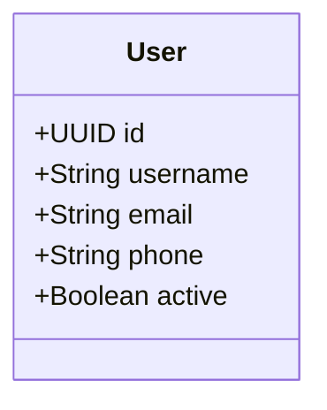
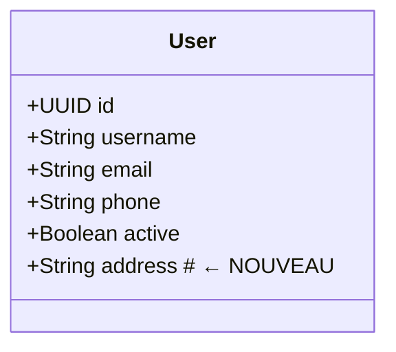
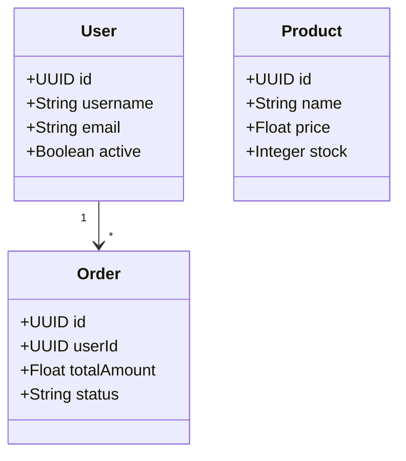

# 🏠 Utilisation Locale - Mode Watch

## 🚀 Installation et Configuration

### 1. **Build du Projet**
```bash
mvn clean package
```

### 2. **Configuration**
Créez ou modifiez `generator.yml` :
```yaml
watch_directory: "./diagrams"      # Dossier à surveiller
output_directory: "./generated"    # Dossier de sortie
package_name: "com.myproject"      # Package Java
incremental: true                  # Mode incrémental
auto_watch: true                   # Surveillance automatique
```

### 3. **Lancement du Mode Watch**
```bash
java -jar target/uml-generator.jar watch
```

Ou avec config personnalisée :
```bash
java -jar target/uml-generator.jar watch --config=my-config.yml
```

## 📁 Structure des Dossiers

```
mon-projet/
├── generator.yml          # Configuration
├── diagrams/             # Vos fichiers .mermaid
│   ├── user.mermaid
│   ├── product.mermaid
│   └── order.mermaid
└── generated/            # Code généré automatiquement
    └── src/main/java/com/myproject/
        ├── entity/
        ├── repository/
        ├── service/
        └── controller/
```

## 📝 Workflow Simple

### **1. Créer un Diagramme**
Créez `diagrams/user.mermaid` :


### **2. Sauvegardez le Fichier**
Le système détecte automatiquement et génère :
```
🔄 Processing: user.mermaid
✅ Created User
📊 GENERATION SUMMARY
✅ Created: 1
```

### **3. Code Généré Automatiquement**
```
generated/src/main/java/com/myproject/
├── entity/User.java
├── repository/UserRepository.java
├── service/UserService.java
└── controller/UserController.java
```

### **4. Modifiez le Diagramme**
Ajoutez un champ dans `diagrams/user.mermaid` :


### **5. Sauvegardez → Génération Incrémentale**
```
🔄 Processing: user.mermaid
💾 Backup created: User_20241201_143022.java.bak
🔄 Merged User - Added: 1 fields, 2 methods
📊 GENERATION SUMMARY
🔄 Merged: 1
```

## 🎯 Avantages du Mode Local

### ✅ **Simplicité**
- Pas d'API à appeler
- Pas de ZIP à télécharger
- Code généré directement dans votre projet

### ✅ **Temps Réel**
- Détection automatique des changements
- Génération instantanée
- Feedback immédiat

### ✅ **Préservation du Code**
- Mode incrémental par défaut
- Backup automatique
- Merge intelligent

### ✅ **Intégration IDE**
- Code généré dans votre workspace
- Auto-completion immédiate
- Compilation directe

## 🔧 Commandes Disponibles

### **Mode Watch (Recommandé)**
```bash
# Surveillance automatique
java -jar target/uml-generator.jar watch

# Avec config personnalisée
java -jar target/uml-generator.jar watch -c my-config.yml
```

### **Génération Ponctuelle**
```bash
# Génération standard
java -jar target/uml-generator.jar diagram.mermaid -o output

# Génération incrémentale
java -jar target/uml-generator.jar diagram.mermaid -o output --incremental
```

### **Génération Dynamique**
```bash
java -jar target/uml-generator.jar generate-dynamic diagram.mermaid
```

## 📊 Exemple Complet

### **1. Setup Initial**
```bash
# Build
mvn clean package

# Créer la structure
mkdir diagrams generated

# Lancer le watch
java -jar target/uml-generator.jar watch
```

### **2. Créer des Diagrammes**

`diagrams/ecommerce.mermaid` :


### **3. Résultat Automatique**
```
👀 Watching: /path/to/diagrams
📝 Place .mermaid files here for auto-generation

🔄 Processing: ecommerce.mermaid
✅ Created User
✅ Created Product  
✅ Created Order
📊 GENERATION SUMMARY
✅ Created: 3
📁 Total: 3
```

### **4. Code Généré**
```
generated/src/main/java/com/example/
├── entity/
│   ├── User.java        # JPA Entity avec validation
│   ├── Product.java     # Annotations complètes
│   └── Order.java       # Audit automatique
├── repository/
│   ├── UserRepository.java    # Spring Data JPA
│   ├── ProductRepository.java # Requêtes personnalisées
│   └── OrderRepository.java   # Méthodes par status
├── service/
│   ├── UserService.java       # Logique métier
│   ├── ProductService.java    # CRUD transactionnel
│   └── OrderService.java      # Gestion de statut
└── controller/
    ├── UserController.java    # REST API
    ├── ProductController.java # Swagger intégré
    └── OrderController.java   # Endpoints métier
```

## 🎉 Workflow de Développement

1. **Modélisez** vos entités en Mermaid
2. **Sauvegardez** → Code généré automatiquement
3. **Développez** votre logique métier
4. **Modifiez** le diagramme → Merge intelligent
5. **Répétez** sans perdre votre code manuel

**Plus besoin d'API, de ZIP, ou de copier-coller !** 🚀