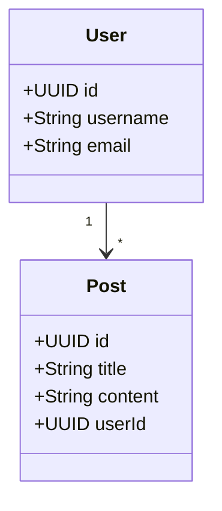
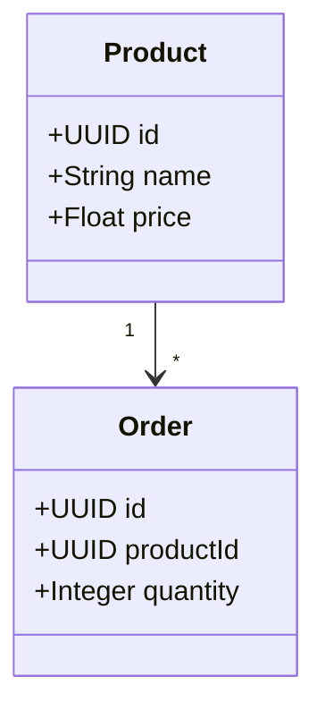
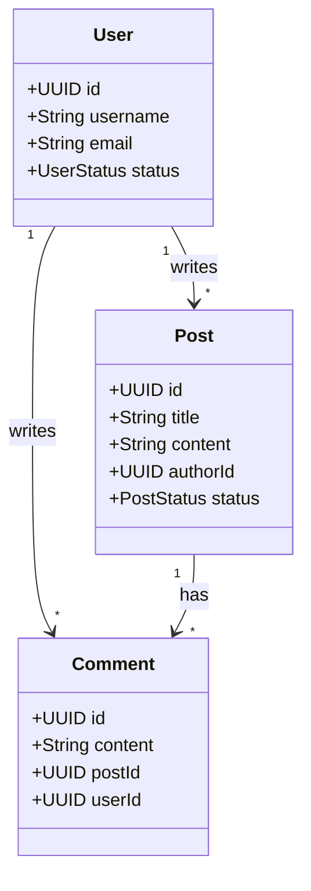

# ⚡ Démarrage Rapide - Extension VSCode

## 🚀 Installation en 3 Minutes

### Étape 1 : Réparer et Installer (2 min)

```bash
cd /home/folongzidane/Documents/Projet/basicCode/vscode-extension
./fix-extension.sh
```

Ce script va :
- ✅ Nettoyer les anciens fichiers
- ✅ Réinstaller les dépendances
- ✅ Recompiler TypeScript
- ✅ Créer le package VSIX
- ✅ Installer l'extension dans VSCode

### Étape 2 : Redémarrer VSCode (30 sec)

```bash
# Fermer toutes les fenêtres VSCode
# Puis rouvrir
code .
```

### Étape 3 : Tester (30 sec)

1. Appuyer sur `Ctrl+Shift+P`
2. Taper `basicCode`
3. Vous devriez voir : **"basicCode: Generate Project"**

---

## 🎯 Premier Projet en 5 Minutes

### 1. Créer la Structure

```bash
mkdir mon-premier-projet
cd mon-premier-projet
mkdir -p src/diagrams
code .
```

### 2. Configurer le Backend

Créer `.vscode/settings.json` :

```json
{
  "basiccode.backend": "https://codegenerator-cpyh.onrender.com",
  "basiccode.language": "java",
  "basiccode.packageName": "com.example"
}
```

### 3. Créer un Diagramme Simple

Créer `src/diagrams/class-diagram.mmd` :



### 4. Générer le Projet

- Appuyer sur `Ctrl+Shift+G`
- Attendre 30 secondes
- ✅ Projet généré !

### 5. Lancer l'Application

```bash
./mvnw spring-boot:run
```

Accéder à : http://localhost:8080/swagger-ui.html

---

## 🔧 Résolution du Problème "Command Not Found"

### Solution Rapide

```bash
cd /home/folongzidane/Documents/Projet/basicCode/vscode-extension
./fix-extension.sh
```

### Solution Alternative : Mode Debug

1. Ouvrir le dossier `vscode-extension` dans VSCode
2. Appuyer sur `F5`
3. Une nouvelle fenêtre VSCode s'ouvre avec l'extension chargée
4. Tester la commande dans cette fenêtre

---

## 📋 Checklist de Vérification

Avant de générer :

```bash
# 1. Backend accessible ?
curl https://codegenerator-cpyh.onrender.com/actuator/health

# 2. Extension installée ?
code --list-extensions | grep basiccode

# 3. Fichiers présents ?
ls -la src/diagrams/

# 4. Configuration OK ?
cat .vscode/settings.json
```

---

## 🎨 Exemples de Diagrammes

### E-commerce Minimal



### Blog Complet



---

## 🚨 Problèmes Courants

### "No workspace folder found"
**Solution :** Ouvrir un dossier (`File → Open Folder`)

### "No diagrams found"
**Solution :** Créer `src/diagrams/` et ajouter des fichiers `.mmd`

### "Backend connection failed"
**Solution :** Vérifier l'URL dans les settings

### Extension ne se charge pas
**Solution :** Exécuter `./fix-extension.sh`

---

## 📚 Documentation Complète

- **Guide Complet** : [GUIDE-UTILISATION-EXTENSION.md](GUIDE-UTILISATION-EXTENSION.md)
- **API Backend** : [API-USAGE-DEPLOYED.md](API-USAGE-DEPLOYED.md)
- **README Principal** : [README.md](README.md)

---

## 🎉 Vous êtes Prêt !

L'extension est maintenant fonctionnelle. Commencez à générer vos projets ! 🚀

**Raccourci à retenir :** `Ctrl+Shift+G` pour générer
