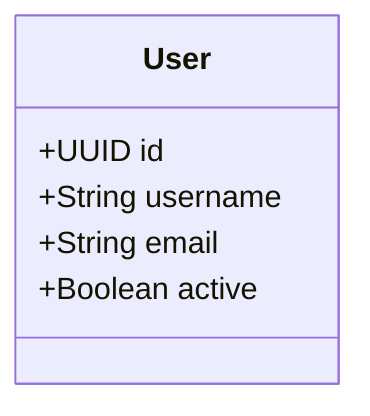

# ⚡ Quick Start - Mode Local

## 🚀 En 3 Étapes

### **1. Build & Launch**
```bash
mvn clean package
java -jar target/uml-generator.jar watch
```

### **2. Créer un Diagramme**
Créez `diagrams/my-model.mermaid` :


### **3. Code Généré Automatiquement !**
```
generated/src/main/java/com/example/
├── entity/User.java
├── repository/UserRepository.java  
├── service/UserService.java
└── controller/UserController.java
```

## 🎯 Workflow

1. **Modifiez** `diagrams/*.mermaid`
2. **Sauvegardez** → Génération automatique
3. **Votre code manuel est préservé** ✅

## ⚙️ Configuration

Modifiez `generator.yml` :
```yaml
watch_directory: "./diagrams"
output_directory: "./generated"  
package_name: "com.myproject"
incremental: true
```

**C'est tout !** Plus simple qu'une API 🎉

## 🆚 Comparaison

### ❌ **Avant (API)**
```javascript
const response = await fetch('https://api.../generate', {
  method: 'POST',
  body: JSON.stringify({umlContent, packageName})
});
const blob = await response.blob();
// Télécharger ZIP, extraire, copier...
```

### ✅ **Maintenant (Local)**
```bash
# 1. Lancer une fois
java -jar uml-generator.jar watch

# 2. Créer/modifier .mermaid files
# 3. Code généré automatiquement !
```

**10x plus simple !** 🚀