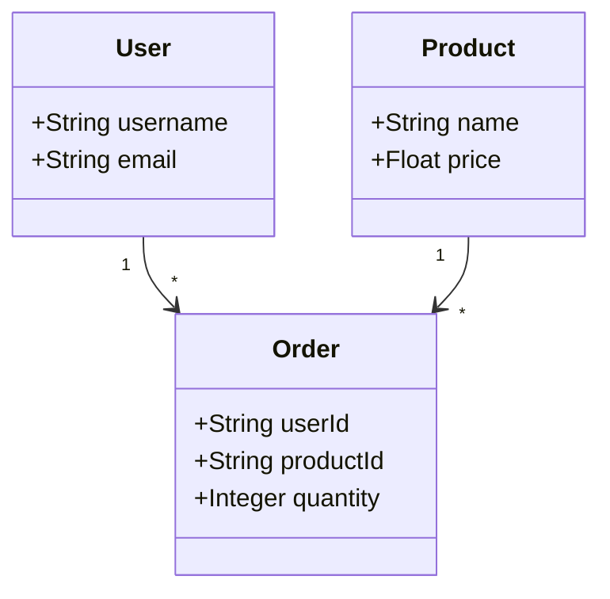
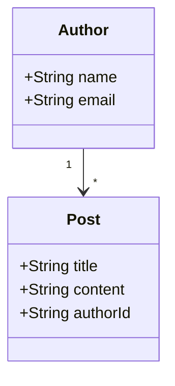

# 🚀 Générateur UML vers Code - Production Ready

Transformez vos diagrammes UML en applications CRUD complètes et fonctionnelles en quelques secondes.

## 🌟 Fonctionnalités

- **6 langages supportés** : Java, Python (FastAPI/Django), C#, TypeScript, PHP
- **Applications 100% fonctionnelles** : Base de données, API REST, documentation incluses
- **Architecture MVC complète** : Entités, Repositories, Services, Controllers
- **Génération comportementale** : Combine diagrammes de classes et de séquence pour du code réaliste
- **Logique métier intelligente** : Workflows, validations et gestion d'erreurs automatiques
- **Déploiement immédiat** : Applications prêtes pour la production

## 🌐 API Déployée - Prête à l'Emploi

- **URL Production** : https://codegenerator-cpyh.onrender.com
- **Documentation Live** : https://codegenerator-cpyh.onrender.com/docs
- **Guide d'utilisation** : [API-USAGE-DEPLOYED.md](API-USAGE-DEPLOYED.md)
- **Aucune installation locale requise** ✅

## ⚡ Utilisation Rapide - API Déployée

### 1. Génération Directe avec cURL
```bash
# Générer un projet Java Spring Boot complet
curl -X POST "https://codegenerator-cpyh.onrender.com/api/generate/crud" \
  -H "Content-Type: application/json" \
  -d '{
    "umlContent": "classDiagram\n    class User {\n        +UUID id\n        +String username\n        +String email\n        +validateEmail()\n    }\n    class Product {\n        +UUID id\n        +String name\n        +Float price\n    }\n    User \"1\" --> \"*\" Product",
    "packageName": "com.ecommerce",
    "language": "java"
  }' \
  -o ecommerce-java.zip

# Extraire et démarrer
unzip ecommerce-java.zip
cd ecommerce-java
./start.sh  # Application prête !
```

### 2. Avec Insomnia/Postman
```json
POST https://codegenerator-cpyh.onrender.com/api/generate/crud
Content-Type: application/json

{
  "umlContent": "classDiagram\n    class User {\n        +UUID id\n        +String username\n    }\n    class Order {\n        +UUID id\n        +UUID userId\n        +Float total\n    }\n    User \"1\" --> \"*\" Order",
  "language": "django",
  "packageName": "com.blog"
}
```

### 3. Génération Comportementale (Nouveau !)
```bash
# Générer du code réaliste avec diagrammes de classes ET de séquence
curl -X POST "https://codegenerator-cpyh.onrender.com/api/behavioral/generate" \
  -H "Content-Type: application/json" \
  -d '{
    "classDiagramContent": "classDiagram\n    class User {\n        +UUID id\n        +String username\n        +String email\n    }",
    "sequenceDiagramContent": "sequenceDiagram\n    Client->>UserController: POST /api/users/register\n    UserController->>UserService: createUser(userData)\n    UserService->>UserRepository: save(user)\n    UserRepository-->>UserService: User created\n    UserService-->>UserController: Success\n    UserController-->>Client: 201 Created",
    "packageName": "com.example.behavioral",
    "language": "java"
  }' \
  -o behavioral-project.zip
```

### 4. Génération Complète (🆕 NOUVEAU !)
```bash
# Générer du code COMPLET avec les 3 diagrammes : Classes + Séquences + États
curl -X POST "https://codegenerator-cpyh.onrender.com/api/comprehensive/generate" \
  -H "Content-Type: application/json" \
  -d '{
    "classDiagramContent": "classDiagram\n    class User {\n        +UUID id\n        +String username\n        +UserStatus status\n    }",
    "sequenceDiagramContent": "sequenceDiagram\n    Client->>UserService: activateUser()\n    UserService->>User: changeStatus(ACTIVE)",
    "stateDiagramContent": "stateDiagram-v2\n    [*] --> INACTIVE\n    INACTIVE --> ACTIVE : activate()\n    ACTIVE --> SUSPENDED : suspend()\n    SUSPENDED --> ACTIVE : reactivate()",
    "packageName": "com.example.comprehensive",
    "language": "java"
  }' \
  -o comprehensive-project.zip
```

### 5. Génération ULTIME (🔥 NOUVEAU !)
```bash
# Générer du code ULTIME avec les 5 diagrammes : Classes + Séquences + États + Objets + Composants
curl -X POST "https://codegenerator-cpyh.onrender.com/api/ultimate/generate" \
  -H "Content-Type: application/json" \
  -d '{
    "classDiagramContent": "classDiagram\n    class User {\n        +UUID id\n        +String username\n    }",
    "sequenceDiagramContent": "sequenceDiagram\n    Client->>UserService: createUser()",
    "stateDiagramContent": "stateDiagram-v2\n    [*] --> ACTIVE",
    "objectDiagramContent": "objectDiagram\n    object user1 {\n        id = \"123\"\n        username = \"test\"\n    }",
    "componentDiagramContent": "componentDiagram\n    component WebLayer\n    component ServiceLayer\n    WebLayer --> ServiceLayer",
    "packageName": "com.example.ultimate",
    "language": "java"
  }' \
  -o ultimate-project.zip
```

### 6. Génération COMPLÈTE (🎯 NOUVEAU !)
```bash
# Générer du code COMPLET avec les 3 diagrammes essentiels : Classes + Séquences + États
curl -X POST "https://codegenerator-cpyh.onrender.com/api/comprehensive/generate" \
  -H "Content-Type: application/json" \
  -d '{
    "classDiagramContent": "classDiagram\n    class Order {\n        +UUID id\n        +String customerEmail\n        +Float total\n        +OrderStatus status\n    }",
    "sequenceDiagramContent": "sequenceDiagram\n    Client->>OrderController: POST /api/orders\n    OrderController->>OrderService: createOrder(orderData)\n    OrderService->>OrderRepository: save(order)",
    "stateDiagramContent": "stateDiagram-v2\n    [*] --> PENDING\n    PENDING --> CONFIRMED : confirm()\n    CONFIRMED --> SHIPPED : ship()\n    SHIPPED --> DELIVERED : deliver()",
    "packageName": "com.example.comprehensive",
    "language": "java"
  }' \
  -o comprehensive-project.zip
```

### 7. Génération PARFAITE (🎯 NOUVEAU !)
```bash
# Générer du code PARFAIT avec les 6 diagrammes : Classes + Séquences + États + Objets + Composants + Activités
curl -X POST "https://codegenerator-cpyh.onrender.com/api/perfect/generate" \
  -H "Content-Type: application/json" \
  -d '{
    "classDiagramContent": "classDiagram\n    class User {\n        +UUID id\n        +String username\n    }",
    "sequenceDiagramContent": "sequenceDiagram\n    Client->>UserService: createUser()",
    "stateDiagramContent": "stateDiagram-v2\n    [*] --> ACTIVE",
    "objectDiagramContent": "objectDiagram\n    object user1 {\n        id = \"123\"\n        username = \"test\"\n    }",
    "componentDiagramContent": "componentDiagram\n    component WebLayer\n    component ServiceLayer\n    WebLayer --> ServiceLayer",
    "activityDiagramContent": "activityDiagram\n    [*]\n    activity ProcessUser\n    ProcessUser --> end",
    "packageName": "com.example.perfect",
    "language": "java"
  }' \
  -o perfect-project.zip
```

## 🎯 Langages Supportés

| Langage | Framework | Status | Exemple |
|---------|-----------|--------|---------|
| **Java** | Spring Boot | ✅ Complet | `./generate-from-mermaid.sh app.mermaid java` |
| **Python** | FastAPI | ✅ Complet | `./generate-from-mermaid.sh app.mermaid python` |
| **Python** | Django REST | ✅ Complet | `./generate-from-mermaid.sh app.mermaid django` |
| **C#** | .NET Core | ✅ Complet | `./generate-from-mermaid.sh app.mermaid csharp` |
| **TypeScript** | Express + TypeORM | ✅ Complet | `./generate-from-mermaid.sh app.mermaid typescript` |
| **PHP** | Slim + Eloquent | ✅ Complet | `./generate-from-mermaid.sh app.mermaid php` |

## 📋 Ce qui est Généré

### Génération Classique
- ✅ **Entités/Modèles** avec annotations ORM
- ✅ **Repositories** avec CRUD complet
- ✅ **Services** avec logique métier
- ✅ **Controllers** avec endpoints REST
- ✅ **Configuration** base de données
- ✅ **Documentation** API (Swagger)
- ✅ **Point d'entrée** application
- ✅ **Dépendances** et configuration

### Génération Comportementale (🆕 Nouveau)
- ✨ **Logique métier réaliste** basée sur les diagrammes de séquence
- ✨ **Workflows documentés** extraits des interactions
- ✨ **Validation intelligente** selon les paramètres
- ✨ **Gestion d'erreurs contextuelle** (try-catch appropriés)
- ✨ **Patterns comportementaux** (alt, opt, loop, par, critical)
- ✨ **Méthodes implémentées** avec logique fonctionnelle
- ✨ **Architecture cohérente** respectant les interactions
- ✨ **Documentation des scénarios** d'utilisation

### Génération Complète (🆕 NOUVEAU !)
- 🔥 **Gestion d'états avancée** avec diagrammes d'état-transition
- 🔥 **Enums d'état** générés automatiquement
- 🔥 **Méthodes de transition** avec validation d'état
- 🔥 **Règles métier** basées sur les transitions
- 🔥 **Validation d'état** prévenant les transitions invalides
- 🔥 **Endpoints REST** conscients de l'état
- 🔥 **Logique combinée** : Structure + Comportement + État
- 🔥 **Code production-ready** avec gestion complète du cycle de vie

### Génération ULTIME (🔥 NOUVEAU !)
- ⚡ **Architecture modulaire** avec diagrammes de composants
- ⚡ **Données de test réalistes** avec diagrammes d'objets
- ⚡ **Configuration de build** automatique (Maven/Gradle)
- ⚡ **Projets multi-modules** pour architectures complexes
- ⚡ **Configurations Spring Boot** par composant
- ⚡ **Suites de tests complètes** avec données réelles
- ⚡ **Validation croisée** entre diagrammes
- ⚡ **Documentation exhaustive** de l'architecture
- ⚡ **Dépendances intelligentes** entre modules
- ⚡ **Code 100% production-ready** avec tous les patterns

### Génération PARFAITE (🎯 NOUVEAU !)
- 🎯 **Moteurs de workflow** avec diagrammes d'activité
- 🎯 **Automatisation des processus** métier complets
- 🎯 **Orchestration de workflows** avec décisions et parallélisme
- 🎯 **Génération de méthodes** basées sur les activités
- 🎯 **Logique de contrôle avancée** (boucles, conditions, fork/join)
- 🎯 **Implémentation complète** des processus métier
- 🎯 **Gestion des exceptions** dans les workflows
- 🎯 **Documentation des processus** automatique
- 🎯 **Intégration parfaite** des 6 diagrammes UML
- 🎯 **Code PARFAIT** - l'aboutissement ultime de la génération automatique

### Endpoints REST Automatiques
```
GET    /api/users/        # Liste avec pagination
POST   /api/users/        # Création
GET    /api/users/{id}/   # Détail
PUT    /api/users/{id}/   # Modification
DELETE /api/users/{id}/   # Suppression
```

## 🌐 API Live - Aucune Installation

### Accès Direct
- **API Production** : https://codegenerator-cpyh.onrender.com
- **Documentation** : https://codegenerator-cpyh.onrender.com/docs
- **Exemples** : https://codegenerator-cpyh.onrender.com/examples
- **Santé API** : https://codegenerator-cpyh.onrender.com/actuator/health

### Test Rapide
```bash
# Vérifier que l'API fonctionne
curl https://codegenerator-cpyh.onrender.com/actuator/health

# Valider un diagramme UML
curl -X POST https://codegenerator-cpyh.onrender.com/api/generate/validate \
  -H "Content-Type: text/plain" \
  -d "classDiagram\n    class User {\n        +UUID id\n    }"

# Tester la génération comportementale
curl -X GET https://codegenerator-cpyh.onrender.com/api/behavioral/example

# Valider les diagrammes comportementaux
curl -X POST https://codegenerator-cpyh.onrender.com/api/behavioral/validate \
  -H "Content-Type: application/json" \
  -d '{"classDiagramContent": "...", "sequenceDiagramContent": "..."}'
```

## 📚 Documentation

- **[Documentation Complète](API-DOCUMENTATION-COMPLETE.md)** - Guide complet d'utilisation
- **[Architecture Refactorisée](REFACTORED-ARCHITECTURE.md)** - 🏗️ **NOUVEAU !** Architecture modulaire avec SOLID & Design Patterns
- **[Génération Comportementale](BEHAVIORAL-GENERATION.md)** - 🆕 Nouveau ! Guide de la génération avec diagrammes de séquence
- **[Améliorations Django](DJANGO-AMELIORE.md)** - Détails sur le générateur Django
- **[Langages Complétés](LANGAGES-COMPLETES.md)** - Support multi-langages
- **[Corrections Appliquées](CORRECTIONS-APPLIQUEES.md)** - Historique des améliorations

## 🎯 Exemples d'Applications

### E-commerce


### Blog


## 🚀 Déploiement

L'application est déployée sur Render et accessible à l'adresse :
**https://codegenerator-cpyh.onrender.com**

## 🤝 Contribution

1. Fork le projet
2. Créer une branche feature
3. Commit les changements
4. Push vers la branche
5. Ouvrir une Pull Request

## 📄 Licence

Ce projet est sous licence MIT.