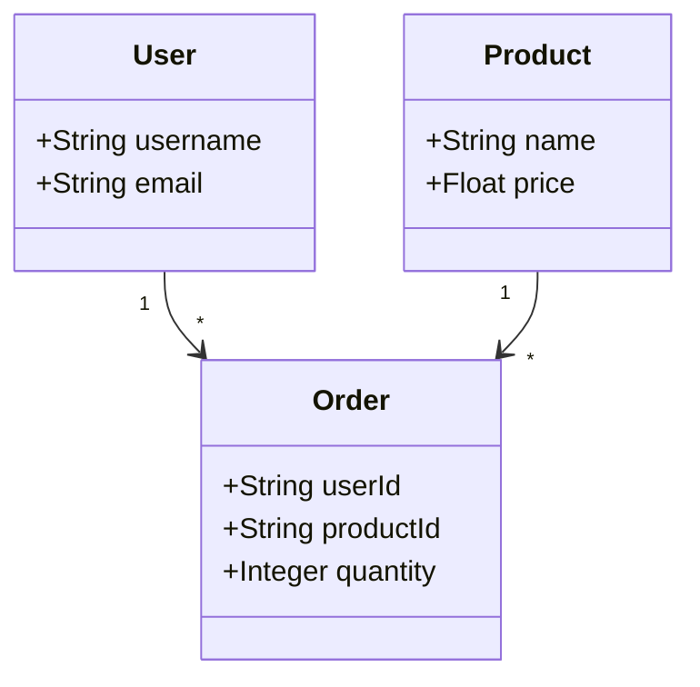
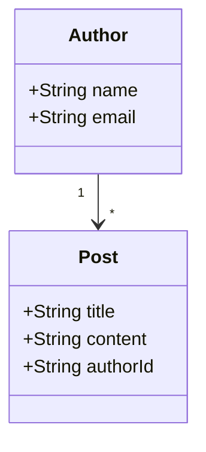

# 🚀 Générateur UML vers Code - Production Ready

Transformez vos diagrammes UML en applications CRUD complètes et fonctionnelles en quelques secondes.

## 🌟 Fonctionnalités

- **6 langages supportés** : Java, Python (FastAPI/Django), C#, TypeScript, PHP
- **Applications 100% fonctionnelles** : Base de données, API REST, documentation incluses
- **Architecture MVC complète** : Entités, Repositories, Services, Controllers
- **Déploiement immédiat** : Applications prêtes pour la production

## 🌐 API Déployée

- **URL Production** : https://codegenerator-cpyh.onrender.com
- **Documentation** : [API-DOCUMENTATION-COMPLETE.md](API-DOCUMENTATION-COMPLETE.md)
- **Script d'utilisation** : [generate-from-mermaid.sh](generate-from-mermaid.sh)

## ⚡ Utilisation Rapide

### 1. Avec le Script (Recommandé)
```bash
# Télécharger le script
curl -O https://raw.githubusercontent.com/votre-repo/generate-from-mermaid.sh
chmod +x generate-from-mermaid.sh

# Créer un diagramme UML
cat > app.mermaid << 'EOF'
classDiagram
    class User {
        +String username
        +String email
        +Boolean active
    }
    class Product {
        +String name
        +Float price
        +Integer stock
    }
EOF

# Générer une application Django
./generate-from-mermaid.sh app.mermaid django com.example ./my-django-app

# Démarrer l'application
cd my-django-app
pip install -r requirements.txt
python manage.py migrate
python manage.py runserver
```

### 2. Avec cURL Direct
```bash
curl -X POST "https://codegenerator-cpyh.onrender.com/api/generate/crud" \
  -H "Content-Type: application/json" \
  -d '{
    "umlContent": "classDiagram\n    class User {\n        +String username\n        +String email\n    }",
    "packageName": "com.example",
    "language": "java"
  }' \
  -o java-app.zip
```

## 🎯 Langages Supportés

| Langage | Framework | Status | Exemple |
|---------|-----------|--------|---------|
| **Java** | Spring Boot | ✅ Complet | `./generate-from-mermaid.sh app.mermaid java` |
| **Python** | FastAPI | ✅ Complet | `./generate-from-mermaid.sh app.mermaid python` |
| **Python** | Django REST | ✅ Complet | `./generate-from-mermaid.sh app.mermaid django` |
| **C#** | .NET Core | ✅ Complet | `./generate-from-mermaid.sh app.mermaid csharp` |
| **TypeScript** | Express + TypeORM | ✅ Complet | `./generate-from-mermaid.sh app.mermaid typescript` |
| **PHP** | Slim + Eloquent | ✅ Complet | `./generate-from-mermaid.sh app.mermaid php` |

## 📋 Ce qui est Généré

### Pour Chaque Langage
- ✅ **Entités/Modèles** avec annotations ORM
- ✅ **Repositories** avec CRUD complet
- ✅ **Services** avec logique métier
- ✅ **Controllers** avec endpoints REST
- ✅ **Configuration** base de données
- ✅ **Documentation** API (Swagger)
- ✅ **Point d'entrée** application
- ✅ **Dépendances** et configuration

### Endpoints REST Automatiques
```
GET    /api/users/        # Liste avec pagination
POST   /api/users/        # Création
GET    /api/users/{id}/   # Détail
PUT    /api/users/{id}/   # Modification
DELETE /api/users/{id}/   # Suppression
```

## 🏗️ Développement Local

### Prérequis
- Java 21+
- Maven 3.9+

### Démarrage
```bash
git clone <repository>
cd basicCode
mvn spring-boot:run
```

L'API sera disponible sur http://localhost:8080

## 📚 Documentation

- **[Documentation Complète](API-DOCUMENTATION-COMPLETE.md)** - Guide complet d'utilisation
- **[Améliorations Django](DJANGO-AMELIORE.md)** - Détails sur le générateur Django
- **[Langages Complétés](LANGAGES-COMPLETES.md)** - Support multi-langages
- **[Corrections Appliquées](CORRECTIONS-APPLIQUEES.md)** - Historique des améliorations

## 🎯 Exemples d'Applications

### E-commerce


### Blog


## 🚀 Déploiement

L'application est déployée sur Render et accessible à l'adresse :
**https://codegenerator-cpyh.onrender.com**

## 🤝 Contribution

1. Fork le projet
2. Créer une branche feature
3. Commit les changements
4. Push vers la branche
5. Ouvrir une Pull Request

## 📄 Licence

Ce projet est sous licence MIT.