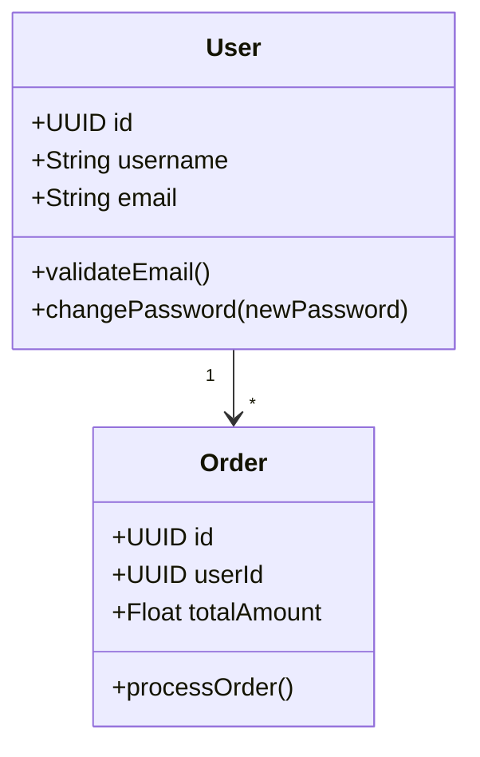

# Générateur de Code CRUD avec Architecture MVC

Un générateur de code puissant qui transforme vos diagrammes UML en code CRUD complet avec architecture MVC pour plusieurs langages de programmation.

## 🚀 Fonctionnalités

- **Multi-langages** : Java, Python, C#, C, C++
- **Architecture MVC complète** : Entités, Repositories, Services, Controllers
- **Support UML** : Diagrammes Mermaid et PlantUML
- **Génération automatique** : Code prêt à l'emploi avec annotations JPA/ORM
- **CLI simple** : Interface en ligne de commande intuitive

## 📦 Installation

### Prérequis
- Java 21+
- Maven 3.9+

### Build
```bash
git clone <repository>
cd uml-to-code-generator
mvn clean package
```

### Utilisation
```bash
# Générer du code Java
java -jar target/uml-generator.jar examples/sample-diagram.mermaid \
  --output=./generated \
  --package=com.example \
  --language=java

# Générer du code Python
java -jar target/uml-generator.jar examples/sample-diagram.mermaid \
  --output=./generated \
  --package=com.example \
  --language=python

# Générer du code C#
java -jar target/uml-generator.jar examples/sample-diagram.mermaid \
  --output=./generated \
  --package=com.example \
  --language=csharp
```

## 📋 Options CLI

```
Usage: uml-generator <inputFile> [OPTIONS]

Parameters:
  <inputFile>              Input UML file (Mermaid or PlantUML)

Options:
  -o, --output=<dir>       Output directory (default: generated)
  -p, --package=<name>     Base package name (default: com.example)
  -l, --language=<lang>    Target language: java, python, csharp, c, cpp
      --with-services      Generate Service layer (default: true)
      --with-controllers   Generate Controller layer (default: true)
      --with-repositories  Generate Repository layer (default: true)
  -h, --help              Show help message
  -V, --version           Print version information
```

## 📝 Format UML Supporté

### Exemple Mermaid


## 🏗️ Architecture Générée

### Java (Spring Boot)
```
generated/
├── src/main/java/com/example/
│   ├── entity/
│   │   ├── User.java
│   │   └── Order.java
│   ├── repository/
│   │   ├── UserRepository.java
│   │   └── OrderRepository.java
│   ├── service/
│   │   ├── UserService.java
│   │   └── OrderService.java
│   └── controller/
│       ├── UserController.java
│       └── OrderController.java
```

### Python (FastAPI)
```
generated/
├── entities/
│   ├── User.py
│   └── Order.py
├── repositories/
│   ├── UserRepository.py
│   └── OrderRepository.py
├── services/
│   ├── UserService.py
│   └── OrderService.py
└── controllers/
    ├── UserController.py
    └── OrderController.py
```

### C# (.NET)
```
generated/
├── Entities/
│   ├── User.cs
│   └── Order.cs
├── Repositories/
│   ├── UserRepository.cs
│   └── OrderRepository.cs
├── Services/
│   ├── UserService.cs
│   └── OrderService.cs
└── Controllers/
    ├── UserController.cs
    └── OrderController.cs
```

## 🔧 Exemple de Code Généré

### Entité Java
```java
@Entity
@Table(name = "user")
public class User {
    @Id
    @GeneratedValue
    private UUID id;
    
    @Column(nullable = false, unique = true)
    private String username;
    
    @Column(nullable = false)
    private String email;
    
    // Constructors, getters, setters...
    
    public void validateEmail() {
        // TODO: Implement business logic
    }
    
    public void changePassword(String newPassword) {
        // TODO: Implement business logic
    }
}
```

### Repository Java
```java
@Repository
public interface UserRepository extends JpaRepository<User, UUID> {
    Optional<User> findByUsername(String username);
    Optional<User> findByEmail(String email);
}
```

### Service Java
```java
@Service
@Transactional
public class UserService {
    private final UserRepository repository;
    
    public User create(User entity) {
        return repository.save(entity);
    }
    
    @Transactional(readOnly = true)
    public Optional<User> findById(UUID id) {
        return repository.findById(id);
    }
    
    // ... autres méthodes CRUD
}
```

### Controller Java
```java
@RestController
@RequestMapping("/api/users")
public class UserController {
    private final UserService service;
    
    @PostMapping
    public ResponseEntity<User> create(@RequestBody User entity) {
        User created = service.create(entity);
        return ResponseEntity.ok(created);
    }
    
    @GetMapping("/{id}")
    public ResponseEntity<User> getById(@PathVariable UUID id) {
        Optional<User> entity = service.findById(id);
        return entity.map(ResponseEntity::ok)
                    .orElse(ResponseEntity.notFound().build());
    }
    
    // ... autres endpoints REST
}
```

## 🧪 Tests

```bash
# Exécuter les tests
mvn test

# Test avec l'exemple fourni
java -jar target/uml-generator.jar examples/sample-diagram.mermaid \
  --output=./test-output \
  --package=com.test \
  --language=java
```

## 🛠️ Développement

### Structure du Projet
```
src/main/java/com/basiccode/generator/
├── model/          # Modèles de données (Diagram, ClassModel, etc.)
├── parser/         # Parsers ANTLR4 pour UML
├── generator/      # Générateurs de code par langage
├── cli/            # Interface ligne de commande
└── util/           # Utilitaires
```

### Ajouter un Nouveau Langage
1. Étendre `EntityGenerator`, `RepositoryGenerator`, etc.
2. Ajouter la logique de génération dans chaque générateur
3. Mettre à jour `GeneratorCLI` pour supporter le nouveau langage

## 📚 Technologies Utilisées

- **ANTLR4** : Parsing des diagrammes UML
- **JavaPoet** : Génération de code Java
- **PicoCLI** : Interface ligne de commande
- **Lombok** : Réduction du boilerplate
- **JUnit 5** : Tests unitaires

## 🤝 Contribution

1. Fork le projet
2. Créer une branche feature (`git checkout -b feature/amazing-feature`)
3. Commit vos changements (`git commit -m 'Add amazing feature'`)
4. Push vers la branche (`git push origin feature/amazing-feature`)
5. Ouvrir une Pull Request

## 📄 Licence

Ce projet est sous licence MIT. Voir le fichier `LICENSE` pour plus de détails.

## 🎯 Roadmap

- [ ] Support PlantUML complet
- [ ] Génération de tests unitaires
- [ ] Support Kotlin et Go
- [ ] Plugin Maven/Gradle
- [ ] Interface web
- [ ] Génération de documentation API