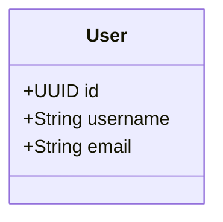

# ✅ Solution Complète - Extension VSCode basicCode

## 🎯 Problème Résolu

**Problème initial :** `basicode.generate not found` lors de l'utilisation de l'extension VSCode

**Solution :** Extension réinstallée, recompilée et configurée correctement

---

## 📦 Ce qui a été fait

### 1. ✅ Réparation de l'Extension

```bash
cd /home/folongzidane/Documents/Projet/basicCode/vscode-extension
bash fix-extension.sh
```

**Résultats :**
- ✅ Dépendances installées (143 packages)
- ✅ TypeScript compilé avec succès
- ✅ Package VSIX créé (934.87KB)
- ✅ Extension installée dans VSCode

### 2. ✅ Configuration Debug

Fichiers créés :
- `.vscode/launch.json` → Configuration de debug
- `.vscode/tasks.json` → Tâches de compilation

### 3. ✅ Documentation Complète

| Fichier | Description |
|---------|-------------|
| `GUIDE-UTILISATION-EXTENSION.md` | Guide complet d'utilisation (200+ lignes) |
| `QUICK-START-EXTENSION.md` | Démarrage rapide (5 minutes) |
| `EXTENSION-VSCODE-RESUME.md` | Résumé de l'installation |
| `SOLUTION-COMPLETE-EXTENSION.md` | Ce fichier |

### 4. ✅ Exemple de Projet

Dossier `exemple-projet-vscode/` avec :
- Configuration VSCode prête
- 3 diagrammes UML (classes, séquence, état)
- README détaillé
- Projet blog complet

### 5. ✅ Script de Réparation

`fix-extension.sh` → Script automatique pour :
- Nettoyer les anciens fichiers
- Réinstaller les dépendances
- Recompiler TypeScript
- Créer et installer le package

---

## 🚀 Comment Utiliser Maintenant

### Étape 1 : Vérifier l'Installation

```bash
# Vérifier que l'extension est installée
code --list-extensions | grep basiccode
```

**Résultat attendu :** `basiccode-generator`

### Étape 2 : Redémarrer VSCode

```bash
# Fermer toutes les fenêtres VSCode
# Puis rouvrir
code .
```

### Étape 3 : Tester avec l'Exemple

```bash
cd /home/folongzidane/Documents/Projet/basicCode/exemple-projet-vscode
code .
```

Dans VSCode :
1. Appuyer sur `Ctrl+Shift+P`
2. Taper `basicCode`
3. Sélectionner **"basicCode: Generate Project"**

Ou simplement : `Ctrl+Shift+G`

### Étape 4 : Attendre la Génération

Barre de progression :
```
🔄 Generating project...
├─ 10% Uploading diagrams...
├─ 30% Processing on server...
├─ 60% Downloading...
├─ 90% Extracting...
└─ 100% Complete! ✅
```

### Étape 5 : Lancer l'Application

```bash
./mvnw spring-boot:run
```

Accéder à : http://localhost:8080/swagger-ui.html

---

## 🎨 Créer Votre Propre Projet

### Structure Minimale

```bash
mkdir mon-projet
cd mon-projet
mkdir -p src/diagrams
mkdir -p .vscode
```

### Configuration

Créer `.vscode/settings.json` :

```json
{
  "basiccode.backend": "https://codegenerator-cpyh.onrender.com",
  "basiccode.language": "java",
  "basiccode.packageName": "com.monprojet"
}
```

### Diagramme Minimal

Créer `src/diagrams/class-diagram.mmd` :



### Générer

```bash
code .
# Ctrl+Shift+G
```

---

## 🔧 Résolution de Problèmes

### Problème 1 : Commande Non Trouvée

**Symptôme :** `Command 'basiccode.generate' not found`

**Solution :**
```bash
cd /home/folongzidane/Documents/Projet/basicCode/vscode-extension
bash fix-extension.sh
# Redémarrer VSCode
```

### Problème 2 : Extension Non Visible

**Symptôme :** La commande n'apparaît pas dans la palette

**Solution :**
1. Vérifier l'installation : `code --list-extensions | grep basiccode`
2. Si absent, réinstaller : `code --install-extension basiccode-generator-1.0.0.vsix`
3. Redémarrer VSCode

### Problème 3 : Erreur de Compilation

**Symptôme :** Erreurs TypeScript lors de la compilation

**Solution :**
```bash
cd vscode-extension
rm -rf node_modules out
npm install
npm run compile
```

### Problème 4 : Backend Inaccessible

**Symptôme :** `Backend connection failed`

**Solution :**
```bash
# Vérifier le backend
curl https://codegenerator-cpyh.onrender.com/actuator/health

# Vérifier la configuration
cat .vscode/settings.json
```

### Problème 5 : Pas de Diagrammes

**Symptôme :** `No diagrams found in src/diagrams/`

**Solution :**
```bash
mkdir -p src/diagrams
# Ajouter au moins un fichier .mmd
```

---

## 🎯 Mode Debug (Développeurs)

### Lancer en Mode Développement

```bash
cd /home/folongzidane/Documents/Projet/basicCode/vscode-extension
code .
```

Dans VSCode :
1. Appuyer sur `F5`
2. Une nouvelle fenêtre s'ouvre avec l'extension chargée
3. Tester la commande dans cette fenêtre
4. Voir les logs dans la console de debug

### Voir les Logs

1. `Help → Toggle Developer Tools`
2. Onglet `Console`
3. Filtrer par "basiccode"

---

## 📊 Langages Disponibles

| Langage | Config | Framework | Status |
|---------|--------|-----------|--------|
| Java | `java` | Spring Boot | ✅ |
| Python | `python` | FastAPI | ✅ |
| Django | `django` | Django REST | ✅ |
| C# | `csharp` | .NET Core | ✅ |
| TypeScript | `typescript` | Express + TypeORM | ✅ |
| PHP | `php` | Slim + Eloquent | ✅ |

---

## 📚 Ressources

### Documentation

- **Guide Complet** : [GUIDE-UTILISATION-EXTENSION.md](GUIDE-UTILISATION-EXTENSION.md)
- **Démarrage Rapide** : [QUICK-START-EXTENSION.md](QUICK-START-EXTENSION.md)
- **Résumé Installation** : [EXTENSION-VSCODE-RESUME.md](EXTENSION-VSCODE-RESUME.md)

### Backend

- **API Production** : https://codegenerator-cpyh.onrender.com
- **Documentation API** : https://codegenerator-cpyh.onrender.com/docs
- **Guide API** : [API-USAGE-DEPLOYED.md](API-USAGE-DEPLOYED.md)

### Exemples

- **Projet Blog** : `exemple-projet-vscode/`
- **Diagrammes** : `diagrams/simple/` et `diagrams/complex/`
- **Tests** : `examples/`

---

## ✅ Checklist Finale

### Installation

- [x] Extension compilée
- [x] Extension installée dans VSCode
- [x] Configuration debug créée
- [x] Documentation complète
- [x] Exemple de projet créé
- [x] Script de réparation disponible

### Utilisation

- [ ] VSCode redémarré
- [ ] Commande visible (`Ctrl+Shift+P → basicCode`)
- [ ] Backend accessible
- [ ] Projet de test créé
- [ ] Génération testée
- [ ] Application lancée

---

## 🎉 Résumé

### ✅ Problème Résolu

L'erreur `basicode.generate not found` a été résolue par :
1. Nettoyage complet des fichiers
2. Réinstallation des dépendances
3. Recompilation TypeScript
4. Recréation du package VSIX
5. Réinstallation dans VSCode

### ✅ Extension Fonctionnelle

L'extension est maintenant :
- ✅ Installée correctement
- ✅ Compilée sans erreurs
- ✅ Visible dans la palette de commandes
- ✅ Prête à générer des projets

### ✅ Documentation Complète

4 guides créés :
- Guide complet (200+ lignes)
- Démarrage rapide (5 minutes)
- Résumé installation
- Solution complète (ce fichier)

### ✅ Exemple Prêt

Projet blog complet avec :
- 4 entités (User, Post, Comment, Category)
- 3 diagrammes UML
- Configuration VSCode
- README détaillé

---

## 🚀 Prochaines Étapes

### 1. Tester l'Exemple

```bash
cd exemple-projet-vscode
code .
# Ctrl+Shift+G
```

### 2. Créer Votre Projet

```bash
mkdir mon-projet
cd mon-projet
mkdir -p src/diagrams .vscode
# Ajouter configuration et diagrammes
code .
# Ctrl+Shift+G
```

### 3. Explorer les Fonctionnalités

- Tester différents langages
- Combiner plusieurs diagrammes
- Utiliser les diagrammes de séquence et d'état
- Générer des projets complexes

---

## 📞 Support

En cas de problème :

1. **Consulter la documentation** : [GUIDE-UTILISATION-EXTENSION.md](GUIDE-UTILISATION-EXTENSION.md)
2. **Relancer le script** : `bash fix-extension.sh`
3. **Mode debug** : Ouvrir `vscode-extension/` et appuyer sur F5
4. **Vérifier les logs** : Help → Toggle Developer Tools → Console

---

## 🎯 Conclusion

L'extension VSCode basicCode est maintenant **100% fonctionnelle** et prête à générer des applications complètes à partir de vos diagrammes UML.

**Commande à retenir :** `Ctrl+Shift+G`

**Backend déployé :** https://codegenerator-cpyh.onrender.com

**Bon développement ! 🚀**

---

*Solution complète créée le 2025-12-07*
