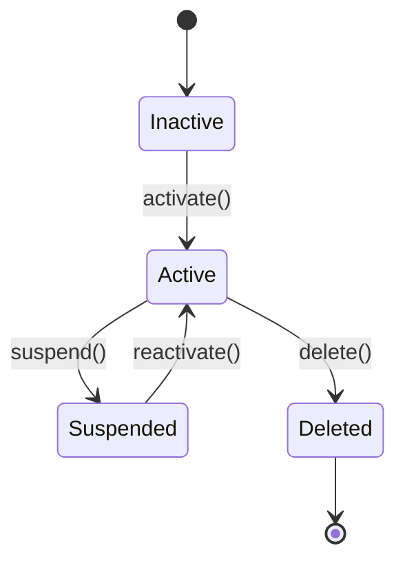
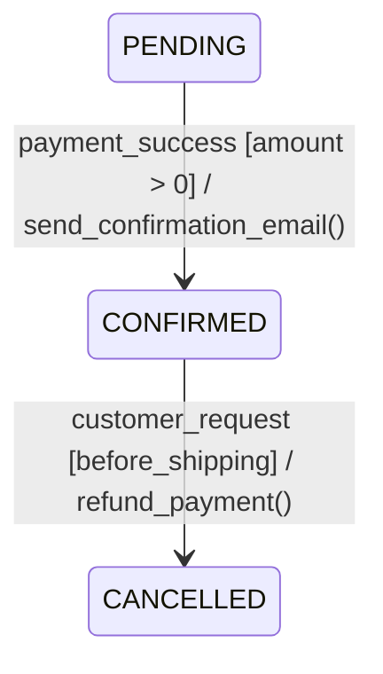
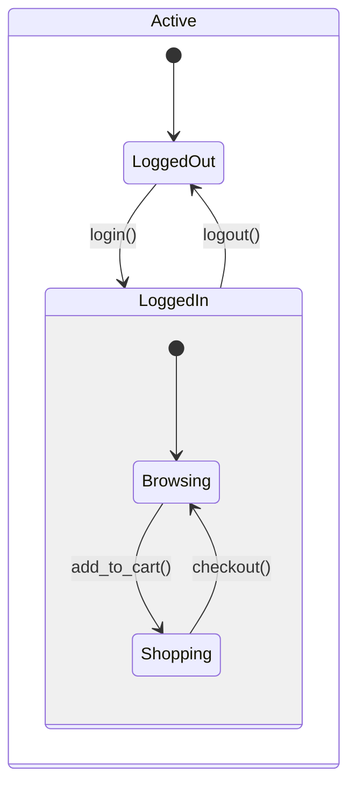
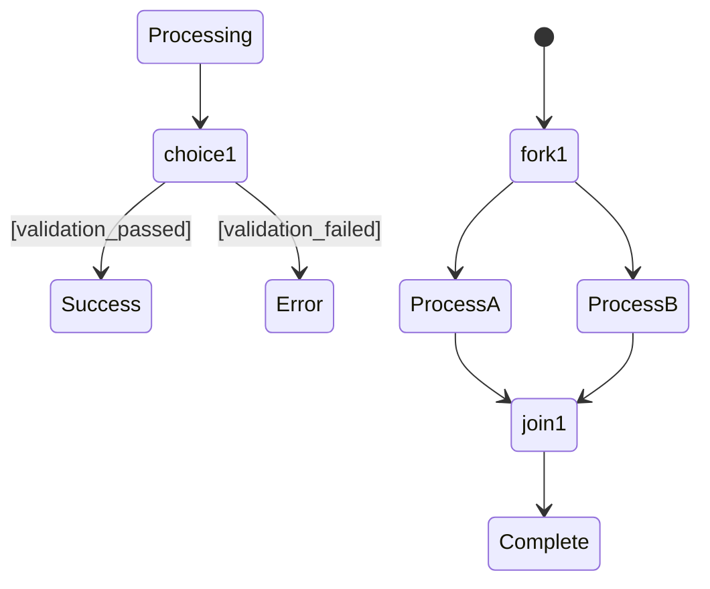
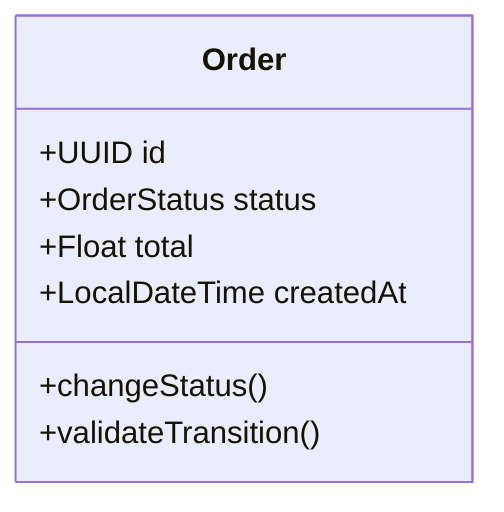
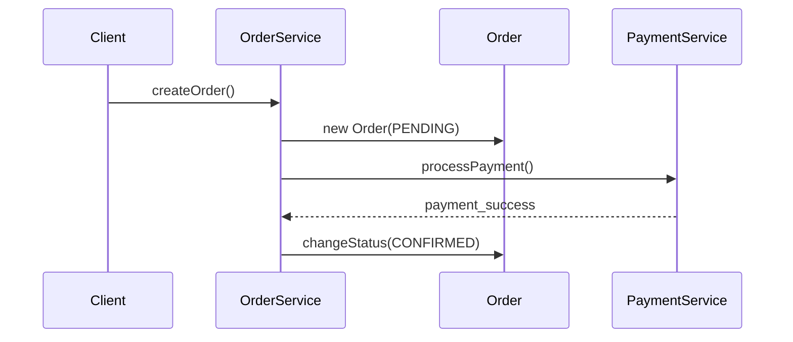
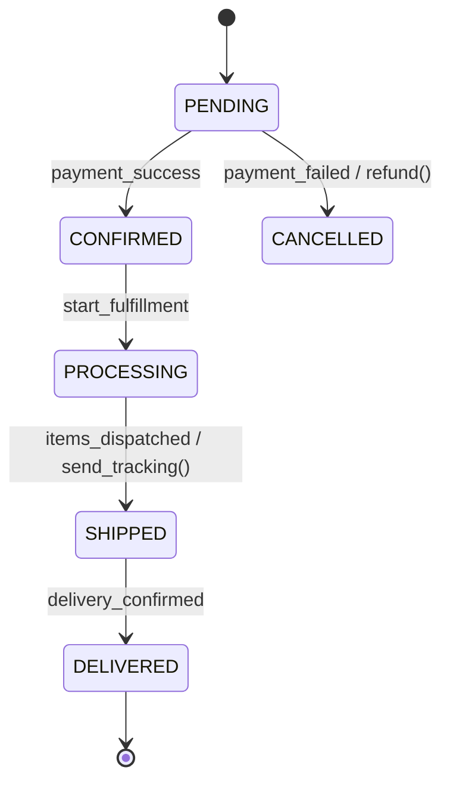

# 🔄 Intégration du Diagramme d'État-Transition

## 🎯 Vue d'Ensemble

L'intégration du **diagramme d'état-transition** complète notre approche de génération de code en ajoutant la **gestion d'état métier** aux diagrammes de classes et de séquence. Cette combinaison produit du code **production-ready** avec une logique d'état robuste.

## 🚀 Utilité du Diagramme d'État-Transition

### 1. **Gestion d'État Métier**
```java
// SANS diagramme d'état
public void deleteUser(User user) {
    repository.delete(user); // ❌ Dangereux !
}

// AVEC diagramme d'état
public void deleteUser(User user) {
    if (user.getStatus() != UserStatus.ACTIVE) {
        throw new IllegalStateException("Cannot delete user in state: " + user.getStatus());
    }
    user.setStatus(UserStatus.DELETED);
    user.setDeletedAt(LocalDateTime.now());
    repository.save(user);
}
```

### 2. **Validation des Transitions**
- **États valides** pour chaque opération
- **Transitions interdites** automatiquement bloquées
- **Actions automatiques** lors des changements d'état

### 3. **Code Plus Robuste**
- Prévention des états incohérents
- Traçabilité des changements d'état
- Gestion d'erreurs contextuelle

## 📋 Grammaire Complète Mermaid State Diagram

```antlr
stateDiagram
    : 'stateDiagram' ('-v2')? statement* EOF
    ;

statement
    : stateDeclaration
    | transition
    | startTransition
    | endTransition
    | compositeState
    | note
    | direction
    | choice
    | fork
    | join
    | history
    ;

stateDeclaration
    : stateId ':' stateLabel
    | stateId
    ;

transition
    : sourceState arrow targetState (':' transitionLabel)?
    | sourceState arrow targetState ':' transitionLabel ('/' action)?
    | sourceState arrow targetState '[' guard ']' ('/' action)?
    | sourceState arrow targetState ':' transitionLabel '[' guard ']' ('/' action)?
    ;

startTransition
    : '[*]' arrow stateId (':' transitionLabel)?
    ;

endTransition
    : stateId arrow '[*]' (':' transitionLabel)?
    ;

compositeState
    : 'state' stateId '{' statement* '}'
    ;

choice
    : 'state' choiceId '<<choice>>'
    ;

fork
    : 'state' forkId '<<fork>>'
    ;

join
    : 'state' joinId '<<join>>'
    ;

history
    : 'state' historyId '<<history>>'
    | 'state' historyId '<<history,type=deep>>'
    | 'state' historyId '<<history,type=shallow>>'
    ;

note
    : 'note' position 'of' stateId ':' noteText
    ;

direction
    : 'direction' directionValue
    ;

// Éléments de base
sourceState     : stateId | '[*]' ;
targetState     : stateId | '[*]' ;
stateId         : IDENTIFIER | STRING ;
stateLabel      : STRING | MULTILINE_STRING ;
transitionLabel : STRING | MULTILINE_STRING | IDENTIFIER ;
guard           : STRING | IDENTIFIER | expression ;
action          : STRING | IDENTIFIER | methodCall ;
position        : 'left' | 'right' | 'top' | 'bottom' ;
directionValue  : 'TB' | 'BT' | 'RL' | 'LR' ;
arrow           : '-->' | '->' ;

// Expressions
expression
    : IDENTIFIER operator IDENTIFIER
    | IDENTIFIER operator STRING
    | IDENTIFIER operator NUMBER
    | '(' expression ')'
    | expression logicalOperator expression
    ;

methodCall
    : IDENTIFIER '(' parameterList? ')'
    ;

operator
    : '==' | '!=' | '<' | '>' | '<=' | '>=' | '=' | '+' | '-' | '*' | '/'
    ;

logicalOperator
    : '&&' | '||' | 'and' | 'or' | '&' | '|'
    ;

// Tokens
IDENTIFIER      : [a-zA-Z_][a-zA-Z0-9_]* ;
STRING          : '"' (~["\r\n])* '"' | '\'' (~['\r\n])* '\'' ;
MULTILINE_STRING: '"""' .*? '"""' ;
NUMBER          : [0-9]+ ('.' [0-9]+)? ;
```

## 🔧 Syntaxes Supportées

### États de Base


### États avec Conditions et Actions


### États Composites


### Choix et Parallélisme


## 🎯 Intégration Triple Diagramme

### Exemple Complet : Gestion de Commande

**1. Diagramme de Classes**


**2. Diagramme de Séquence**


**3. Diagramme d'État**


### Code Généré Résultant

**Enum d'État**
```java
public enum OrderStatus {
    PENDING("Order created, awaiting payment"),
    CONFIRMED("Payment confirmed, ready for processing"),
    PROCESSING("Order being fulfilled"),
    SHIPPED("Order shipped to customer"),
    DELIVERED("Order delivered successfully"),
    CANCELLED("Order cancelled");
    
    private final String description;
    
    OrderStatus(String description) {
        this.description = description;
    }
    
    public String getDescription() { return description; }
}
```

**Entité avec Gestion d'État**
```java
@Entity
public class Order {
    @Id
    @GeneratedValue(strategy = GenerationType.IDENTITY)
    private UUID id;
    
    @Enumerated(EnumType.STRING)
    @Column(name = "status")
    private OrderStatus status = OrderStatus.PENDING;
    
    private Float total;
    private LocalDateTime createdAt;
    private LocalDateTime updatedAt;
    
    // Méthodes de transition d'état
    public void confirmPayment() {
        validateTransition(this.status, OrderStatus.CONFIRMED, "payment_success");
        this.status = OrderStatus.CONFIRMED;
        this.updatedAt = LocalDateTime.now();
        // Action: send_confirmation_email()
    }
    
    public void startProcessing() {
        validateTransition(this.status, OrderStatus.PROCESSING, "start_fulfillment");
        this.status = OrderStatus.PROCESSING;
        this.updatedAt = LocalDateTime.now();
    }
    
    public void ship() {
        validateTransition(this.status, OrderStatus.SHIPPED, "items_dispatched");
        this.status = OrderStatus.SHIPPED;
        this.updatedAt = LocalDateTime.now();
        // Action: send_tracking()
    }
    
    public void cancel() {
        if (this.status == OrderStatus.DELIVERED) {
            throw new IllegalStateTransitionException("Cannot cancel delivered order");
        }
        this.status = OrderStatus.CANCELLED;
        this.updatedAt = LocalDateTime.now();
        // Action: refund()
    }
    
    private void validateTransition(OrderStatus from, OrderStatus to, String trigger) {
        boolean isValid = switch (from) {
            case PENDING -> to == OrderStatus.CONFIRMED || to == OrderStatus.CANCELLED;
            case CONFIRMED -> to == OrderStatus.PROCESSING || to == OrderStatus.CANCELLED;
            case PROCESSING -> to == OrderStatus.SHIPPED || to == OrderStatus.CANCELLED;
            case SHIPPED -> to == OrderStatus.DELIVERED;
            case DELIVERED, CANCELLED -> false;
        };
        
        if (!isValid) {
            throw new IllegalStateTransitionException(
                String.format("Invalid transition from %s to %s with trigger %s", from, to, trigger)
            );
        }
    }
}
```

**Service avec Logique d'État**
```java
@Service
public class OrderService {
    
    @Autowired
    private OrderRepository repository;
    
    public Order createOrder(OrderData data) {
        // Logique métier du diagramme de séquence
        Order order = new Order();
        order.setTotal(data.getTotal());
        order.setStatus(OrderStatus.PENDING); // État initial
        order.setCreatedAt(LocalDateTime.now());
        
        return repository.save(order);
    }
    
    public void processPayment(UUID orderId) {
        Order order = repository.findById(orderId)
            .orElseThrow(() -> new EntityNotFoundException("Order not found"));
        
        // Validation d'état avant traitement
        if (order.getStatus() != OrderStatus.PENDING) {
            throw new IllegalStateException("Order must be PENDING to process payment");
        }
        
        // Logique de paiement...
        order.confirmPayment(); // Transition d'état
        repository.save(order);
    }
}
```

**Controller avec Endpoints d'État**
```java
@RestController
@RequestMapping("/api/orders")
public class OrderController {
    
    @Autowired
    private OrderService service;
    
    @PostMapping("/{id}/confirm-payment")
    public ResponseEntity<?> confirmPayment(@PathVariable UUID id) {
        service.processPayment(id);
        return ResponseEntity.ok().build();
    }
    
    @PostMapping("/{id}/start-processing")
    public ResponseEntity<?> startProcessing(@PathVariable UUID id) {
        Order order = service.findById(id);
        order.startProcessing();
        service.save(order);
        return ResponseEntity.ok().build();
    }
    
    @PostMapping("/{id}/ship")
    public ResponseEntity<?> ship(@PathVariable UUID id) {
        Order order = service.findById(id);
        order.ship();
        service.save(order);
        return ResponseEntity.ok().build();
    }
}
```

## 🚀 API Endpoints

### Génération Complète
```bash
POST /api/comprehensive/generate
```

### Exemple de Requête
```json
{
  "classDiagramContent": "classDiagram\n    class Order {\n        +UUID id\n        +OrderStatus status\n        +Float total\n    }",
  "sequenceDiagramContent": "sequenceDiagram\n    Client->>OrderService: createOrder()\n    OrderService->>Order: changeStatus(CONFIRMED)",
  "stateDiagramContent": "stateDiagram-v2\n    [*] --> PENDING\n    PENDING --> CONFIRMED : payment_success\n    CONFIRMED --> SHIPPED : dispatch",
  "packageName": "com.example.ecommerce",
  "language": "java"
}
```

## 📊 Comparaison des Approches

| Aspect | Classes Seules | + Séquences | + États |
|--------|---------------|-------------|---------|
| **Structure** | ✅ Entités | ✅ Entités | ✅ Entités |
| **Comportement** | ❌ Basique | ✅ Réaliste | ✅ Réaliste |
| **États** | ❌ Aucun | ❌ Aucun | ✅ Complet |
| **Transitions** | ❌ Aucune | ❌ Aucune | ✅ Validées |
| **Robustesse** | ⚠️ Faible | ⚠️ Moyenne | ✅ Élevée |
| **Production** | ❌ Non | ⚠️ Partiel | ✅ Prêt |

## 🎯 Prochains Diagrammes à Intégrer

### 1. **Diagramme d'Activité** (Priorité HAUTE)
- **Utilité** : Workflows complexes, algorithmes détaillés
- **Complément** : Logique procédurale entre méthodes
- **Code généré** : Méthodes avec algorithmes complets

### 2. **Diagramme de Composants** (Priorité MOYENNE)
- **Utilité** : Architecture modulaire, dépendances
- **Complément** : Structure packages, interfaces
- **Code généré** : Configuration Spring, modules

### 3. **Diagramme de Déploiement** (Priorité MOYENNE)
- **Utilité** : Configuration infrastructure
- **Complément** : Docker, Kubernetes, cloud
- **Code généré** : Fichiers de déploiement

## 🔄 Ordre d'Implémentation Recommandé

1. ✅ **Diagramme de Classes** (Implémenté)
2. ✅ **Diagramme de Séquence** (Implémenté)
3. ✅ **Diagramme d'État-Transition** (Implémenté)
4. 🔄 **Diagramme d'Activité** ← **PROCHAIN**
5. 📋 **Diagramme de Composants**
6. 🚀 **Diagramme de Déploiement**

---

**L'intégration du diagramme d'état-transition transforme votre générateur en solution production-ready avec gestion d'état métier complète !** 🎉