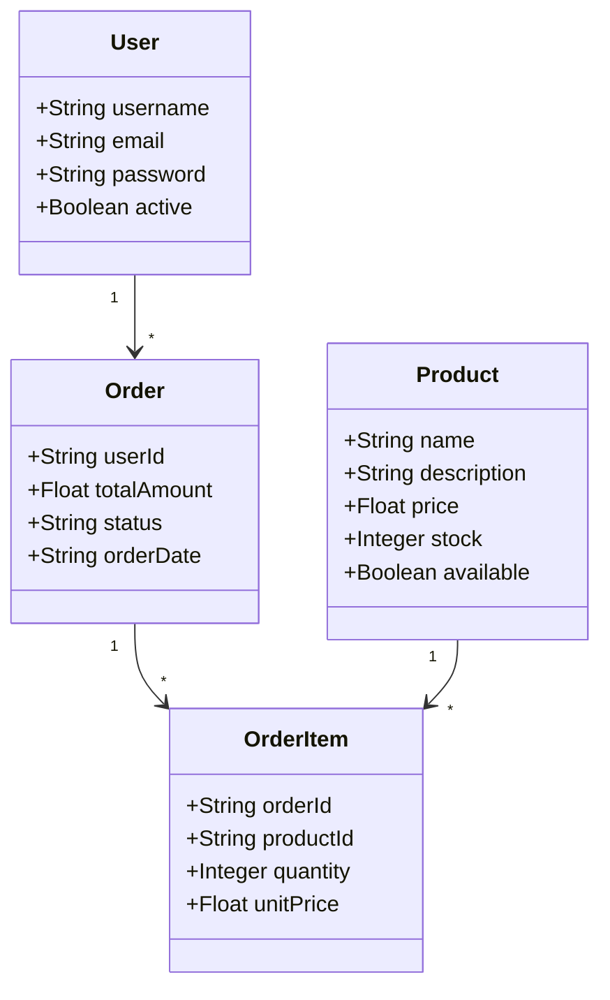
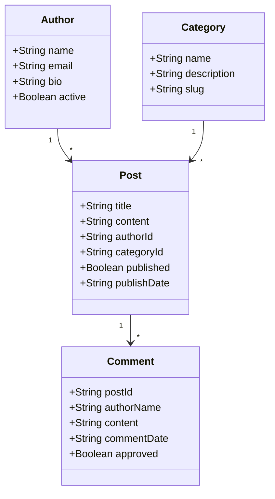
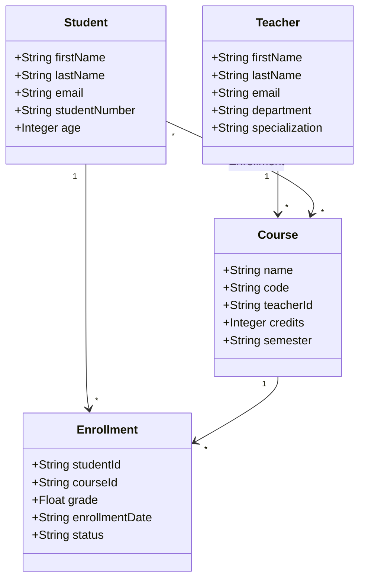
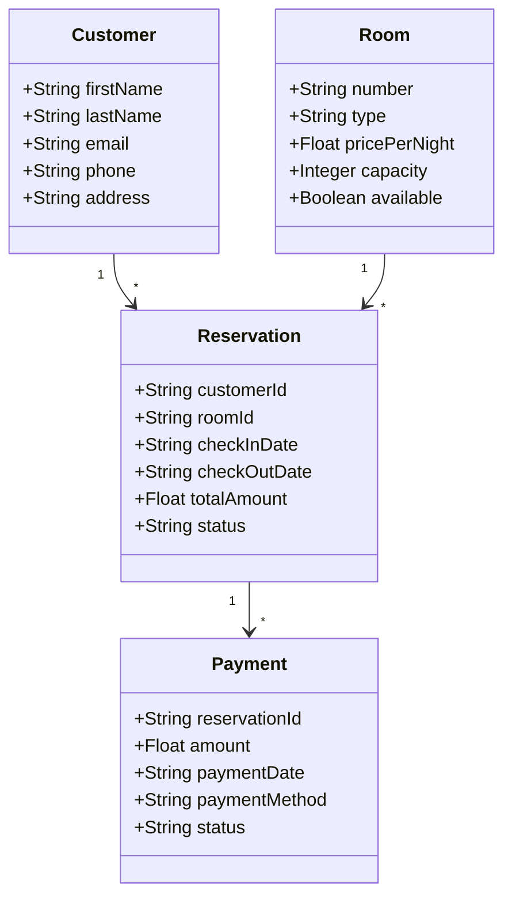
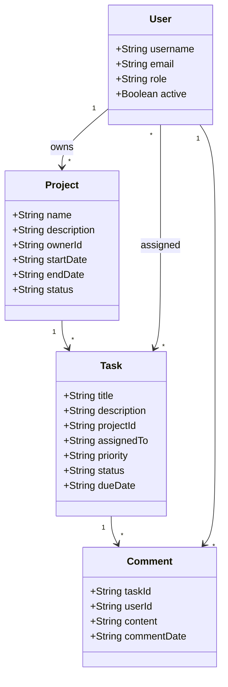

# 📋 Exemples d'Utilisation

## 🎯 Exemples de Diagrammes UML

### 1. E-commerce Simple


**Génération :**
```bash
./generate-from-mermaid.sh ecommerce.mermaid django com.ecommerce ./ecommerce-app
```

### 2. Système de Blog


**Génération :**
```bash
./generate-from-mermaid.sh blog.mermaid java com.blog ./blog-app
```

### 3. Gestion d'École


**Génération :**
```bash
./generate-from-mermaid.sh school.mermaid typescript com.school ./school-app
```

### 4. Système de Réservation d'Hôtel


**Génération :**
```bash
./generate-from-mermaid.sh hotel.mermaid csharp Com.Hotel ./hotel-app
```

### 5. Système de Gestion de Tâches


**Génération :**
```bash
./generate-from-mermaid.sh tasks.mermaid php com.tasks ./tasks-app
```

## 🚀 Commandes de Test Rapide

### Test de Tous les Langages
```bash
# Créer un diagramme simple
cat > simple.mermaid << 'EOF'
classDiagram
    class User {
        +String name
        +String email
    }
EOF

# Tester tous les langages
./generate-from-mermaid.sh simple.mermaid java com.test ./test-java
./generate-from-mermaid.sh simple.mermaid python com.test ./test-python
./generate-from-mermaid.sh simple.mermaid django com.test ./test-django
./generate-from-mermaid.sh simple.mermaid csharp Com.Test ./test-csharp
./generate-from-mermaid.sh simple.mermaid typescript com.test ./test-typescript
./generate-from-mermaid.sh simple.mermaid php com.test ./test-php
```

### Validation UML
```bash
# Valider un diagramme avant génération
curl -X POST "https://codegenerator-cpyh.onrender.com/api/generate/validate" \
  -H "Content-Type: application/json" \
  -d "$(cat simple.mermaid | jq -Rs .)"
```

## 📊 Résultats Attendus

Chaque génération produit une application complète avec :
- ✅ Base de données configurée
- ✅ API REST fonctionnelle
- ✅ Documentation Swagger
- ✅ Authentification (Django)
- ✅ Interface admin (Django)
- ✅ Tests de base
- ✅ Configuration de déploiement