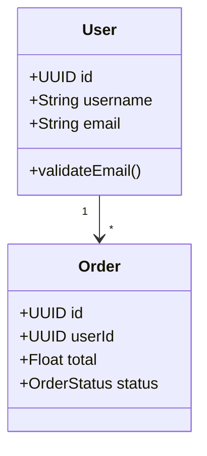
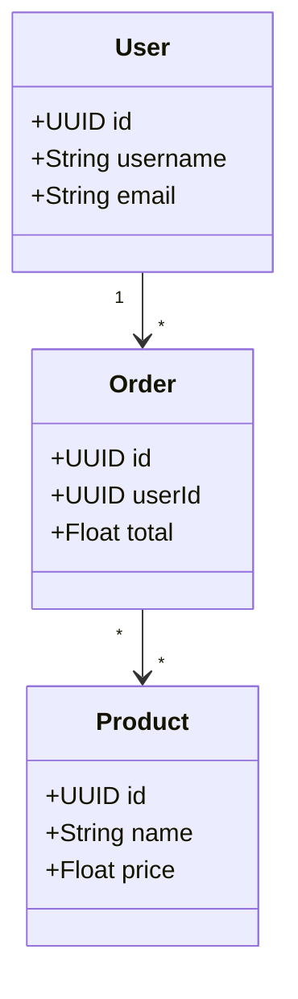

# 🚀 basicCode Generator - Extension VSCode

Extension VSCode pour générer des projets complets à partir de diagrammes UML.

## 📋 Fonctionnalités

- ✅ **Génération automatique** : Projets complets depuis diagrammes UML
- ✅ **6 langages supportés** : Java, Python, Django, C#, TypeScript, PHP  
- ✅ **Scanner intelligent** : Détection automatique des diagrammes
- ✅ **Smart merge** : Fusion intelligente avec backup automatique
- ✅ **Progress tracking** : Suivi temps réel de la génération
- ✅ **Configuration flexible** : Backend, langage, package personnalisables

## 🔧 Installation

### Méthode 1: Script automatique
```bash
cd vscode-extension
chmod +x fix-and-build.sh
./fix-and-build.sh
code --install-extension basiccode-generator.vsix
```

### Méthode 2: Manuelle
```bash
cd vscode-extension
npm install
npm run compile
npx @vscode/vsce package
code --install-extension basiccode-generator-1.0.0.vsix
```

## 🎮 Utilisation

### 1. Structure du projet
```
mon-projet/
├── src/
│   └── diagrams/
│       ├── class.mmd      # Diagramme de classes
│       ├── sequence.mmd   # Diagramme de séquence  
│       └── state.mmd      # Diagramme d'état
└── ...
```

### 2. Exemple de diagramme


### 3. Génération
- **Raccourci** : `Ctrl+Shift+G` (ou `Cmd+Shift+G` sur Mac)
- **Menu** : `F1` → "basicCode: Generate Project"

## ⚙️ Configuration

### Via VSCode Settings
```json
{
  "basiccode.backend": "https://codegenerator-cpyh.onrender.com",
  "basiccode.language": "java",
  "basiccode.packageName": "com.example"
}
```

### Langages supportés
- `java` - Spring Boot
- `python` - FastAPI  
- `django` - Django REST
- `csharp` - .NET Core
- `typescript` - Express + TypeORM
- `php` - Slim Framework

## 🔄 Workflow

1. **Scanner** : Détection automatique des diagrammes dans `src/diagrams/`
2. **Upload** : Envoi sécurisé vers le backend
3. **Processing** : Génération côté serveur avec suivi temps réel
4. **Download** : Téléchargement du projet généré
5. **Merge** : Fusion intelligente avec backup des fichiers existants

## 📁 Résultat

L'extension génère une structure complète :

```
projet-généré/
├── src/
│   ├── main/
│   │   ├── java/com/example/
│   │   │   ├── entity/        # Entités JPA
│   │   │   ├── repository/    # Repositories
│   │   │   ├── service/       # Services métier
│   │   │   ├── controller/    # Controllers REST
│   │   │   └── Application.java
│   │   └── resources/
│   │       ├── application.yml
│   │       └── db/migration/  # Scripts SQL
├── pom.xml                    # Configuration Maven
├── README.md                  # Documentation
└── start.sh                   # Script de démarrage
```

## 🛠️ Développement

### Prérequis
- Node.js 16+
- VSCode 1.74+
- TypeScript 4.9+

### Build local
```bash
git clone <repo>
cd vscode-extension
npm install
npm run compile
npm run watch  # Mode développement
```

### Test
```bash
# Ouvrir dans VSCode
code .
# F5 pour lancer Extension Development Host
```

## 🔗 Backend

L'extension communique avec le backend basicCode Generator :
- **Production** : https://codegenerator-cpyh.onrender.com
- **Local** : http://localhost:8080
- **API Docs** : https://codegenerator-cpyh.onrender.com/docs

## 📚 Exemples

### Projet E-commerce


### Génération complète
- ✅ 15+ fichiers générés
- ✅ API REST complète
- ✅ Base de données configurée
- ✅ Documentation Swagger
- ✅ Tests unitaires
- ✅ Prêt pour déploiement

## 🐛 Dépannage

### Extension non visible
```bash
# Vérifier installation
code --list-extensions | grep basiccode

# Réinstaller
code --uninstall-extension basiccode-generator
code --install-extension basiccode-generator.vsix
```

### Erreur de génération
1. Vérifier la configuration backend
2. Tester la connectivité : `curl https://codegenerator-cpyh.onrender.com/actuator/health`
3. Vérifier les diagrammes dans `src/diagrams/`

### Problème de merge
- Les backups sont dans `*.backup`
- Comparer avec `diff fichier.java fichier.java.backup`

## 📄 Licence

MIT License - Voir LICENSE file

## 🤝 Contribution

1. Fork le projet
2. Créer une branche feature
3. Commit les changements  
4. Push vers la branche
5. Ouvrir une Pull Request

---

**Version** : 1.0.0  
**Auteur** : basicCode Team  
**Support** : https://github.com/basiccode/vscode-extension